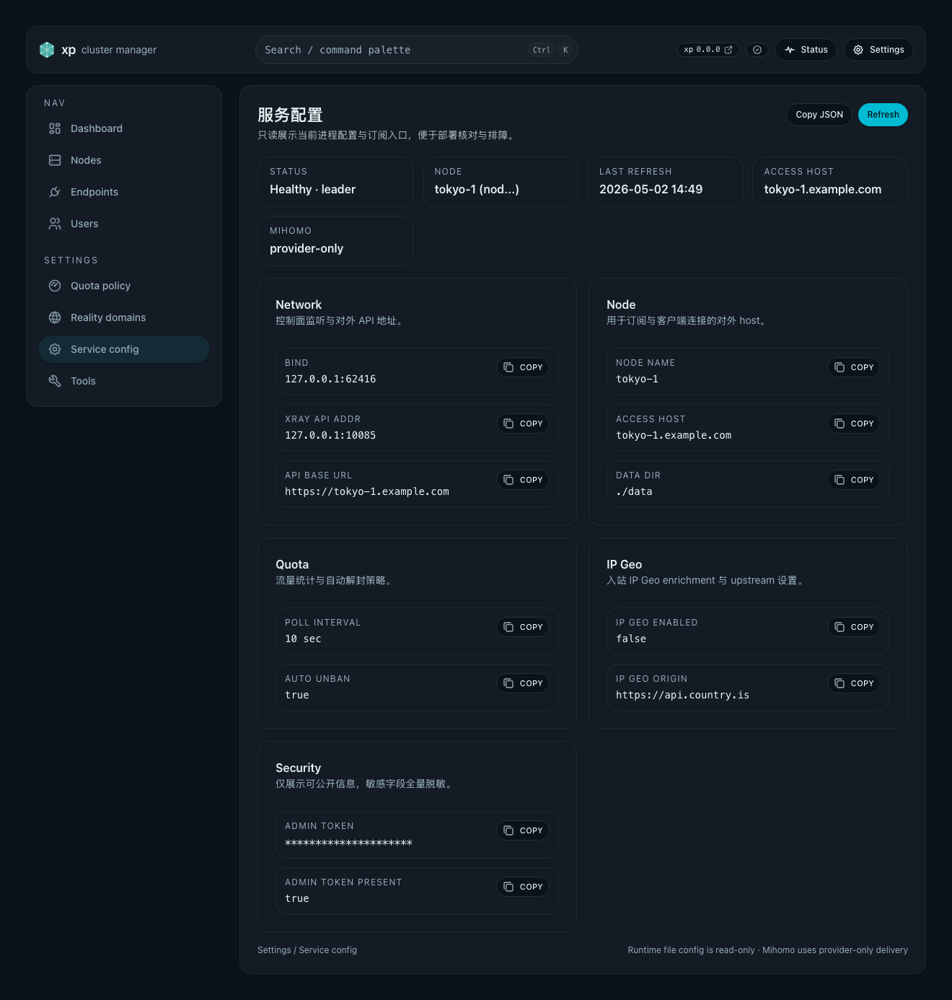

# Mihomo provider-only 动态链式订阅（#3e4q4）

## 状态

- Status: 已完成
- Created: 2026-04-17
- Last: 2026-05-02

## 背景 / 问题陈述

- 当前 `format=mihomo` 已支持系统动态节点 + 用户 mixin，但系统节点仍直接写入最终 `proxies`，一旦项目自己的入口地址、端口或节点集合变化，就需要整体刷新主配置。
- 这对真实客户端并不友好：用户导入的是完整配置而不是独立 provider，入口池变化无法通过 Mihomo 自身的 `proxy-provider` 拉取机制独立更新。
- 现网已切到 provider 默认方案；继续保留 legacy Mihomo 会增加双轨测试和 UI 心智成本，且不能满足链式节点随 provider 动态更新的目标。

## 目标 / 非目标

### Goals

- 移除 legacy Mihomo 输出与全局 delivery mode，`GET /api/sub/{token}?format=mihomo` 固定返回 provider 主配置。
- 保留显式 provider 回归路径：
  - `GET /api/sub/{token}/mihomo/provider`
  - `GET /api/sub/{token}/mihomo/provider/system`
- provider 方案采用单一系统 provider `xp-system-generated`，将系统直连节点与链式节点都移入 provider payload。
- 链式节点命名为 `{base}-ss-chain` / `{base}-reality-chain`，继续复用 `dialer-proxy: 🛣️ JP/HK/TW`。
- provider 主配置中的地区组、`💎 高质量`、`🚀 节点选择` 与 `🤯 All` 改为基于节点主动探测得到的订阅地区自动生成，并固定暴露 `Japan/HongKong/Taiwan/Korea/Singapore/US/Other`。
- 管理端只展示 provider-only 状态；用户详情页复制/预览 canonical Mihomo URL。

### Non-goals

- 不改 `raw` / `base64` / `clash` 输出。
- 不做按用户维度的 Mihomo delivery mode。
- 不承诺 provider 主配置继续兼容手写系统节点名；系统节点应通过 provider `use + filter` 消费。
- 不按 endpoint probe 健康状态过滤节点；有 access host 与用户 endpoint membership 即视为可输出。

## 范围（Scope）

### In scope

- 后端 provider-only Mihomo HTTP 路由与 provider payload 渲染。
- provider 主配置渲染、provider payload 渲染、请求 origin 解析。
- Web `Settings / Service config` provider-only 状态展示与 `User Details` canonical Mihomo URL。
- Storybook / 前后端回归 / 真实 Mihomo provider 装载验证。
- 设计文档与契约文档同步。

### Out of scope

- 不扩展更多 provider 名称或多套系统 provider。
- 不替换当前 `UserMihomoProfile` 结构。
- 不改 `raw` / `base64` / `clash` 输出。

## 需求（Requirements）

### MUST

- `GET /api/sub/{token}?format=mihomo` 必须输出 provider 主配置。
- `GET /api/sub/{token}/mihomo/legacy` 不再是可用订阅路径。
- `GET /api/sub/{token}/mihomo/provider` 必须输出 provider 主配置。
- `GET /api/sub/{token}/mihomo/provider/system` 必须返回合法 `text/yaml`，根为 `proxies:`。
- provider 主配置里的系统 provider 名称固定为 `xp-system-generated`；若用户 `extra_proxy_providers_yaml` 里占用了同名 provider，服务端返回清晰错误。
- provider 主配置里的 provider `url` 必须基于请求对外 origin 生成，而不是直接复用内网 `api_base_url`。
- provider 方案中：
  - 顶层 `proxy-providers` = `xp-system-generated` + `extra_proxy_providers_yaml`
  - 顶层 `proxies` = `extra_proxies_yaml`，不枚举系统生成节点
  - `xp-system-generated` payload = 系统 `{base}-ss` / `{base}-reality` / `{base}-ss-chain` / `{base}-reality-chain`
  - `🛣️ JP/HK/TW`、`🌟/🔒/🤯/🛣️ {Japan|HongKong|Taiwan|Korea|Singapore|US|Other}`、`💎 高质量`、`🚀 节点选择`、`🤯 All`、`🛬 {base}`、`🔒 落地` 保持可用
- provider 方案下 `🛬 {base}` 必须通过 `use: [xp-system-generated]` 与精确 filter 消费 `{base}-ss-chain` / `{base}-reality-chain`，且 Mihomo 运行时候选顺序必须稳定为 ss-chain 在前、reality-chain 在后。
- provider 方案下 `🔒 高质量` 与 `🔒 {Region}` 必须能通过 `xp-system-generated` 动态消费 `{base}-reality` 直连接入点；`{base}-ss` 仍只作为 provider payload 原料，不作为本次接入点目标。
- `🛣️ JP/HK/TW` 不得消费 `xp-system-generated`，避免链式节点的 `dialer-proxy` 递归选中自身；外部 provider 为空时回落 `DIRECT`。
- provider 主配置里的系统可见地区组必须以节点主动探测归类为主；但对尚未产生首次成功探测结果的历史节点，渲染阶段会先沿用 legacy slug fallback（仅覆盖 JP/HK/TW/KR）以避免升级瞬间清空原有地区组。首次成功探测落盘后，仅在 probe 未 stale 时继续把 `subscription_region` 视为权威；probe stale 后渲染回退到 legacy slug fallback / `Other`。
- legacy Mihomo 路径已移除；raw/base64/clash 路径不得回归。

### SHOULD

- `PATCH /api/admin/config` 应只接受可写字段，保留其它配置只读。
- provider payload 与主配置应共享同一套系统节点命名与分组逻辑，避免悬挂引用。
- 前端订阅 URL 选择应只暴露 canonical `mihomo(provider)`。

## 功能与行为规格（Functional/Behavior Spec）

### Core flows

- 管理员在 `Settings / Service config` 查看 Mihomo provider-only 状态。
- 普通 Mihomo 客户端继续使用 canonical URL；其实际返回 provider 主配置。
- 回归/测试场景通过 canonical/provider URL 与 provider system payload 验证。
- provider 主配置加载后，Mihomo 自动拉取 `/mihomo/provider/system` 获取系统直连与链式节点；链式代理仍经 `🛣️ JP/HK/TW` 做外层中转。

### Edge cases / errors

- 用户未配置 Mihomo profile 时，canonical `?format=mihomo` 与显式 provider 路径回退 clash；`/mihomo/provider/system` 始终返回系统 provider payload，不依赖用户 mixin。
- 当 `extra_proxy_providers_yaml` 已包含 `xp-system-generated` 时，保存 profile 成功但渲染 provider 路径返回 `400 invalid_request`，提示保留名冲突。
- 当请求头无法推导外部 origin 时，provider 主配置回退到 `Config.api_base_url` 的规范化 origin。

## 接口契约（Interfaces & Contracts）

### 接口清单（Inventory）

| 接口（Name）                                  | 类型（Kind） | 范围（Scope） | 变更（Change） | 契约文档（Contract Doc） | 使用方（Consumers） |
| --------------------------------------------- | ------------ | ------------- | -------------- | ------------------------ | ------------------- |
| `GET /api/sub/{token}?format=mihomo`          | HTTP API     | external      | Changed        | ./contracts/http-apis.md | Mihomo clients      |
| `GET /api/sub/{token}/mihomo/provider`        | HTTP API     | external      | Existing       | ./contracts/http-apis.md | Mihomo clients      |
| `GET /api/sub/{token}/mihomo/provider/system` | HTTP API     | external      | New            | ./contracts/http-apis.md | Mihomo clients      |
| `GET /api/admin/config`                       | HTTP API     | internal      | Changed        | ./contracts/http-apis.md | Web admin           |

### 契约文档（按 Kind 拆分）

- [contracts/http-apis.md](./contracts/http-apis.md)

## 验收标准（Acceptance Criteria）

- Given 请求 `GET /api/sub/{token}?format=mihomo`，Then 返回 provider 主配置，且 `proxy-providers.xp-system-generated.url` 指向同一外部 origin 下的 `/api/sub/{token}/mihomo/provider/system`。
- Given 请求 `GET /api/sub/{token}/mihomo/legacy`，Then 不再返回 legacy Mihomo 主配置。
- Given 请求 `/mihomo/provider/system`，When 返回 provider payload，Then 返回 `proxies:` YAML，且包含系统直连与链式节点（`-ss` / `-reality` / `-ss-chain` / `-reality-chain`）。
- Given provider 方案同时存在 `base-reality` 与 `base-ss`，When 检查 `🛬 {base}`，Then 该组只通过 provider filter 暴露 `{base}-ss-chain` / `{base}-reality-chain`，并在 Mihomo 运行时按 ss-chain、reality-chain 顺序展示。
- Given provider 方案同时存在 `base-reality` 与 `base-ss`，When 检查 `🔒 高质量`，Then 该组能动态包含 `{base}-reality` 接入点，且不会把 `{base}-ss` 作为系统直连接入候选。
- Given provider 方案同时存在 `base-reality` 与 `base-ss`，When 检查 `🔒 {Region}`，Then 对应地区组能动态包含 `{base}-reality` 接入点。
- Given provider 主配置，When 检查顶层 `proxies`，Then 不包含系统生成的 `{base}-ss` / `{base}-reality` / `{base}-ss-chain` / `{base}-reality-chain`。
- Given 新增节点完成主动探测并被归类到 `Taiwan`，When 请求 provider 主配置，Then `🌟 Taiwan`、`💎 高质量` 与 `🚀 节点选择` 会自动包含对应 `🛬 {base}`，无需更新用户模板。
- Given Web 管理端打开 `Settings / Service config`，Then 显示 Mihomo provider-only 状态，且 `User Details` 可复制/预览 canonical Mihomo URL。
- Given 真实 Mihomo 加载显式 provider URL，When 执行 `mihomo -t` 或运行时 delay 检查，Then provider 内链式节点可引用主配置中的 `🛣️ JP/HK/TW`。

## 实现前置条件（Definition of Ready / Preconditions）

- Provider-only URL 语义与 provider 保留名已冻结。
- provider 路径只保证系统组与链式逻辑兼容的口径已冻结。
- 旧全局默认开关不再影响 canonical Mihomo 输出。

## 非功能性验收 / 质量门槛（Quality Gates）

### Testing

- Rust unit/integration tests：覆盖 provider-only 订阅路径、provider payload、origin 解析、保留名冲突与 legacy 路由移除。
- Web tests：覆盖 provider-only service config 状态与 user details canonical Mihomo URL。
- Storybook：为 `ServiceConfigPage` / `UserDetailsPage` 增加 provider-only 状态与交互覆盖。
- Mihomo smoke：至少一次真实 Mihomo provider 装载与 provider 内链式 `dialer-proxy` 验证。

### Quality checks

- `cargo test`
- `cargo fmt`
- `cargo clippy -- -D warnings`
- `cd web && bun run lint`
- `cd web && bun run typecheck`
- `cd web && bun run test`
- `cd web && bun run test-storybook`

## 文档更新（Docs to Update）

- `docs/desgin/subscription.md`
- `docs/specs/README.md`
- `docs/specs/3e4q4-mihomo-provider-dual-track/contracts/http-apis.md`

## 计划资产（Plan assets）

- Directory: `docs/specs/3e4q4-mihomo-provider-dual-track/assets/`

## Visual Evidence

- source_type=storybook_canvas · target_program=mock-only · capture_scope=element
  - state: `Pages/ServiceConfigPage/ProviderOnly`
  - evidence_note: 管理端 `Settings / Service config` 展示 Mihomo 已收敛为 provider-only，移除 legacy/default route 切换。
    
- Real Mihomo validation
  - environment: local `mihomo v1.19.24`
  - result: provider-hosted `*-ss-chain` can reference main-config `dialer-proxy: 🛣️ JP/HK/TW`; missing main-config dialer fails immediately, proving the chain depends on the stable main group.

## 实现里程碑（Milestones / Delivery checklist）

- [x] M1: follow-up spec / 设计文档 / 契约冻结双轨语义
- [x] M2: provider-only admin config 与订阅路由
- [x] M3: provider 主配置 / payload 渲染 + origin 解析 helper
- [x] M4: provider payload 动态承载直连与链式节点
- [x] M5: Web 设置页与订阅 URL provider-only UI + Storybook
- [x] M6: 回归测试、视觉证据、共享测试机 Mihomo 验证
- [x] M7: PR / review / merge / cleanup

## 风险 / 开放问题 / 假设（Risks, Open Questions, Assumptions）

- 风险：provider 路径若把 `{base}-reality` 或 `{base}-ss` 直连暴露到用户可见组，容易绕过链式中转，需要用测试锁死。
- 风险：请求头组合在反向代理下可能非常杂，需要优先以 live 请求头为准，并保留 `api_base_url` 回退。
- 假设：项目自己的系统 provider 名称 `xp-system-generated` 当前未被现有用户配置占用；若占用，返回显式错误即可。

## 变更记录（Change log）

- 2026-04-17: 创建规格并冻结双轨 URL、provider 保留名与双轨 admin 设置语义。
- 2026-04-17: 完成全局 `mihomo_delivery_mode`、显式 dual-track 路由、Storybook/真实 Mihomo provider 验证与文档同步。
- 2026-04-24: provider 主配置的系统地区组切换为 probe-derived 固定地区面，并补充 `🌟 Other`、`💎 高质量` / `🚀 节点选择` 自动补点语义。
- 2026-05-02: 冻结 provider-only Mihomo 口径；系统 provider 动态输出直连与链式节点，主配置通过 provider filter 消费链式候选。
- 2026-05-02: 修正 provider-only 高质量与地区接入点口径；`🔒 高质量` / `🔒 {Region}` 动态包含系统 `{base}-reality`，`🛬 {base}` 通过 system provider payload 顺序保证 ss-chain 先于 reality-chain。
