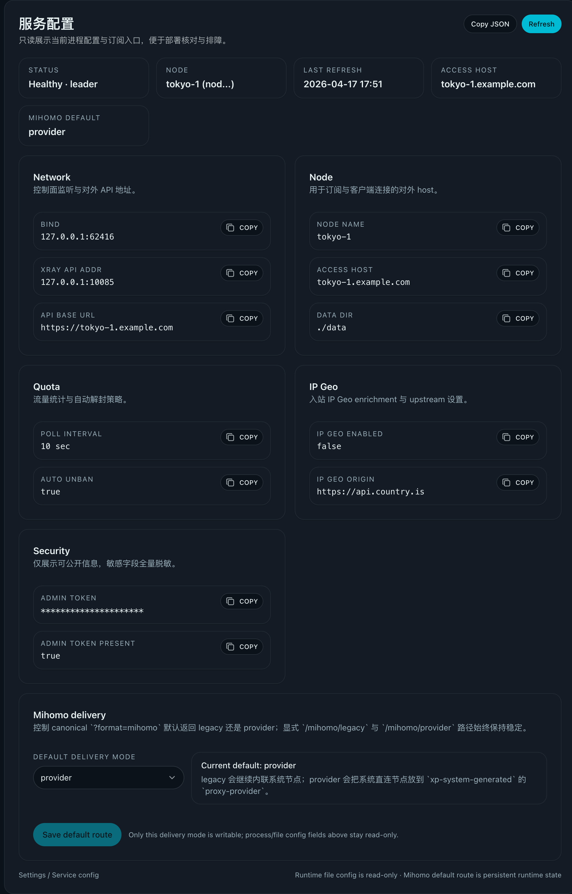
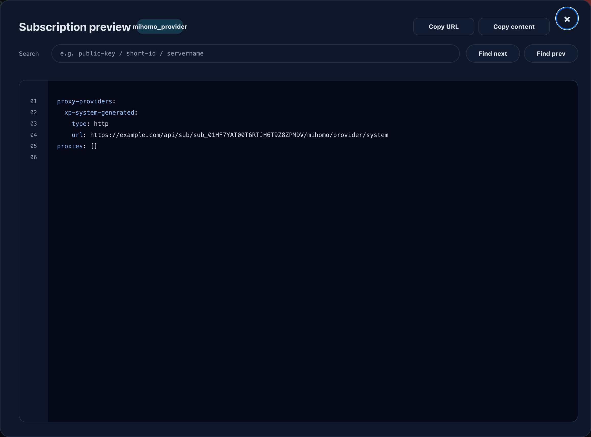

# Mihomo 双轨订阅：legacy 默认 + provider 并行（#3e4q4）

## 状态

- Status: 已完成
- Created: 2026-04-17
- Last: 2026-04-17

## 背景 / 问题陈述

- 当前 `format=mihomo` 已支持系统动态节点 + 用户 mixin，但系统节点仍直接写入最终 `proxies`，一旦项目自己的入口地址、端口或节点集合变化，就需要整体刷新主配置。
- 这对真实客户端并不友好：用户导入的是完整配置而不是独立 provider，入口池变化无法通过 Mihomo 自身的 `proxy-provider` 拉取机制独立更新。
- 同时，现网已经存在稳定工作的 legacy 方案，不能为了引入 provider 路径而破坏现有订阅、链式中转和管理员工作流。

## 目标 / 非目标

### Goals

- 保留现有 legacy Mihomo 输出为默认方案，作为零风险回退路径。
- 新增 provider 方案，并让 legacy / provider 双轨长期并行。
- 新增全局持久化设置 `mihomo_delivery_mode=legacy|provider`，默认 `legacy`。
- 保留 canonical URL `GET /api/sub/{token}?format=mihomo`，但其返回方案跟随全局设置。
- 新增显式测试/回归路径：
  - `GET /api/sub/{token}/mihomo/legacy`
  - `GET /api/sub/{token}/mihomo/provider`
  - `GET /api/sub/{token}/mihomo/provider/system`
- provider 方案采用单一系统 provider `xp-system-generated`，将系统直连节点从主配置移入 provider payload。
- 保留 `{base}-chain` 为主配置里的 glue proxy，继续复用 `dialer-proxy: 🛣️ JP/HK/TW`。
- 管理端支持切换全局默认方案；用户详情页可直接复制/预览 default / legacy / provider 三类 Mihomo URL。

### Non-goals

- 不改 `raw` / `base64` / `clash` 输出。
- 不做按用户维度的 Mihomo delivery mode。
- 不承诺 provider 路径继续兼容手写 `{base}-ss` / `{base}-reality` 业务引用。
- 不把 `{base}-chain` 也放进 provider payload。

## 范围（Scope）

### In scope

- 后端全局设置持久化、admin config GET/PATCH 扩展、双轨 Mihomo HTTP 路由。
- provider 主配置渲染、provider payload 渲染、请求 origin 解析。
- Web `Settings / Service config` 全局开关与 `User Details` 订阅 URL 双轨选择。
- Storybook / 前后端回归 / 真实 Mihomo provider 装载验证。
- 设计文档与契约文档同步。

### Out of scope

- 不扩展更多 provider 名称或多套系统 provider。
- 不替换当前 `UserMihomoProfile` 结构。
- 不把 legacy 方案降级成兼容层；它仍是完整受支持路径。

## 需求（Requirements）

### MUST

- `GET /api/sub/{token}?format=mihomo` 在 `mihomo_delivery_mode=legacy` 时继续输出当前 legacy 配置；在 `provider` 时输出 provider 主配置。
- `GET /api/sub/{token}/mihomo/legacy` 与 `GET /api/sub/{token}/mihomo/provider` 必须始终返回固定方案，与全局设置无关。
- `GET /api/sub/{token}/mihomo/provider/system` 必须返回合法 `text/yaml`，根为 `proxies:`。
- `GET /api/admin/config` 必须返回 `mihomo_delivery_mode`；`PATCH /api/admin/config` 必须允许管理员切换该值并持久化。
- provider 主配置里的系统 provider 名称固定为 `xp-system-generated`；若用户 `extra_proxy_providers_yaml` 里占用了同名 provider，服务端返回清晰错误。
- provider 主配置里的 provider `url` 必须基于请求对外 origin 生成，而不是直接复用内网 `api_base_url`。
- provider 方案中：
  - 顶层 `proxy-providers` = `xp-system-generated` + `extra_proxy_providers_yaml`
  - 顶层 `proxies` = `extra_proxies_yaml` + 系统 `{base}-chain`
  - `🛣️ JP/HK/TW`、地区组、`🛬 {base}`、`🔒 落地`、`{base}-chain` 保持可用
- provider 方案下 `🛬 {base}` 必须采用 `use + filter + proxies` 混合组：存在 SS 时保留 `{base}-chain` 并筛 `{base}-ss`；仅有 Reality 时只筛 `{base}-reality`。
- legacy 路径行为不得回归。

### SHOULD

- `PATCH /api/admin/config` 应只接受可写字段，保留其它配置只读。
- provider payload 与主配置应共享同一套系统节点生成逻辑，避免 legacy/provider 漂移。
- 前端订阅 URL 选择应显式区分 `mihomo(default)` / `mihomo(legacy)` / `mihomo(provider)`。

## 功能与行为规格（Functional/Behavior Spec）

### Core flows

- 管理员在 `Settings / Service config` 选择 Mihomo 默认方案并保存。
- 普通 Mihomo 客户端继续使用 canonical URL；其实际返回 legacy/provider 由全局设置决定。
- 回归/测试场景通过显式 legacy/provider URL 做 A/B 对照。
- provider 主配置加载后，Mihomo 自动拉取 `/mihomo/provider/system` 获取系统直连节点；链式代理仍经 `🛣️ JP/HK/TW` 做外层中转。

### Edge cases / errors

- 用户未配置 Mihomo profile 时，canonical `?format=mihomo` 与显式 legacy 路径继续回退 clash；显式 provider 路径同样回退 clash，避免输出残缺 provider 主配置；`/mihomo/provider/system` 则始终返回系统直连节点 payload，不依赖用户 mixin。
- 当 `extra_proxy_providers_yaml` 已包含 `xp-system-generated` 时，保存 profile 成功但渲染 provider 路径返回 `400 invalid_request`，提示保留名冲突。
- 当请求头无法推导外部 origin 时，provider 主配置回退到 `Config.api_base_url` 的规范化 origin。

## 接口契约（Interfaces & Contracts）

### 接口清单（Inventory）

| 接口（Name）                                  | 类型（Kind） | 范围（Scope） | 变更（Change） | 契约文档（Contract Doc） | 使用方（Consumers） |
| --------------------------------------------- | ------------ | ------------- | -------------- | ------------------------ | ------------------- |
| `GET /api/sub/{token}?format=mihomo`          | HTTP API     | external      | Changed        | ./contracts/http-apis.md | Mihomo clients      |
| `GET /api/sub/{token}/mihomo/legacy`          | HTTP API     | external      | New            | ./contracts/http-apis.md | Mihomo clients      |
| `GET /api/sub/{token}/mihomo/provider`        | HTTP API     | external      | New            | ./contracts/http-apis.md | Mihomo clients      |
| `GET /api/sub/{token}/mihomo/provider/system` | HTTP API     | external      | New            | ./contracts/http-apis.md | Mihomo clients      |
| `GET /api/admin/config`                       | HTTP API     | internal      | Changed        | ./contracts/http-apis.md | Web admin           |
| `PATCH /api/admin/config`                     | HTTP API     | internal      | New            | ./contracts/http-apis.md | Web admin           |

### 契约文档（按 Kind 拆分）

- [contracts/http-apis.md](./contracts/http-apis.md)

## 验收标准（Acceptance Criteria）

- Given 全局设置仍为 `legacy`，When 请求 `GET /api/sub/{token}?format=mihomo`，Then 返回现有 legacy 输出。
- Given 全局设置切到 `provider`，When 请求 `GET /api/sub/{token}?format=mihomo`，Then 返回 provider 主配置，且 `proxy-providers.xp-system-generated.url` 指向同一外部 origin 下的 `/api/sub/{token}/mihomo/provider/system`。
- Given 请求 `GET /api/sub/{token}/mihomo/legacy` 或 `/mihomo/provider`，When 全局设置任意切换，Then 两条显式路径始终返回固定方案。
- Given 请求 `/mihomo/provider/system`，When 返回 provider payload，Then 返回 `proxies:` YAML，且包含系统 `-reality` / `-ss` 直连节点，不依赖用户是否配置 Mihomo profile。
- Given provider 方案存在 `base-ss`，When 检查 `🛬 {base}`，Then 该组保留 `{base}-chain` 并通过 `filter` 消费 provider 中的 `{base}-ss`。
- Given provider 方案只有 `base-reality`，When 检查 `🛬 {base}`，Then 该组只通过 `filter` 消费 provider 中的 `{base}-reality`，不再引用缺失的 `{base}-chain` / `{base}-ss`。
- Given Web 管理端打开 `Settings / Service config`，When 修改 Mihomo delivery mode 并保存，Then 页面刷新后仍显示新值，且 `User Details` 可复制/预览三类 Mihomo URL。
- Given 真实 Mihomo 在共享测试环境加载显式 provider URL，When 执行 `mihomo -t` 或等价校验，Then 主配置与 provider payload 均可被成功解析。

## 实现前置条件（Definition of Ready / Preconditions）

- 双轨 URL 语义与 provider 保留名已冻结。
- provider 路径只保证系统组与链式逻辑兼容的口径已冻结。
- 全局默认开关由持久化 admin setting 控制，而不是静态环境变量。

## 非功能性验收 / 质量门槛（Quality Gates）

### Testing

- Rust unit/integration tests：覆盖 delivery mode、双轨订阅路径、provider payload、origin 解析、保留名冲突。
- Web tests：覆盖 service config 开关与 user details 三类 Mihomo URL 选择。
- Storybook：为 `ServiceConfigPage` / `UserDetailsPage` 增加双轨状态与交互覆盖。
- Shared testbox：至少一次真实 Mihomo provider 装载验证。

### Quality checks

- `cargo test`
- `cargo fmt`
- `cargo clippy -- -D warnings`
- `cd web && bun run lint`
- `cd web && bun run typecheck`
- `cd web && bun run test`
- `cd web && bun run test-storybook`

## 文档更新（Docs to Update）

- `docs/desgin/subscription.md`
- `docs/specs/README.md`
- `docs/specs/3e4q4-mihomo-provider-dual-track/contracts/http-apis.md`

## 计划资产（Plan assets）

- Directory: `docs/specs/3e4q4-mihomo-provider-dual-track/assets/`

## Visual Evidence

- source_type=storybook_canvas · target_program=mock-only · capture_scope=element
  - state: `Pages/ServiceConfigPage/SaveProviderMode`
  - evidence_note: 管理端 `Settings / Service config` 已提供全局 Mihomo delivery mode 开关，保存后展示 `provider` 为当前默认路由。
    
- source_type=storybook_canvas · target_program=mock-only · capture_scope=element
  - state: `Pages/UserDetailsPage/MihomoProviderPreview`
  - evidence_note: 用户详情页可显式预览 `mihomo(provider)`，预览内容包含 `xp-system-generated` 的系统 provider URL。
    
- Shared testbox real Mihomo validation
  - environment: `codex-testbox`
  - run_id: `20260417_104340_1b0cc8e_mihomo`
  - compose_project: `codex_xp__1f006d76_20260417_104340_1b0cc8e_mihomo`
  - result: `main.yaml` / `system.yaml` 显式 URL 均可 fetch，`/mihomo` provider 主配置执行 `/mihomo -t -f /tmp/main.yaml` 返回 `configuration file /tmp/main.yaml test is successful`。

## 实现里程碑（Milestones / Delivery checklist）

- [x] M1: follow-up spec / 设计文档 / 契约冻结双轨语义
- [x] M2: 全局 `mihomo_delivery_mode` 持久化与 admin config GET/PATCH
- [x] M3: 双轨订阅路由 + origin 解析 helper
- [x] M4: provider 主配置 / payload 渲染与 legacy 并行保持兼容
- [x] M5: Web 设置页与订阅 URL 双轨 UI + Storybook
- [x] M6: 回归测试、视觉证据、共享测试机 Mihomo 验证
- [x] M7: PR / review / merge / cleanup

## 风险 / 开放问题 / 假设（Risks, Open Questions, Assumptions）

- 风险：provider 路径若误保留 legacy `-ss` / `-reality` 组内直引，容易造成悬挂引用，需要用测试锁死。
- 风险：请求头组合在反向代理下可能非常杂，需要优先以 live 请求头为准，并保留 `api_base_url` 回退。
- 假设：项目自己的系统 provider 名称 `xp-system-generated` 当前未被现有用户配置占用；若占用，返回显式错误即可。
