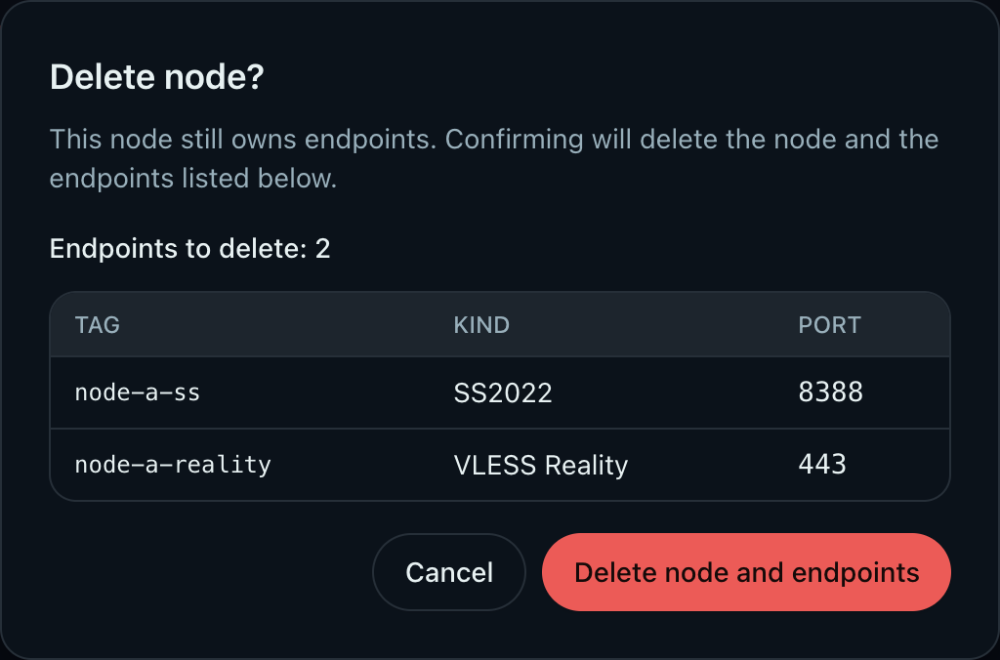

# Admin: Delete cluster node (#3hpk4)

## 状态

- Status: 已完成
- Created: 2026-02-06
- Last: 2026-05-18

## 背景 / 问题陈述

- 集群节点在反复 join、灾难恢复或误操作后，可能残留历史节点。
- 历史节点如果仍被 endpoints 引用，旧删除流程返回 `409 conflict`，需要管理员先手动定位并清理 endpoints。
- 该阻断对运维不够友好：删除节点时应能明确预览影响，并在管理员确认后自动清理该节点拥有的 endpoints。

## 目标 / 非目标

### Goals

- 提供公开管理员 API 删除节点：`DELETE /api/admin/nodes/:node_id`。
- 提供只读删除预览 API：`GET /api/admin/nodes/:node_id/delete-preview`，返回该节点下会被清理的 endpoints。
- Web UI 在 Node details Danger zone 提供删除入口，先预览受影响 endpoints，再二次确认删除。
- 删除动作从 Raft membership 与 Raft state machine nodes inventory 中移除节点。
- 显式确认清理时，同一状态机命令原子删除该节点拥有的 endpoints，并清理 endpoint probe history、memberships、node quota/weight/probe 等节点相关状态。
- 保留护栏：禁止删除当前 leader、禁止删除当前正在服务的本机节点。

### Non-goals

- 不实现 endpoint 自动迁移到其他节点。
- 不放宽本机节点、当前 leader 的删除限制。
- 不改变单独删除 endpoint 的现有 API 行为。
- 不暴露完整 Raft membership 管理面。

## 需求（Requirements）

### MUST

- `GET /api/admin/nodes/:node_id/delete-preview` 必须返回：
  - `node_id`
  - `endpoints: Array<{ endpoint_id, tag, kind, port }>`
- 删除不存在节点时，preview 与 delete 都必须返回 `404 not_found`。
- `DELETE /api/admin/nodes/:node_id` 未带确认参数且节点仍有 endpoints 时必须继续返回 `409 conflict`。
- `DELETE /api/admin/nodes/:node_id?delete_endpoints=true` 必须删除节点与该节点拥有的 endpoints。
- 确认删除后必须对被删除 endpoints 触发 remove-inbound，并触发 full reconcile。
- Web UI 必须在确认弹窗中展示将被删除的 endpoint 数量、tag、kind 与 port。

### SHOULD

- 删除确认弹窗在没有 endpoints 时保持简短危险确认。
- 删除成功后 Web UI 返回 Nodes 列表并展示成功 toast。

## 功能与行为规格（Functional/Behavior Spec）

### Core flows

- 管理员进入节点详情 Danger zone，点击 Delete node。
- 前端调用 `GET /api/admin/nodes/:node_id/delete-preview`。
- 若 preview 返回 endpoints，确认弹窗展示 endpoint 影响列表，并把确认动作升级为 `delete_endpoints=true`。
- 后端删除时先执行本机/leader 护栏与 membership removal，再通过 Raft state machine 删除 node 和 endpoints。
- 状态机完成后，HTTP 层根据删除结果触发每个 endpoint tag 的 remove-inbound 和一次 full reconcile。

### Edge cases / errors

- 未确认清理且节点仍有 endpoints：返回 `409 conflict`，节点和 endpoints 均不变。
- 确认清理但节点不存在：返回 `404 not_found`。
- 删除本机节点：返回 `400 invalid_request`，不删除 endpoints。
- 删除当前 leader：返回 `400 invalid_request`，不删除 endpoints。

## 接口契约（Interfaces & Contracts）

- `GET /api/admin/nodes/:node_id/delete-preview`
  - Response: `{ "node_id": string, "endpoints": [{ "endpoint_id": string, "tag": string, "kind": EndpointKind, "port": number }] }`
- `DELETE /api/admin/nodes/:node_id`
  - 默认行为：若仍有 endpoints，返回 `409 conflict`。
- `DELETE /api/admin/nodes/:node_id?delete_endpoints=true`
  - 确认清理行为：删除节点及其 endpoints，成功返回 `204 No Content`。

## 验收标准（Acceptance Criteria）

- Given 节点无 endpoints，When 管理员确认删除，Then API 返回 `204` 且节点不再出现在 `GET /api/admin/nodes`。
- Given 节点仍有关联 endpoints，When 调用 delete preview，Then 返回这些 endpoints 的 `endpoint_id/tag/kind/port`。
- Given 节点仍有关联 endpoints，When 未带 `delete_endpoints=true` 删除，Then 返回 `409 conflict` 且状态不变。
- Given 节点仍有关联 endpoints，When 带 `delete_endpoints=true` 删除，Then 节点和 endpoints 都从后续 admin API 响应中消失。
- Given 删除本机节点或当前 leader，When 调用 delete，Then 返回 `400 invalid_request` 且 endpoints 不被清理。
- Given Web UI preview 返回 endpoints，When 打开确认弹窗，Then 展示 endpoint 数量、tag、kind、port，并在确认后调用带 endpoint cleanup 的删除请求。

## 实现前置条件（Definition of Ready / Preconditions）

- 管理员明确选择“确认后清理”语义。
- 删除确认参数采用 `delete_endpoints=true` query 语义。
- preview 采用只读 admin API。

## 非功能性验收 / 质量门槛

- Rust HTTP/state tests 覆盖 preview、未确认冲突、确认清理、本机/leader 护栏。
- Web unit tests 覆盖 preview、取消、确认删除。
- Storybook 覆盖 NodeDetailsPage 有 endpoint cleanup 的确认态，并提供视觉证据来源。

## Visual Evidence

- Node details endpoint cleanup confirmation:
  

## 文档更新

- Canonical spec 位于本目录。
- Legacy source `docs/plan/3hpk4:admin-delete-node/PLAN.md` 暂时保留，等待单独删除确认。

## 实现里程碑（Milestones）

- [x] M1: Server 端支持 delete preview 与确认清理参数。
- [x] M2: State machine 支持确认模式下原子删除 node 和 endpoints。
- [x] M3: Web Node details 删除流展示 endpoint 影响列表。
- [x] M4: 测试、Storybook 与视觉证据同步。

## 风险与开放问题

- 删除 endpoints 会影响订阅输出与数据面 inbound；因此只能在管理员显式确认后执行。

## 假设

- 管理员在删除节点前已确认该节点不再承载应保留的服务。
