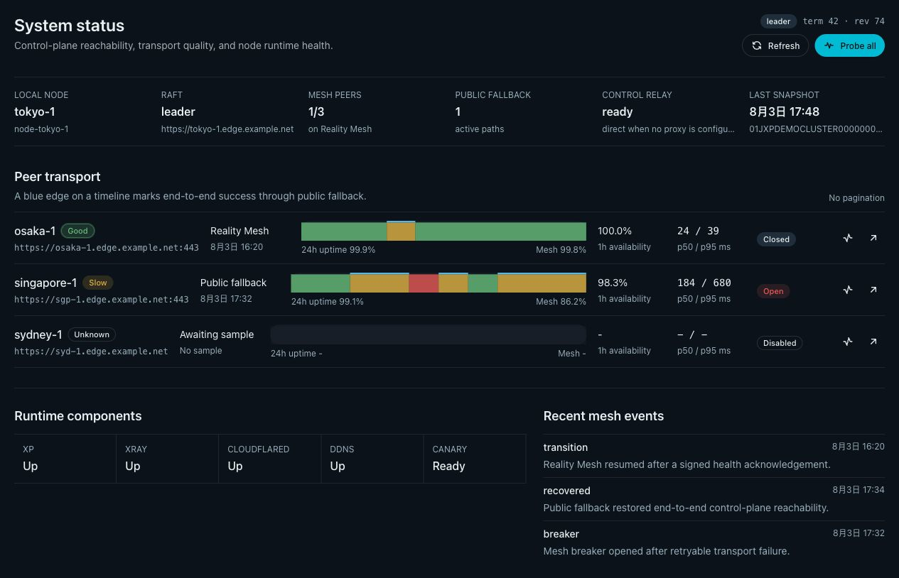
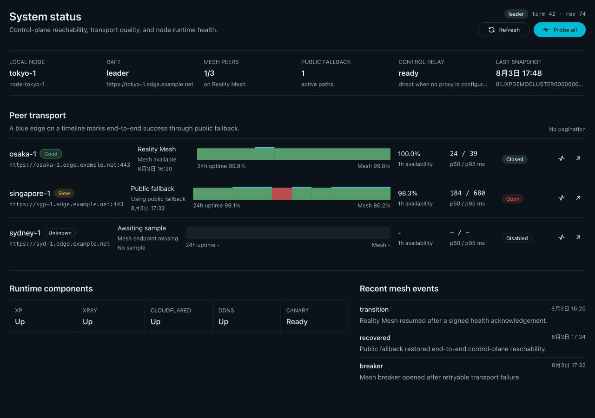

# Reality fallback 控制面 Mesh 与系统状态页（#56dtr）

> 本文是当前有效规范。
> 实现状态见 `./IMPLEMENTATION.md`，设计缘由见 `./HISTORY.md`。

## 背景

- `XP_MESH_PROXY_URL` 只是一条本机 SOCKS 出站路径。
- 控制面此前只访问 peer 的公网 `api_base_url`。
- 内部 HMAC 没有覆盖 body、时间或身份。
- 失败后的跨路径重试可能让 mutation 重复执行。
- 管理界面缺少当前节点视角的 peer 链路诊断。

## 目标

- 从唯一 managed-default VLESS-REALITY endpoint 派生 HTTPS Mesh 路径。
- 先尝试 Mesh；路径不可用时再访问 peer 的公网地址。
- 用 internal-auth v2、稳定 request ID 和 durable dedupe 保护内部调用。
- 提供本地持久遥测、管理 API 与 `/system-status`。
- 对 auth epoch 跨界升级实施维护窗口 hard cut。

## 非目标

- 不实现 VLESS protocol overlay、L3 VPN、mTLS 或每节点身份体系。
- 不改变 join、bootstrap、浏览器管理入口或用户代理流量。
- 不为响应 body 或 SSE event 单独增加 MAC。
- 不实现 nonce replay cache、强制选路、breaker reset 或自动修复。
- 不保证 50 个以上 peer 的性能。

## 范围

### In scope

- Raft RPC、leader forwarding、内部 fan-out、runtime events、alerts 与 probes。
- Reality fallback canary mux、request/ack HMAC、idempotency、breaker 与 telemetry。
- System Status 表格、SVG uptime strip、Storybook、mock-only `ui_demo` 与离线快照。
- systemd、OpenRC、single-image Docker 的 cutover guard 与回滚路径。

### Out of scope

- 对 operator supplied URL 发起探测。
- UI 强制选路、重置 breaker 或主动修复。
- 混合 auth v1/v2 的零停机滚动升级。

## 必须满足

- Mesh URL 只能由唯一 managed-default endpoint 推导。
- 无端点、多个 endpoint 或不可用的 `access_host` 时，使用 `Node.api_base_url`；已选择 Mesh
  路径后，health ack 的认证或协议无效必须拒绝，不能降级到公网。
- `XP_MESH_PROXY_URL` 仅保留公网出站 proxy-first/direct 兼容语义。
- `health-v2` 与 `mesh-v2` 使用同一个 v2 认证协议。
- canonical 覆盖版本、route、method、原始 URI、content metadata、body hash、
  cluster、sender、target、request ID 和 issued-at。
- 认证窗口为 `+/-120s`；不得引入 nonce header 或 nonce cache。
- request 与 acknowledgement key 经 HKDF-SHA256 做用途分离。
- key material 来自 parsed CA private-key DER 与 CA certificate fingerprint。
- canary 顺序固定为 `/generate_204`、health、mesh、ordinary camouflage。
- Canary 转发只把认证后的原始 path/query 组合到固定 XP loopback origin；HTTP/2
  absolute-form URI 的 origin 不得进入 loopback URL，URL client 会规范化 path/query 时必须拒绝。
- 无效 reserved route 返回普通 `404`，不得把 body 交给 camouflage upstream。
- Mesh 只允许 `/raft/*` 与 `/api/admin/_internal/*`。
- 普通 `/api/admin/*` 始终要求管理员 Bearer token。
- 普通内部 body 上限为 1 MiB；Raft/snapshot 上限为 8 MiB。

## 传输与幂等

- 每个 peer 连续三次可重试 Mesh transport 失败后打开 breaker。
- breaker 退避为 `30/60/120/240/300s`。
- half-open 只允许一次探测性 Mesh 请求。
- auth 或 protocol failure 会释放 half-open 探测槽，但不触发公网降级或改变 breaker 失败计数。
- Mesh 预算为 `min(5s, max(500ms, total/3))`；公网取得剩余预算。
- 有效 ack 的任何 HTTP status 都是权威结果，禁止降级。
- auth、protocol error 与 headers 后的流中断不得触发公网降级。
- 只读、Raft RPC 与 durable idempotency mutation 才可模糊超时后 fallback。
- 其他 mutation 必须返回 `outcome_unknown`。
- 跨 Mesh/public 的 mutation 重用同一个 `request_id`。
- `XP_MESH_PROXY_URL` 的 relay 无响应同样属于模糊结果；没有 durable 幂等保障的 mutation
  不得再直连重试。
- 本地 ledger 保留 10 分钟，最多 16,384 条，满载拒绝新请求。

## 遥测与 API

- 遥测原子保存在 `XP_DATA_DIR/mesh/telemetry.json`，不经过 Raft。
- 每个 peer 保存 24 小时的 1 分钟 buckets；本机另外保存最近 200 个全局事件。
- Mesh probe 每 60 秒；public standby 每 5 分钟。
- public standby 记录可用性样本，但不得覆盖 peer 的当前 active path 或最近切换时间。
- probe 有 jitter，最多并发四个 peer；三分钟无样本标记 stale。
- `GET /api/admin/mesh/status` 对完整状态表示计算 ETag。
- `POST /api/admin/mesh/probes` 只接受当前成员 node ID。
- status SSE 只发布合并后的 telemetry revision。
- 质量枚举固定为 good、slow、unstable、down 与 unknown。
- Mesh 失败但公网成功代表端到端成功，并单独记录 fallback。

## Web

- `/system-status` 在桌面显示无分页的全部 peer 表格。
- 每行包含当前路径、24h uptime、1h/24h availability、Mesh availability、
  p50/p95、breaker、最近切换和操作。
- 压缩 SVG strip 用填充色表示质量，用 2px 顶边表示公网 fallback。
- 移动布局按 peer 堆叠，不能隐藏 uptime strip。
- 页首显示本机、leader、term、XP、Xray、cloudflared、DDNS 与 canary 摘要。
- 离线时只展示带时间戳的持久快照，并禁用 probe。

## 升级

- 多节点跨 auth epoch 的 Web upgrade 返回 `coordinated_upgrade_required`。
- host 由已校验的目标版 `xp-ops upgrade --allow-internal-auth-v2-cutover` 执行一次性 bootstrap；
  容器由目标 image 的 `container mark-internal-auth-v2-cutover` 写入 marker。
- marker 未消费时可由容器的 `container cancel-internal-auth-v2-cutover` 取消。
- 新 binary 在多节点且没有 marker 时拒绝启动，交给现有升级路径回滚。
- marker 消费后持久化 epoch；此后拒绝 v1 回滚，同 epoch 的 Web upgrade 再次可用。
- 若 marker 已被新进程消费，随后重启或 runtime reconcile 失败都只保留 v2 XP；绝不恢复旧 v1
  XP binary。

## 契约

- [internal-auth v2](./contracts/internal-auth-v2.md)
- [Mesh status API](./contracts/mesh-status-api.md)

## 验收

- body、method、URI、member、target、时间窗、v1 与未认证 Raft 均被拒绝。
- 已执行但响应丢失的 mutation 复用 request ID，只返回第一次结果。
- breaker、预算、ack、降级规则、header 清洗、SSRF/self-loop 与 body limit 有测试。
- 真实流量和主动 probe 均更新本地 telemetry。
- Web 覆盖 healthy、fallback、slow、down、stale、empty、partial 与 50 peers。
- 后端通过 fmt、clippy 和 test；前端通过 lint、typecheck、Vitest、
  Storybook、Playwright 与 style budget。

## Visual Evidence

- Source: mock-only, login-free `/ui-demo/system-status`.
- Bound implementation commit: `721c0a6a1d4e1cd2c6f4ff20e6a067802766058a`.
- Capture metadata: `source_type=ui_demo`, `target_program=mock-only`,
  `capture_scope=browser-viewport`, `requested_viewports=1280x720,393x852`,
  `rendered_assets=1265x712,393x852`, `sensitive_exclusion=N/A`,
  `submission_gate=approved`.

PR: include

PR: include

- Whitespace normalization: no meaningful surrounding whitespace was present.

Latest capability/reason diagnostics and unified row actions:

- Source: mock-only, login-free `/ui-demo/system-status`.
- Evidence implementation commit: `b1f932e2b31035f8852ea03d3147c887616775b4`.
- Capture metadata: `source_type=ui_demo`, `target_program=mock-only`,
  `capture_scope=browser-viewport`, `requested_viewports=1280x900,393x852`,
  `rendered_assets=1280x900,393x852`, `sensitive_exclusion=N/A`,
  `submission_gate=approved`.
- The desktop peer rows show equal `32x32` Probe and details controls; the mobile
  capture keeps the existing text actions and shows short Mesh reasons.

PR: include

PR: include

## 参考

- `docs/specs/nbs5f-xray-control-plane-relay/SPEC.md`
- `docs/solutions/ops/reality-dest-sni-separation.md`
- `docs/solutions/web/pwa-offline-admin-shell.md`
- `docs/solutions/ops/reality-fallback-control-plane-mesh.md`
