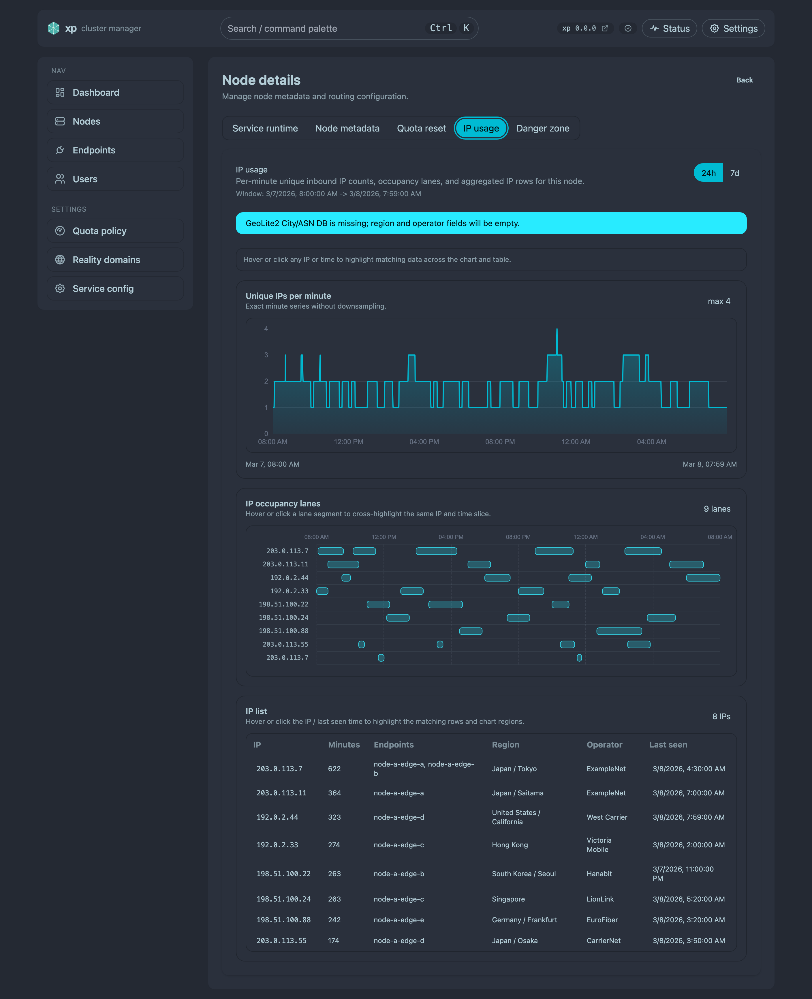
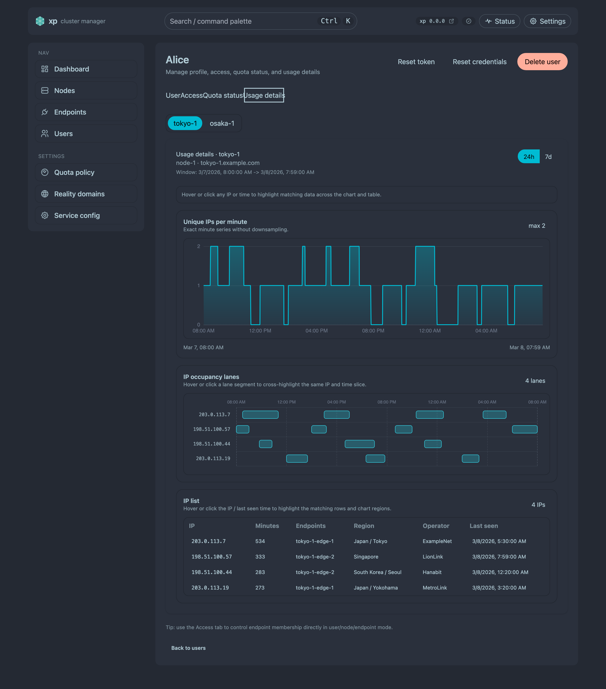

# 节点 / 用户入站 IP 使用详情（#6e7e4）

## 状态

- Status: 已完成
- Created: 2026-03-08
- Last: 2026-03-11

## 背景 / 问题陈述

- 当前管理端只能看到节点运行态、端点探测与用户配额状态，看不到“谁在什么时间段从哪些来源 IP 占用入站”。
- 节点详情与用户详情都缺少 source IP 维度的使用画像，排查共享账号、多地并发、异常占用时只能靠外部日志。
- 现有本地历史能力只有 `service_runtime.json`（7d/30min）与 `endpoint_probe_history`（24h/hour），没有 1 分钟粒度的 per-IP 历史。

## 目标 / 非目标

### Goals

- 在每个节点本地记录 membership 级别的 source IP 分钟 presence，保留最近 7 天。
- 在节点详情新增 `IP usage` tab，支持最近 `24h` / `7d` 的 unique-IP 趋势、IP 占用时间线与 IP 列表。
- 在用户详情新增 `Usage details` tab，以节点 tabs 切换展示最近 `24h` / `7d` 的同类信息。
- 通过 Xray 官方 `statsUserOnline` + `GetStatsOnlineIpList` 做每分钟在线快照，不解析 access log。
- 使用 `country.is` Hosted API 解析地区与运营商信息，并对首次出现的公网 IP 做持久化缓存。

### Non-goals

- 不实现 access log 解析、历史回填或更细粒度秒级采样。
- 不恢复本地 MMDB/Geo DB 管理面；图表渲染改为使用 ECharts，本规格不再约束“不得新增图表库”。
- 不新增跨节点混合总览页，也不做 usage SSE/live streaming。

## 范围（Scope）

### In scope

- Backend：Xray online IP 采集、本地持久化 `inbound_ip_usage.json`、Geo 解析缓存、node/user usage admin APIs、internal local fan-out APIs、删除/快照安装清理逻辑。
- Frontend：NodeDetailsPage 新增 `IP usage` tab；UserDetailsPage 新增按节点 tabs 切换的 `Usage details` tab；24h/7d 切换、ECharts 面积折线图、泳道时间图、IP 列表、warning/empty/error 空态，以及图表/列表跨视图高亮联动。
- Ops / config：不再提供专用 Geo env；节点只需能访问 `https://api.country.is/`，并在 Xray 静态配置中开启 `statsUserOnline=true`。
- Docs：规格、HTTP API、文件格式、CLI/env、设计文档同步。

### Out of scope

- access log/会话日志采集。
- 外部依赖服务（Geo API、对象存储、TSDB）。
- 自动迁移旧历史数据。

## 需求（Requirements）

### MUST

- 节点本地必须保留最近 7 天（10080 分钟）的 membership source IP presence 历史。
- 采集口径固定为每分钟在线快照：每分钟最多采一次 `GetStatsOnlineIpList("user>>>m:{membership_key}>>>online")`。
- 新增 `GET /api/admin/nodes/{node_id}/ip-usage?window=24h|7d`。
- 新增 `GET /api/admin/users/{user_id}/ip-usage?window=24h|7d`。
- 新增 internal local APIs：
  - `GET /api/admin/_internal/nodes/ip-usage/local?window=24h|7d`
  - `GET /api/admin/_internal/users/{user_id}/ip-usage/local?window=24h|7d`
- 节点详情 unique-IP 图必须按“节点内所有 membership 去重后的每分钟不同 IP 数”计算。
- 用户详情必须按节点 tabs 切换展示；每个节点视图内的 unique-IP 图按“该用户在该节点所有 membership 去重后的每分钟不同 IP 数”计算。
- 用户详情在切换 `24h` / `7d` 窗口时，必须保持当前选中的节点 tab，不得重置到首个节点。
- unique-IP 面积图、泳道图与 IP 列表必须共享 IP / 时间高亮状态；hover 或 click 任一 IP/时间后，其余视图同步高亮对应数据。
- 占用时间图必须按 `endpoint_tag / IP` 输出已合并的连续时间段。
- IP 列表必须返回 `ip`、`minutes`、`endpoint_tags`、`region`、`operator`、`last_seen_at`，并按 `minutes desc` 排序。
- 首次见到新公网 IP 时必须尝试调用 `country.is` Hosted API 补全地区与运营商，并将结果持久化缓存到 `inbound_ip_usage.json`；调用失败时不阻断采集/API。
- 当 Xray online stats 不可用时，collector/API 必须返回 warning，不得把它误判为“当前没有在线 IP”。
- membership / user / endpoint 删除，以及 snapshot install 后，必须清理对应 stale IP 历史。

### SHOULD

- 分钟 presence 存储应使用紧凑位图/压缩字节，避免全量分钟 JSON 展开。
- Node API 的远端访问失败应返回明确错误；User API 的跨节点聚合应返回 `partial` 与 `unreachable_nodes`。
- 默认只展示占用分钟数最高的前 20 条时间线泳道，避免节点上多 endpoint 时页面过载。

### COULD

- None.

## 功能与行为规格（Functional/Behavior Spec）

### Core flows

- quota worker 在常规流量采样循环中枚举 active memberships；若 UTC 分钟未变化，仅更新字节使用量，不重复抓 online IP。
- 当分钟发生变化时，worker 对每个 membership 调用 Xray online IP stats，记录当前在线 IP 到该分钟位图，并更新每个 IP 的 `last_seen_at` 与 Geo 缓存。
- 管理员打开节点详情 `IP usage` tab：前端请求 node usage API，渲染范围切换器、unique-IP 面积图、泳道图、IP 列表。
- 管理员打开用户详情 `Usage details` tab：前端请求 user usage API，以节点 tabs 切换渲染同样三块内容，并在窗口切换后保持当前选中的节点。
- 查询远端节点详情时，leader/follower 通过 internal signature 调用远端 local node usage API。
- 查询用户详情时，本地节点先返回 local user usage，再 fan-out 其余节点的 internal local user usage API，并聚合为按节点分组结果。

### Edge cases / errors

- `statsUserOnline` 未开启或 Xray 不支持 online IP stats：collector 标记 `online_stats_unavailable=true`，API 返回 warning，前端显示 explanation 空态。
- 单 IP 在线查询失败时：地区/运营商字段允许为空，页面显示 `Unknown`；采集与图表继续工作。
- Node 详情查询远端节点失败：直接返回错误，不静默回空结果。
- User 详情查询远端节点失败：返回 `partial=true` 且列出 `unreachable_nodes`，可达节点数据仍正常展示。
- 两次采样之间出现并断开的极短连接不会被回填；这是固定采样语义的一部分。

## 接口契约（Interfaces & Contracts）

### 接口清单（Inventory）

| 接口（Name）             | 类型（Kind） | 范围（Scope） | 变更（Change） | 契约文档（Contract Doc）    | 负责人（Owner） | 使用方（Consumers） | 备注（Notes）                    |
| ------------------------ | ------------ | ------------- | -------------- | --------------------------- | --------------- | ------------------- | -------------------------------- |
| Node IP usage admin APIs | HTTP API     | internal      | New            | ./contracts/http-apis.md    | backend         | web/admin           | 节点详情与 local internal detail |
| User IP usage admin APIs | HTTP API     | internal      | New            | ./contracts/http-apis.md    | backend         | web/admin           | 用户详情按节点分组聚合           |
| inbound_ip_usage.json    | File format  | internal      | New            | ./contracts/file-formats.md | backend         | backend             | 本地高频历史与 Geo 缓存          |
| IP usage config/env      | CLI          | internal      | Modify         | ./contracts/cli.md          | backend/ops     | xp/xp-ops/operators | Hosted API，无额外 Geo 配置      |

### 契约文档（按 Kind 拆分）

- [contracts/README.md](./contracts/README.md)
- [contracts/http-apis.md](./contracts/http-apis.md)
- [contracts/file-formats.md](./contracts/file-formats.md)
- [contracts/cli.md](./contracts/cli.md)

## 验收标准（Acceptance Criteria）

- Given 某个 membership 在最近 7 天内持续有在线 IP，When quota worker 每分钟推进，Then `inbound_ip_usage.json` 仅保留最近 10080 个分钟位且旧窗口外数据被裁掉。
- Given 节点详情打开 `IP usage` tab，When 选择 `24h` 或 `7d`，Then 页面显示对应窗口的 unique-IP 面积图、`endpoint_tag / IP` 泳道图与 IP 列表。
- Given 某节点下同一 IP 同时占用多个 endpoint，When 渲染泳道图，Then 行维度按 `endpoint_tag / IP` 区分，连续分钟先合并为时间段。
- Given 用户详情打开 `Usage details` tab，When 选择任一窗口，Then 页面以节点 tabs 展示该用户的 unique-IP 图、时间线与列表，且切换窗口后保持当前节点 tab 不变。
- Given 管理员在面积图、泳道图或 IP 列表中 hover / click 任一 IP 或时间位置，When 交互触发，Then 其余视图同步高亮对应的 IP / 时间数据。
- Given 远端节点不可达，When 请求用户 usage API，Then 返回 `partial=true` 且 `unreachable_nodes` 包含对应 `node_id`，可达节点数据仍返回。
- Given Xray 未开启 `statsUserOnline`，When collector 运行或页面加载，Then 返回 warning，而不是把图表展示成正常的全零无数据。
- Given 某些 IP 尚未拿到 Geo 结果，When 页面渲染 IP 列表，Then `region/operator` 显示 `Unknown`，但不阻断图表与列表展示。
- Given user / endpoint / membership 已删除或安装新 snapshot，When cleanup 运行后再次查询，Then 不再返回对应 stale IP 历史。

## 实现前置条件（Definition of Ready / Preconditions）

- 采集语义已冻结为 `statsUserOnline` 每分钟快照。
- 公开 API 的时间窗口仅允许 `24h` / `7d`，且 UTC 分钟起点口径已冻结。
- 用户详情按节点 tabs 切换的展示语义已冻结。
- Geo 数据源为 `country.is` Hosted API（通过 `XP_IP_GEO_ENABLED` 开关启用；关闭时 `geo_source=missing`）。

## 非功能性验收 / 质量门槛（Quality Gates）

### Testing

- Unit tests: 位图窗口推进、minute 去重、timeline segment 合并、Geo fallback、cleanup。
- Integration tests: node/user usage APIs、internal fan-out、partial/warning 语义。
- E2E tests (if applicable): node/user 详情 tab 基础交互 smoke。

### UI / Storybook (if applicable)

- Stories to add/update: `NodeDetailsPage`、`UserDetailsPage` usage 场景。
- Visual regression baseline changes (if any): usage tab 的 charts/list states。

### Quality checks

- Backend: `cargo fmt` / `cargo clippy -- -D warnings` / `cargo test`
- Web: `cd web && bun run lint && bun run typecheck && bun run test`
- Storybook: `cd web && bun run test-storybook`

## 文档更新（Docs to Update）

- `docs/desgin/api.md`: 新增 node/user IP usage APIs。
- `docs/desgin/xray.md`: 增加 `statsUserOnline` 要求与采集限制说明。
- `docs/ops/README.md`: 说明 `country.is` Hosted API 前置条件与无本地 Geo DB 要求。
- `docs/ops/env/xp.env.example`: 不再出现 Geo DB override 示例。

## 计划资产（Plan assets）

- Directory: `docs/specs/6e7e4-node-user-inbound-ip-usage/assets/`
- In-plan references: None.
- PR visual evidence source: maintain `## Visual Evidence (PR)` in this spec when PR screenshots are needed.

## Visual Evidence (PR)

- source_type: `storybook_canvas`
  target_program: `mock-only`
  capture_scope: `element`
  sensitive_exclusion: `N/A`
  submission_gate: `approved-by-owner`
  story_id_or_title: `Pages/NodeDetailsPage/IpUsageTab`
  state: `default (24h)`
  evidence_note: 验证节点详情 `IP usage` tab 的 unique-IP 面积图、占用泳道与 IP 列表在同一视图内完整出现。
  image:
  

- source_type: `storybook_canvas`
  target_program: `mock-only`
  capture_scope: `element`
  sensitive_exclusion: `N/A`
  submission_gate: `approved-by-owner`
  story_id_or_title: `Pages/UserDetailsPage/UsageDetailsTab`
  state: `default (24h)`
  evidence_note: 验证用户详情 `Usage details` tab 以节点切换 tabs 呈现，并展示对应节点的图表与 IP 列表。
  image:
  

## 资产晋升（Asset promotion）

None.

## 实现里程碑（Milestones / Delivery checklist）

- [x] M1: 本地 IP usage 采集/存储/cleanup 与 Xray online stats 接入
- [x] M2: Node/User usage admin/internal APIs、Geo 解析与 warning/partial 语义
- [x] M3: NodeDetailsPage / UserDetailsPage usage 视图、API client、Storybook/Vitest 与文档同步
- [x] M4: 快车道收敛（提交 / PR / checks / review-loop）并回写最终状态

## 方案概述（Approach, high-level）

- 复用 quota worker 的 membership 枚举与 Xray client，避免引入第二个高频调度器。
- 使用本地 `inbound_ip_usage.json` 做单节点高频存储，不进入 Raft；跨节点展示通过现有 internal signature fan-out 聚合。
- 前端改为使用 ECharts 渲染面积图与泳道图，并保留现有 DaisyUI/Tailwind 布局语义。
- Geo 解析只在首次见 IP 时写缓存，API 读缓存优先，避免在请求路径反复查库。

## 风险 / 开放问题 / 假设（Risks, Open Questions, Assumptions）

- 风险：每分钟对全部 active memberships 调用 online IP stats，在 membership 数量很大时会放大 Xray API 压力。
- 风险：两次采样之间的短连接不会出现在历史中，需在文档与 UI 说明中明确。
- 风险：整文件 JSON 持久化会有写放大，必须通过紧凑位图与最小字段集控制文件体积。
- 需要决策的问题：None.
- 假设（需主人确认）：现网节点允许通过重启/升级切换到包含 `statsUserOnline=true` 的 Xray 配置。

## 变更记录（Change log）

- 2026-03-08: 创建规格并冻结采集口径、窗口策略、API/UI 语义与 Geo 数据源。
- 2026-03-08: 根据当前实现回写 M1-M3 进度，并同步 API / Xray / ops 文档与运维示例。
- 2026-03-09: 完成 fast-track 收敛，补齐 Storybook 回归修复、用户节点 tab 切窗保持选中、IP/时间跨视图高亮联动、PR 截图引用、CI 全绿与最终状态回写。
- 2026-03-11: PR #110 跟进修正 IP usage 顶部高亮摘要 badge 的对比度与边界，让深色面板上的 pinned IP / Time 标签不再发虚，并在 review 后统一补正 light/dark 主题下的 IP badge 前景色与组件级样式回归测试。

## 参考（References）

- `src/quota.rs`
- `src/http/mod.rs`
- `src/state.rs`
- `src/node_runtime.rs`
- `web/src/views/NodeDetailsPage.tsx`
- `web/src/views/UserDetailsPage.tsx`
