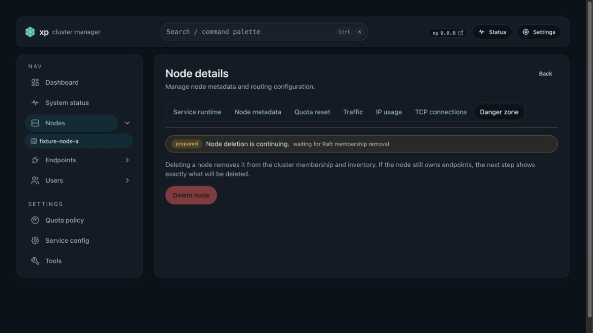
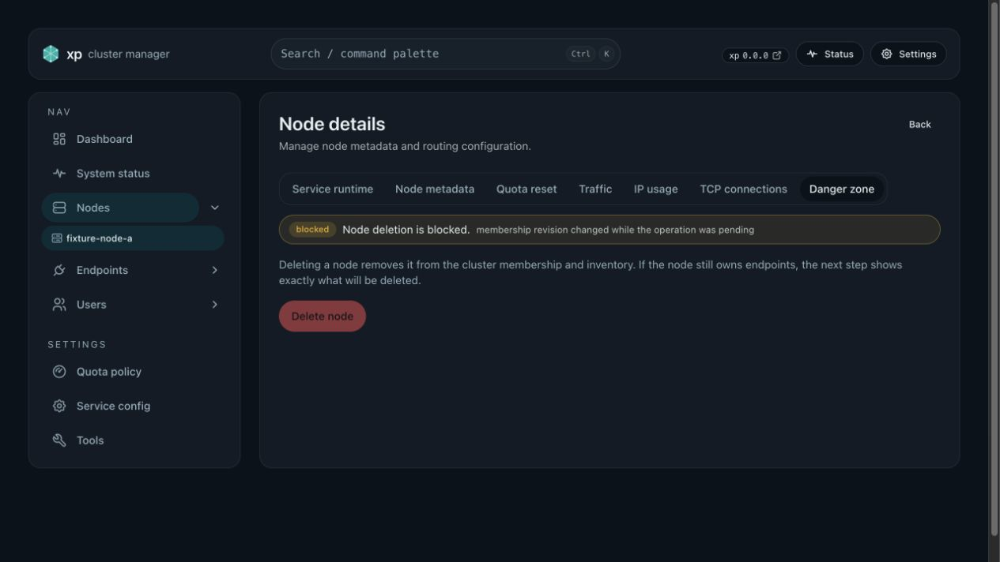

# Raft membership lifecycle invariant (#7mvqp)

## Background

An earlier guard treated every member outside `voter_ids` as a stable voter candidate and called
`add_voters`. That classification was invalid: OpenRaft has exactly three relevant roles,
`voter`, `learner`, and `absent`. A learner is a transient replication state, not a fourth
"non-voter" role that can safely be promoted by a timer. The old guard could turn stale member
metadata into an orphan voter without a DesiredState Node mapping.

## Goals

- Persist one auditable membership operation at a time for join, restore, node removal, and orphan
  voter repair.
- Check a quorum-backed, linearizable membership view before a lifecycle write.
- Preserve a strict mapping from every voter to exactly one DesiredState Node.
- Permit learner promotion only while the recorded join or restore operation owns the exact target
  transition.
- Make every abnormal member shape visible. Keep clean-membership gates for operations that can
  remove or recover an existing member, while allowing an unrelated fresh learner registration to
  proceed; never infer a promotion, deletion, rollback, or disk rewrite from a periodic scan.
- Permit one exact, leader-local orphan voter repair after dry-run fingerprint confirmation.
- Permit one exact, leader-local eviction of an unreachable DesiredState-mapped voter after
  dry-run fingerprint and endpoint-cleanup confirmation.
- Permit one exact, leader-local recovery of a DesiredState-mapped stale learner through the
  ordinary durable Restore lifecycle.

## Related ADRs

- [0003-unreachable-mapped-voter-eviction](../../adr/0003-unreachable-mapped-voter-eviction.md)
- [0006-stale-learner-recovery](../../adr/0006-stale-learner-recovery.md)
- [0010-fresh-join-admission](../../adr/0010-fresh-join-admission.md)

## Roles and invariants

- `voter`: Raft voting member with a DesiredState Node mapping; valid in steady state.
- `learner`: replication-only member. A normal learner is owned by the exact active Join or Restore
  operation that is bringing it in; a learner without that owner is an incident, never steady.
- `absent`: no Raft membership identity; valid for deleted and repaired targets.
- `stale learner`: a DesiredState-mapped learner without an owning active operation; an incident
  shape that requires explicit recovery rather than a periodic promotion. Its presence is reported
  but does not block an unrelated fresh join.

- Every voter maps to one DesiredState Node. A voter without that mapping is an orphan voter.
- A learner is eligible for automatic promotion only when it is the exact target of the active
  operation during its recorded learner phase. An unexpected learner remains observable incident
  state and is not a promotion or deletion signal.
- A DesiredState Node without a Raft member is valid only for the target of a recorded removal
  after membership has become absent.
- Operations advance monotonically through `prepared`, learner/voter/removal phases, and a terminal
  `completed`, `blocked`, or `expired` state. Terminal records include evidence and are retained for
  24 hours. A second non-terminal operation is rejected.
- The membership revision is a SHA-256 fingerprint of the linearizable membership log identity,
  voters, and node metadata. It is an opaque compare-and-swap value, not a user-editable setting.

## Lifecycle contract

- A fresh join passes `cluster.membership-lifecycle-v1` on every current voter before the first
  lifecycle command. Its dedicated admission gate requires a quorum-backed linearizable leader
  view, a non-joint membership configuration, an absent target in both Raft membership and
  DesiredState, no active membership operation, and valid voter/DesiredState mappings. It ignores
  `unexpected_learners` belonging to other identities for this admission only. It then records Join
  intent, registers the learner, waits for the durable log index of that exact target, promotes only
  that recorded learner, and terminally records completion.
- Delete records its endpoint snapshot and RemoveNode intent, requires the mapped target to be a
  voter, uses `RemoveVoters(..., false)`, verifies `absent`, and only then deletes DesiredState
  Node/endpoints. It never performs a compensating re-add on an unknown result.
- The periodic worker only audits invariants, prunes terminal records after their retention period,
  and resumes a recorded RemoveNode or Restore operation. The Join coordinator advances only a
  matching recorded Join operation. None of them calls `add_voters` for an unknown session, deletes
  an unknown member, or uses a speculative rollback.
- Any retained DesiredState-mapped voter lacking `cluster.membership-lifecycle-v1` freezes fresh
  join, delete, restore, and repair lifecycle writes with `coordinated_upgrade_required`.
  A voter with an eligible Mesh endpoint verifies that capability only through signed Mesh
  transport. A voter without an eligible Mesh endpoint verifies through its registered
  control-plane origin using the same signed `mesh-v2` request and acknowledgement; it remains
  unavailable until that signed origin responds. A Mesh-capable voter never falls back to that
  origin after a Mesh failure. The legacy public capability endpoint is a predecessor-only fallback
  after the signed route returns an unacknowledged `404`; public API availability is not a separate
  lifecycle prerequisite for current peers.
  Upgrade one voter at a time while retaining serving quorum. After that barrier, a replayable
  legacy JoinSession converts to a Join operation; malformed legacy material records a terminal
  Blocked operation. New binaries do not fall back to the old auto-promotion behavior.
- When migration finds a legacy `Reserved` JoinSession whose activation deadline has expired while
  its exact target is still a non-voter learner, it atomically marks that session `Expired` through
  the existing additive `UpsertNode` command. It retains the DesiredState Node and learner, creates
  no cleanup membership operation, and issues no `RemoveNodes`; explicit stale-learner recovery
  remains a separate operator decision. Expiry of a recorded active Join operation keeps its
  existing owned-learner cleanup contract.

## Stale learner recovery

- This is an operator-only exception for one existing learner with one exact DesiredState Node
  mapping. It has no Admin Web action and is not a periodic repair.
- Run only against the current leader's local API endpoint:

```bash
sudo xp-ops xp restore-stale-learner --api-base-url http://127.0.0.1:62416 --node-id <node-id>
sudo xp-ops xp restore-stale-learner --api-base-url http://127.0.0.1:62416 --node-id <node-id> \
  --apply --expected-membership <fingerprint>
```

- The dry-run writes nothing and returns the exact target and membership fingerprint. Apply
  requires that fingerprint and writes one `Restore` operation only after rechecking the same
  linearizable membership view.
- The target must be the unique unexpected learner; every other audit category must be empty. It
  must be a current non-voter member whose Raft name, API URL, and raft endpoint exactly match its
  DesiredState Node. The current leader, joint consensus, an active operation, an unknown node,
  metadata drift, multiple learners, or a pending JoinSession for another node reject the request.
- A target JoinSession in `learner_registered` is consumed atomically with Restore intent so its
  stale coordinator state cannot keep reporting an unowned join. A `reserved` target session is
  not adopted because it has not proved learner ownership.
- Every current voter must pass the existing signed lifecycle-capability barrier. The learner is
  not a retained voter and is not excluded from a capability check. Apply creates no endpoint,
  user, or public listener and makes no raw Raft or snapshot edit.
- The existing Restore resumer observes the existing learner, writes `learner_registered`, waits
  for its required log index for at most 30 seconds per attempt, promotes it, then writes
  `voter_promoted` and `completed`. A changed membership revision, learner loss, or failed
  precondition remains a terminal blocked operation; Direct/Public service and the existing voters
  remain available.

## Unreachable mapped voter eviction

- This is an operator-only exception for one exact voter that still has a DesiredState Node
  mapping but cannot complete its required signed capability probe. It has no Admin Web action and
  is not a periodic repair.
- Run only against the local current leader:

```bash
sudo xp-ops xp evict-unreachable-voter --api-base-url http://127.0.0.1:62416 --node-id <node-id>
sudo xp-ops xp evict-unreachable-voter --api-base-url http://127.0.0.1:62416 --node-id <node-id> \
  --apply --expected-membership <fingerprint> --delete-endpoints \
  --expected-endpoint-ids <id,id>
```

- The dry-run writes nothing and returns the exact target, endpoint snapshot, and membership
  fingerprint. Apply requires that fingerprint, an explicit endpoint-cleanup confirmation, and the
  exact endpoint ID set; an empty endpoint set omits `--expected-endpoint-ids`.
- Before either result is accepted, the service rechecks signed internal authentication, local
  leader ownership, linearizability, a non-joint configuration, no active operation, a clean
  membership invariant, a non-leader current-voter target, its exact DesiredState mapping, and no
  pending join session. Apply rechecks the fingerprint and endpoint set before recording intent.
- Only after that exact target is proven does the lifecycle capability barrier exclude it. Every
  retained DesiredState-mapped voter must still verify `cluster.membership-lifecycle-v1` through
  its required signed control-plane path. A retained-voter failure remains terminal; raw Raft
  edits, bulk repair, and `recover-single-node` are not fallback paths.
- Apply records the ordinary durable `RemoveNode` operation. The existing recovery sequence uses
  `RemoveVoters(..., false)`, proves absence, atomically deletes the confirmed node/endpoints, and
  queues inbound, history, and full-reconcile cleanup. It does not re-add the target after an
  unknown result. The resumer acts only on its current local leader; if the target becomes that
  leader before removal, it records terminal Blocked evidence and makes no membership change.

## Orphan voter repair

- Run only on the current leader's local API endpoint:

```bash
sudo xp-ops xp repair-orphan-voter --api-base-url http://127.0.0.1:62416 --raft-node-id <id>
sudo xp-ops xp repair-orphan-voter --api-base-url http://127.0.0.1:62416 --raft-node-id <id> \
  --apply --expected-membership <fingerprint>
```

- The first command is dry-run and writes nothing. Apply requires the exact returned fingerprint.
- The service rechecks signed internal authentication, leader ownership, linearizability, no joint
  configuration, no active operation, the target not being leader, no DesiredState mapping or
  pending join session, and the target being the unique orphan voter.
- The dry-run establishes the unique orphan before the capability barrier excludes that exact
  target. Its advertised public API URL is not a repair prerequisite. Every retained mapped voter
  verifies the lifecycle capability through its required signed control-plane path. Mesh-capable
  voters use Mesh exclusively; a voter without an eligible Mesh endpoint uses its registered
  signed control-plane origin. Only a predecessor's unacknowledged `404` for the signed Mesh route
  uses the legacy public `/api/capabilities`. Other missing or invalid acknowledgements remain
  terminal. Both responses share one probe budget, and each body is limited to 64 KiB.
- Apply issues only `RemoveVoters({target}, false)` and verifies `absent`. It does not edit Nodes,
  endpoints, users, traffic configuration, or Raft files. A failed or mismatched precondition is a
  blocked incident, not an automated recovery signal.

## Interfaces

- `POST /api/admin/_internal/raft/repair-orphan-voter` accepts signed internal-auth requests.
  Dry-run returns `{ dry_run, raft_node_id, expected_membership }`; apply also requires
  `expected_membership` and returns the operation record.
- `POST /api/admin/_internal/raft/evict-unreachable-voter` accepts signed internal-auth requests.
  Dry-run returns `{ dry_run, node_id, raft_node_id, expected_membership, endpoints }`; apply also
  requires `delete_endpoints=true`, the exact `expected_endpoint_ids`, and returns the durable
  RemoveNode operation.
- `POST /api/admin/_internal/raft/restore-stale-learner` accepts signed internal-auth requests.
  Dry-run returns `{ dry_run, node_id, raft_node_id, expected_membership }`; apply requires
  `expected_membership` and returns the durable Restore operation.
- `GET /api/admin/membership-operations/{operation_id}` is read-only admin status.
- `xp-ops xp membership-operation status --api-base-url <local-url> --operation-id <uuid>` reads
  that status through local signed internal authentication.
- Generic internal `client-write` rejects membership-operation commands. The Admin Web has no
  repair action.

## Acceptance

- Unknown learners are never automatically promoted.
- A fresh join succeeds after the voter capability barrier when an unrelated stale learner is
  present; the stale learner, its DesiredState Node, and its terminalized legacy session remain
  unchanged except for the session's `Expired` status, and no catch-up, promotion, or removal is
  issued for that learner.
- Dry-run repair performs zero writes; a stale fingerprint, leader target, joint membership, active
  operation, mapping conflict, or multiple orphan voters is rejected.
- An unreachable public URL on the proven orphan does not block repair when retained mapped voters
  verify the capability through Mesh; unavailable retained voters remain a coordinated-upgrade
  blocker.
- An unreachable mapped voter is evicted only after a zero-write preview; a leader, learner,
  unmapped target, stale fingerprint, changed endpoint set, joint configuration, active operation,
  or unavailable retained voter leaves membership and DesiredState unchanged.
- A stale learner is recovered only after a zero-write preview proves it is the one unexpected
  learner. A stale fingerprint, voter or absent target, metadata mismatch, joint membership,
  active operation, another abnormal membership shape, or unresolved voter capability leaves
  membership and DesiredState unchanged.
- A successful stale learner recovery consumes a matching learner-registered JoinSession, reaches
  a voter-only membership view, and leaves no active operation. An unreachable learner must time
  out without unbounded retries or a speculative promotion.
- Delete returns `204` when completed within five seconds; otherwise it returns `202` with an
  operation id and status URL. The Web resumes polling the same operation after refresh and only
  refreshes inventory after a terminal completion.

## Visual Evidence

- source_type: `storybook_canvas`
  target_program: `mock-only`
  capture_scope: `browser-viewport`
  requested_viewport: `none`
  viewport_strategy: `storybook-viewport`
  margin_policy: `trim_only`
  evidence_surface: `page`
  sensitive_exclusion: `N/A; synthetic Storybook fixture only`
  submission_gate: `pending-owner-approval`
  story_id_or_title: `Pages/NodeDetailsPage/DeletePending`
  state: `prepared`
  evidence_note: `202 delete operation remains visible and disables duplicate deletion.`



- source_type: `storybook_canvas`
  target_program: `mock-only`
  capture_scope: `browser-viewport`
  requested_viewport: `none`
  viewport_strategy: `storybook-viewport`
  margin_policy: `trim_only`
  evidence_surface: `page`
  sensitive_exclusion: `N/A; synthetic Storybook fixture only`
  submission_gate: `pending-owner-approval`
  story_id_or_title: `Pages/NodeDetailsPage/DeleteBlocked`
  state: `blocked`
  evidence_note: `A blocked delete exposes membership evidence; destructive retry stays disabled.`


