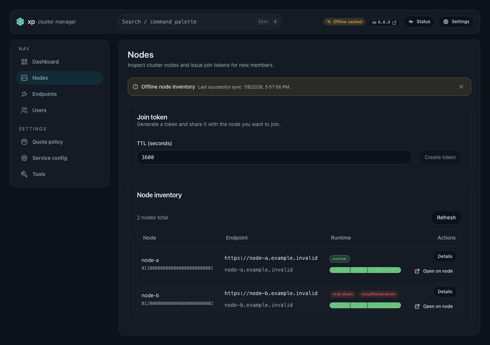
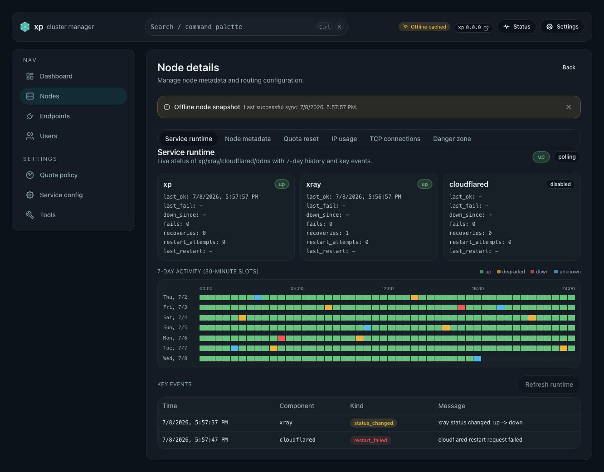

# Web PWA 化与离线状态控制台（#7qj3h）

## 状态

- Status: 已完成
- Created: 2026-07-08
- Last: 2026-07-08

## 背景 / 问题陈述

- 现有 Web 只有 `site.webmanifest` 静态文件，`display` 仍为 `browser`，没有 Service Worker 注册，也没有前端静态资源更新提示。
- 管理台原本主要依赖在线 API 查询；浏览器刷新、慢网、临时断线和上游故障时，页面容易退化成空白加载或通用错误，而不是可读的运维视图。
- 顶栏 `VersionIndicator` 只表达后端 `xp` 升级 job 状态，不表达 Web bundle 自身是否有新版本可刷新。

## 目标 / 非目标

### Goals

- 让 `xp` Web 管理台成为真正可安装的 PWA，首次成功打开后具备 app shell 预缓存、导航兜底和独立的前端 bundle 更新提示。
- 用 IndexedDB 持久化 TanStack Query 读缓存，让 major read pages 在已登录设备上支持离线只读 warm-load。
- 统一离线状态语义：`offline`、`stale`、`last synced at`、`no cached data`，而不是只显示通用加载失败。
- 新增 admin 聚合状态 SSE：在应用打开时持续推送 Dashboard / Nodes / Alerts / Upgrade badge 需要的聚合状态，并把最近快照持久化到本地。
- 把离线能力限制在“只读运维控制台”：离线时所有 mutation、destructive actions、实时探测与依赖后端写入的交互必须禁用或拦截。

### Non-goals

- 不做离线 mutation queue、冲突合并或恢复联网后的自动重放。
- 不做页面关闭后的 Web Push、系统通知中心集成或 Push 订阅管理。
- 不承诺第一次冷启动也在 `1s` 内进入。
- 不把所有鉴权 API 响应直接放入 Service Worker runtime cache。

## 范围（Scope）

### In scope

- `web/vite.config.ts`、`web/src/main.tsx`、PWA manifest、Service Worker 注册与 bundle 更新提示。
- `web/src/offline/**` 中的运行时在线状态、写保护、React Query 持久化与缓存判定工具。
- `web/src/components/AppShell.tsx`、`ReadStateBanner`、`PwaStatusPrompt` 与主要管理读页面的离线只读 UX。
- `src/http/mod.rs` 新增 `GET /api/admin/status/events` admin 聚合状态 SSE。
- 相关测试、Storybook 场景、spec / solution / README 文档同步。

### Out of scope

- 后端 token 模式调整、本地二次解锁或本地 PIN。
- 离线可编辑草稿的冲突协调。
- Web Push 告警网关。

## 需求（Requirements）

### MUST

- Web 构建必须注册并交付 Service Worker，manifest 必须可安装（非 `display: browser`）。
- 首次成功加载后，重复访问在断网场景下必须能显示可交互 app shell 与最近缓存内容，而不是浏览器错误页。
- React Query 持久化必须只覆盖允许的 major read queries，`maxAge` 为 `24h`，且缓存 `buster` 绑定当前前端构建版本。
- 离线时 major read pages 必须明确标记缓存视图与最近同步时间；无缓存时返回专门的 offline empty state。
- 离线时任何 `POST` / `PUT` / `PATCH` / `DELETE` 到同源 `/api/*` 的前端写入都必须被 UI 或全局保护拦截。
- `GET /api/admin/status/events` 必须要求 admin auth，返回
  `text/event-stream`，并至少发送 `hello` 与聚合 `snapshot` 事件。
- Dashboard / Nodes / Alerts / Upgrade badge 所需状态必须能由聚合 SSE 驱动更新，并在断线时显示 reconnecting / stale 提示。

### SHOULD

- 主要离线页应尽量复用已缓存查询结果，优先显示旧快照而不是立即抛错。
- 版本更新提示应与后端升级 job 提示分离，避免用户把“前端可刷新”误认为“后端正在升级”。
- Storybook 应提供稳定的离线状态画廊，供视觉验收与回归使用。

## 接口与行为规格

### PWA / 缓存层

- Service Worker 只负责静态资源与导航回退，不缓存通用认证 API 响应。
- 管理读模型通过 `PersistQueryClientProvider` + IndexedDB 持久化；只持久化 allowlist 中成功完成的 query。
- 离线模式由运行时在线状态推导为只读模式，页面级状态从缓存是否存在、最近更新时间、网络是否在线共同计算。

### 状态 SSE

| Method | Path                       | Auth  | Behavior                                        |
| ------ | -------------------------- | ----- | ----------------------------------------------- |
| GET    | `/api/admin/status/events` | admin | 返回 `hello`、聚合 `snapshot`，失败时发错误事件 |

`snapshot` 至少包含：

- `health`
- `cluster_info`
- `nodes_runtime`
- `alerts`
- `upgrade`

## 验收标准（Acceptance Criteria）

- Given 浏览器已成功加载过管理台一次，When 断网后再次访问，Then `app shell + 最近缓存内容` 在 warm-load 场景下可进入，而不是白屏或浏览器错误页。
- Given 浏览器收到新前端 bundle，When Service Worker 完成更新，Then
  页面显示独立的“new web bundle ready”提示，而不是复用升级 job 文案。
- Given 设备断网但本地仍有 token 与缓存，When 访问 Dashboard / Nodes /
  Node details / Endpoints / Users / Quota policy / Service config / Tools，
  Then 页面进入离线只读态并显示 `last synced at`。
- Given 设备断网且页面没有缓存，When 打开对应详情页，Then 页面显示专门的 offline empty state，而不是通用请求失败。
- Given 离线只读模式，When 用户尝试保存 / 删除 / 创建 / 触发 probe / 运行后端工具，Then 交互被禁用或请求在前端被拦截。
- Given 管理台在线打开，When `GET /api/admin/status/events`
  持续推送状态变化，Then Dashboard / Nodes / Alerts / Upgrade badge
  随快照更新；断流时 UI 显示 reconnecting / stale。

## 非功能性验收 / 质量门槛

- `cargo test`
- `cd web && bun run lint`
- `cd web && bun run typecheck`
- `cd web && bun run test`
- `cd web && bun run build-storybook`
- `cd web && bun run test-storybook`

## Visual Evidence

- Storybook `Pages/NodesPage/OfflineCachedInventory`
  - PR: include
  - 
- Storybook `Pages/NodeDetailsPage/OfflineCachedRuntime`
  - PR: include
  - 

## 文档更新（Docs to Update）

- `docs/specs/README.md`
- `README.md`
- `docs/solutions/web/pwa-offline-admin-shell.md`

## 实现里程碑（Milestones / Delivery checklist）

- [x] M1: 接入 installable PWA shell、Service Worker 注册与 bundle 更新提示
- [x] M2: 落地 IndexedDB Query 持久化与离线写保护
- [x] M3: major read pages 补齐 offline / stale / cached UX
- [x] M4: 新增 admin 聚合状态 SSE，并桥接到 query cache
- [x] M5: 补齐测试、Storybook、规格与项目文档

## 风险 / 假设 / 开放问题

- 风险：缓存模型只覆盖 allowlist 中的读查询；未纳入 allowlist 的新页面默认不会自动具备离线读取能力。
- 风险：离线只读模式允许本地草稿状态继续编辑，但不会保存到后端；页面文案需要持续保持这个边界。
- 假设：`1s` 目标指首次成功加载之后的重复访问 warm-load，而不是第一次冷启动。
- 开放问题：关闭页面后的 Push / 通知系统仍留待后续规格。
