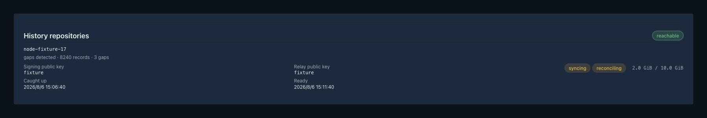
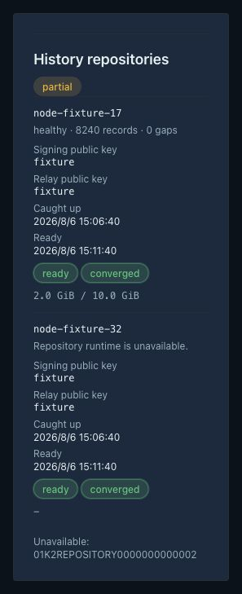

# 集群长期历史数据仓库

> 当前有效规范以本文为准；实现覆盖与当前状态见 `./IMPLEMENTATION.md`。
> 关键演进原因见 `./HISTORY.md`。

## Context and Scope

XP 节点当前以本地窗口保存状态、健康、流量、连接数、入站 IP 和 Mesh 观测。
普通节点通常运行在 NAT LXC VPS 上，磁盘、内存和上行流量有限。
本地窗口不能作为长期集群历史，也不能在节点失联后提供完整查询。
Issue #248 要求一个或多个节点保存完整历史，多仓库最终收敛，并以增量同步降低网络成本。

### Context

### Goals

- 以 SQLite 替换相关 JSON 持久化，同时保持普通节点现有采样、精度、
  保留和清理语义。
- 由 Raft 明确管理仓库角色、生命周期、容量状态和副本可用性。
- 以游标、不可拆 segment、签名哈希链和低开销压缩传输增量数据。
- 让 ready 仓库通过 anti-entropy、tombstone 和分层聚合最终收敛。
- 为历史查询和管理界面返回完整性、覆盖范围、缺口和同步质量。

### Non-goals

- 不改变普通节点数据保留策略或业务流量配额。
- 不提供 quorum 读写、强一致查询、自动提升普通节点、任意 SQL、整库下载或
  内建云备份。
- 不保留任何本机控制面代理；不使用 GZIP 作为新同步编码。
- 不引入 SQLCipher、透明 SQLite 压缩扩展或例行 full `VACUUM`。

### In scope

- 节点历史、Mesh 遥测、入站 IP、TCP 连接历史的 SQLite 存储和原子 JSON 迁移。
- 仓库角色、Ed25519 节点身份、同步状态、退役和容量护栏。
- cursor/segment 同步、Zstandard level 1、同级 direct path、双 direct 失败后的
  Reality Mesh Reverse 与最终动态 Mesh relay。
- primary/standby、五分钟 anti-entropy、分层保留、聚合、查询选择和管理 API/Web。
- systemd、OpenRC、Docker/Compose 的持久卷和启动自检兼容性。

### Out of scope

- 普通节点采样器重写、生产部署和发布自动化、云端备份服务、任意历史导出。

## Requirements

### MUST

- 普通节点迁移失败继续使用 JSON；迁移不双写，成功后原子切换，旧 JSON 备份
  保留 30 天。
- SQLite 使用 WAL 与 `auto_vacuum=INCREMENTAL`，仅执行有界 checkpoint/incremental vacuum，
  不执行例行 full `VACUUM`。
- 仓库默认配额 10 GiB；所在文件系统可用空间低于 256 MiB 时停止历史写入，
  并报告 degraded。
- 仓库保存 7 天分钟级、随后 90 天五分钟级、随后小时级，默认最长两年；
  普通节点的既有窗口不变。
- 每条流使用 `(source_node_id, source_epoch, stream, sequence)` 单调游标；
  发现洞或新 epoch 时报告 gap，不跳过连续水位。
- segment 上限为 1000 条、192 KiB canonical uncompressed 或一分钟；
  传输不得拆分 segment。
- 小于 4 KiB 的 payload 使用 identity；其余仅尝试 Zstandard level 1，压缩无收益时使用 identity；
  单次响应 canonical uncompressed 不超过 1 MiB，wire 不超过 256 KiB。
- 每分钟 source 的 `path_health.v1` 以轮转顺序携带最多 16 个 peer 的当前状态和每 peer 最新一分钟
  bucket；不复制本地完整 24 小时 telemetry 序列。字段和延迟样本先受限，再逐 peer 按序列化后的
  payload 纳入，必须保持在 32 KiB source-record 上限内。
- Reality Mesh 和 Cloudflare Tunnel 是同级直连路径；选择稳定健康路径，另一条低频探测。
  两条都失败后，先尝试 Raft 分配的 Reality Mesh Reverse；Reverse 失败后才每小时抖动一次
  动态 Mesh relay。两类 relay 均不落盘；动态 relay 使用端到端 X25519+AEAD。
- 每个 ready 仓库都保存完整并集；查询选择最完整健康 ready 仓库，响应必须带
  `complete|partial|local_only`、coverage、watermark、gap 和 skew。
- ready 表示仓库已完成完整已知并集的追赶并通过稳定窗口；若所有 ready 仓库一致保有真正永久
  gap，新仓库可进入 ready 以提供同一完整已知并集，但必须保持 `replica_converged=false`，相关
  查询必须为 `partial`。
- tombstone 必须先于受影响记录同步并阻止复活；同一 epoch 同一 sequence 出现两个有效不同 payload
  时隔离旧流并轮换 epoch。

### Source delivery journal

- `REQ-JOURNAL-BOUNDED`: delivery journal 的状态、epoch 恢复和投递页读取必须使用持久化统计状态与匹配
  投递顺序的 SQLite 索引；除一次性旧库初始化外，不得扫描或反序列化整个 backlog，每轮最多读取 256 条，
  且 CPU、磁盘读取和进程内存成本不得随 backlog 条数或 payload 字节数增长。
- `REQ-JOURNAL-REPAIR`: 旧库中缺少投递顺序元数据的 segment 必须通过 state row 的持久主键游标分页校正；
  每个 60 秒 source cycle 最多提交一页 256 条，失败时游标不前进，重启从最后一次提交的位置继续。
- `REQ-JOURNAL-PAUSE`: 状态查询不得隐式执行校正；校正期间继续持久化新 segment，但暂停发送 journal page，
  并以既有 `source_delivery.state=journal_order_repairing` 表示可恢复 backlog。不得新增 partial index。
- `REQ-JOURNAL-ACK`: ACK 成功时间和实际投递路径必须与 journal 删除在同一持久化边界可观察；ACK 只可删除
  真实确认的 segment，未确认 payload、cursor 与 epoch high-water 不得被前推或改写。
- `REQ-JOURNAL-COLLECTOR`: Collector 暂时不可达是正常输入，只形成可恢复 backlog，不得伪造成功或产生无界
  并发重试；Collector 恢复后必须按固定页继续投递并只删除有效 ACK 所列 segment。
- `REQ-JOURNAL-RESOURCE`: 对至少 20,000 条或 128 MiB durable backlog，5 秒 CPU 采样 p95 不超过 9%，
  每个 60 秒周期数据库读取不超过 4 MiB，RSS 增量不超过 2 MiB，且 Direct/Public 与集群控制面保持可用。

### SHOULD

- rendezvous hashing 选择 source 的 primary collector，保留 standby；primary 连续三个一分钟周期失败
  后切换。
- 每五分钟按 source/epoch/stream/partition 做摘要和范围修复，每日做深校验；
  `replica_converged` 仅在所有保留摘要相同时成立。
- unknown schema 保留并转发签名 raw，不参与查询/聚合；legacy 节点保持原行为并标记
  `sync_unsupported`。

## Behavior

### Core flows

1. 管理员在 Raft 中指定仓库成员；新仓库进入 `syncing`，完成历史追赶、无可恢复积压且稳定五分钟后
   进入 `ready`。已一致确认的永久 gap 不阻止 ready，但阻止 `replica_converged`。
2. source 将新 segment 按 cursor 提供给 primary；primary 写入本地 SQLite 并返回 ack；
   其他 ready 仓库通过 anti-entropy 修复缺口。
3. direct path 依据现有 Mesh/Tunnel 健康选择；只有两者均失败时才依次尝试 Reverse 与动态 relay。
   sync control-plane 字节单独计量，不计入用户流量配额。
4. 仓库按 UTC observed time 聚合粗粒度数据，保留输入 sequence 范围、hash、算法和 complete 状态，
   再清理已提交的细粒度记录。
5. 查询端点从最完整仓库读取；仓库不可用时切换到下一仓库；全部不可用时只返回本地当前窗口，
   并标记 `local_only`。

### Edge cases / errors

- source 重建数据库或序号丢失时生成新 epoch；cursor 过期返回 earliest available 和 gap。临时
  传输失败、重试耗尽或有界 outbox 满载只形成可恢复积压；仅当 source 与全部 ready 仓库均无法
  提供已过期的 cursor 范围时，才报告 permanent gap。
- source 在 SQLite delivery journal 中持久化未确认的已签名 segment，并在 collector 确认后增量
  释放空间。若文件系统可用空间低于既有 256 MiB 安全护栏，source 停止新的仓库采集并报告
  `source_storage_guard`；不得前推 cursor、伪造确认或改变普通节点的数据保留策略。
- delivery journal 状态读取必须通过 SQLite 聚合条数与总字节数，并且只读取排序后的单条最老
  segment；状态/API 查询的进程内存不得随 durable backlog 大小增长。
- delivery journal 的周期性状态、epoch 恢复和固定页读取必须使用持久化统计状态与匹配投递顺序的
  SQLite 索引；除一次性旧库迁移外，不得扫描或反序列化整个 backlog。每轮读取最多 256 条，
  其 CPU、磁盘读取和进程内存成本不得随 backlog 条数或 payload 字节数增长。
- 旧库中缺少投递顺序元数据的 segment 必须通过 `source_delivery_journal_state` 的持久主键游标
  分页校正；每个 60 秒 source collection cycle 最多提交一页 256 条，校正失败时游标不前进，
  重启从最后一次提交的位置继续。状态查询不得隐式执行校正；校正期间继续持久化新 segment，
  但暂停发送 journal page，并以既有 `source_delivery.state=journal_order_repairing` 表示可恢复
  backlog。不得为此新增 partial index，因为建立它本身会扫描整个 journal。
- ACK 成功时间和实际投递路径必须与 journal 删除在同一持久化边界可观察；Collector 不可达时保留
  journal，不得伪造成功或产生无界并发重试。Collector 恢复后必须按固定页继续投递并只删除有效 ACK
  所列 segment。
- 仓库磁盘达到护栏时停止历史写入但不影响 Raft、join、配置、代理或升级。
- relay 只承担流式转发；relay 失败不得被误报为数据已持久化。
- 仓库过期超过 tombstone horizon 必须清除并重建，不允许继续宣称 converged。

## Interfaces and Contracts

同步协议和管理查询接口的具体字段见
[`contracts/history-sync.md`](./contracts/history-sync.md)。

### 接口清单（Inventory）

- `history sync cursor/segment`：Protobuf/internal HTTP；internal；
  新增；详见 `./contracts/history-sync.md`；source、repository、relay 使用。
- `repository membership/status`：Raft + admin JSON；external/internal；
  新增；详见 `./contracts/history-sync.md`；admin UI、workers 使用。
- `repository history query`：admin JSON；external；新增；详见
  `./contracts/history-sync.md`；NodeDetails、Traffic、IP views 使用。

## Verification

- Given 普通节点存在旧 JSON，When 启动迁移成功，Then SQLite 与旧窗口语义一致、无双写且可重启
  幂等。
- Given 迁移、写入或 checkpoint 失败，When worker 继续运行，Then 保持旧 JSON 路径并报告 degraded，
  不影响集群控制面。
- Given 两个 ready 仓库和丢包/分区，When 网络恢复，Then anti-entropy 修复到同一完整并集，
  永久缺口显式标记。
- Given Mesh 与 Tunnel 同时不可用，When relay 周期到达，Then 使用端到端加密流式 relay；
  relay 不得落盘。
- Given 查询仓库部分缺失，When 管理员读取历史，Then 返回 partial 及覆盖/水位/缺口信息，
  不伪装为 complete。
- Given 磁盘可用空间低于 256 MiB，When 触发历史写入，Then 写入停止、容量状态 degraded，
  Raft 和 join 仍可用。
- VER-JOURNAL-BOUNDED covers: REQ-JOURNAL-BOUNDED and REQ-JOURNAL-RESOURCE.
  A 128 MiB backlog has no full wire decode or temporary sort; each cycle reads one fixed page,
  while Direct/Public and the cluster control plane remain available.
- VER-JOURNAL-REPAIR covers: REQ-JOURNAL-REPAIR and REQ-JOURNAL-PAUSE.
  One source cycle commits at most one repair page and pauses delivery while repair is incomplete.
  A failed cycle preserves the previous cursor and a restart resumes from that cursor.
- VER-JOURNAL-ACK covers: REQ-JOURNAL-ACK.
  A successful ACK updates acknowledgement time and path only when deletion removes real rows;
  unacknowledged payloads remain unchanged.
- VER-JOURNAL-COLLECTOR covers: REQ-JOURNAL-COLLECTOR.
  An unreachable Collector preserves backlog without unbounded retries; after recovery, valid ACKs
  continue fixed-page drain and expose the actual path and time.

### Verification commands

- VER-JOURNAL-TESTS covers: REQ-JOURNAL-BOUNDED, REQ-JOURNAL-REPAIR, REQ-JOURNAL-ACK,
  and REQ-JOURNAL-COLLECTOR. Rust tests cover migration, cursor recovery, payload integrity,
  unreachable Collector, and resumed fixed-page drain.
- VER-JOURNAL-TESTBOX covers: REQ-JOURNAL-RESOURCE.
  The shared testbox exercises at least 20,000 rows or 128 MiB, an unreachable peer, and recovery,
  while measuring CPU, database reads, RSS, Direct/Public, and control-plane health.

## Resource and Quality Constraints

### Testing

- Rust unit/HTTP tests 覆盖迁移、cursor、segment、签名、压缩、relay、anti-entropy、聚合和查询。
- shared testbox 验证 50 source/2 repository、256 MiB 无 swap；普通节点新增稳态内存不超过
  2 MiB、idle CPU 近零。
- shared testbox 还必须验证至少 20,000 条或 128 MiB source delivery journal 的索引计划、迁移幂等、
  不可达 Collector 和恢复 drain；5 秒 CPU 采样 p95 不超过 9%，每个 60 秒周期数据库读取不超过
  4 MiB，RSS 增量不超过 2 MiB。
- 故障注入覆盖丢包、分区、恢复、退役、过期 tombstone、fork、unknown schema 和磁盘护栏。

### UI / Storybook (if applicable)

- Web 覆盖 repository 配置、syncing/ready/degraded、capacity、partial、offline 和 history query
  状态；Storybook/Playwright 产出桌面与移动证据。

### Quality checks

- `cargo fmt --check`、`cargo clippy -- -D warnings`、`cargo test`。
- `cd web && bun run lint && bun run typecheck && bun run test`，并运行 Storybook、Playwright 和
  style budget。

## Visual Evidence

## Related ADRs

- [ADR 0002](../../adr/0002-history-synchronization-recovery-order.md)

## Failure Model and Assumptions

- 风险：历史数据规模与多节点并发可能放大 SQLite 写入和同步队列；必须保持独立低优先级队列与固定预算。
- 风险：legacy 节点不具备签名能力；不得伪造 source proof，需明确标记 sync unsupported 或先升级。
- 假设：现有 Mesh/Tunnel path health 可复用，不增加全网 all-to-all 探测。

## 参考（References）

- `docs/specs/k7m2n-node-history-fallback/SPEC.md`
- `docs/specs/r26nc-node-user-traffic-analytics/SPEC.md`
- `docs/specs/56dtr-reality-fallback-control-plane-mesh/SPEC.md`
- `docs/agents/issue-tracker.md`
- Issue #248: https://github.com/IvanLi-CN/xp/issues/248
