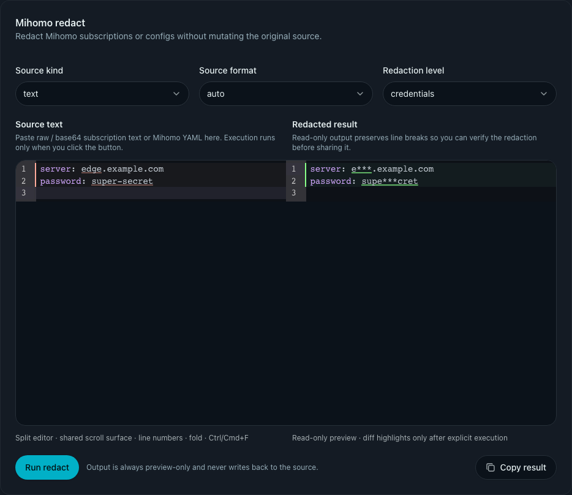

# 前端 Tools 入口 + Mihomo 订阅脱敏（#e5sqd）

## 状态

- Status: 已完成
- Created: 2026-03-19
- Last: 2026-03-19

## 背景 / 问题陈述

- 现有 Web 管理端缺少统一的“工具入口”，零散的运维/排障能力只能依赖 CLI。
- `xp-ops mihomo redact` 已具备稳定的 Mihomo 订阅/配置脱敏能力，但管理端没有对应入口，导致需要在浏览器中查看、复制、分享脱敏结果时仍要切回命令行。
- 直接把 CLI 行为平移到 Web 时，如果没有额外的 URL 安全边界，会把 admin API 变成 SSRF 入口。

## 目标 / 非目标

### Goals

- 在侧边栏 `Settings` 下新增全局 `Tools` 入口，v1 固定为单页 `/tools`。
- 在 `Tools` 页先交付 `Mihomo redact` 工具卡，支持 `URL + 文本粘贴` 两种输入。
- 后端新增 admin-only 脱敏 API，并复用与 CLI 同一套脱敏核心，保证 `level` 与 `source_format` 语义一致。
- URL 输入仅允许公网 `http/https` 目标；本地/私网源必须通过文本粘贴处理。
- 页面结果固定为“显式执行 + 只读预览 + 一键复制”，不回写原始输入。

### Non-goals

- 文件上传、结果下载、批量处理。
- 修改 `/api/sub/*` 或现有订阅预览逻辑。
- 支持内网 URL、附加认证头或代理链路。
- 在 User Details / Service Config 中内嵌相同工具。

## 范围（Scope）

### In scope

- `docs/specs/e5sqd-web-tools-mihomo-redact/` 规格、HTTP contract 与索引。
- Rust 共享脱敏模块、CLI 复用改造、admin HTTP handler 与 SSRF guard。
- `/tools` 路由、侧边栏导航项、Mihomo redact 页面、前端 API client。
- Vitest / Rust tests / Storybook mock 与页面 story。

### Out of scope

- 新增脱敏等级或自定义掩码策略。
- URL allowlist / denylist 配置化。
- 非 Mihomo 工具的实际实现。

## 需求（Requirements）

### MUST

- `Settings` 分组下新增 `Tools` 导航项，指向 `/tools`。
- `POST /api/admin/tools/mihomo/redact` 仅允许管理员调用。
- 请求体固定为：
  - `source_kind: "url" | "text"`
  - `source: string`
  - `level: "minimal" | "credentials" | "credentials_and_address"`
  - `source_format: "auto" | "raw" | "base64" | "yaml"`
- 响应体固定为 `{ "redacted_text": "string" }`。
- URL 模式只允许公网 `http/https`，拒绝 `localhost`、loopback、RFC1918、link-local、documentation、unspecified、multicast、reserved 等目标。
- URL 拉取固定 `15s` 超时，不附加认证头。
- 文本模式与 CLI 一样支持 `auto` 下的 base64 订阅自动解码后输出脱敏明文。
- 前端使用显式按钮触发执行，不做输入即实时脱敏。
- 前端结果区域为只读代码式预览，保留换行与缩进，并提供复制按钮。

### SHOULD

- Storybook mock 应支持该工具页的交互演示与错误分支。
- 共享脱敏模块应让 CLI 与 HTTP handler 的行为差异只剩“输入来源”和“URL 安全策略”。

## 功能与行为规格（Functional/Behavior Spec）

### Core flows

- 管理员打开 `/tools`，默认看到单个 `Mihomo redact` 工具卡。
- 选择 `text` 时，粘贴 raw/base64/YAML 文本后点击 `Run redact`，后端直接按 `source_format + level` 处理并返回预览文本。
- 选择 `url` 时，输入公网 `http/https` 地址后点击 `Run redact`，后端先做 SSRF guard，再拉取远端文本并执行同样的脱敏流程。
- 成功执行后，页面展示只读预览；管理员可一键复制结果。

### Edge cases / errors

- `source` 为空：返回 `400 invalid_request`。
- URL 不是 `http/https`：返回 `400 invalid_request`。
- URL 指向本地/私网/保留地址：返回 `400 invalid_request`。
- URL 拉取失败或非 2xx：返回 `502 upstream_error`。
- `base64` 显式模式解码失败：返回 `400 invalid_request`。
- 前端执行失败时保留表单输入，清空旧预览，并以内联错误展示失败原因。

## 接口契约（Interfaces & Contracts）

### 接口清单（Inventory）

| 接口（Name）              | 类型（Kind） | 范围（Scope） | 变更（Change） | 契约文档（Contract Doc） | 负责人（Owner） | 使用方（Consumers） | 备注（Notes）                       |
| ------------------------- | ------------ | ------------- | -------------- | ------------------------ | --------------- | ------------------- | ----------------------------------- |
| Mihomo redact admin API   | HTTP API     | internal      | New            | ./contracts/http-apis.md | backend         | web/admin           | admin-only；URL 代拉取含 SSRF guard |
| Shared Mihomo redact core | Rust module  | internal      | New            | ./contracts/http-apis.md | backend         | cli/http            | CLI 与 HTTP 共用逻辑                |
| `/tools` page             | Web route    | admin UI      | New            | ./contracts/http-apis.md | web             | admin               | v1 单页，先只承载 Mihomo redact     |

### 契约文档（按 Kind 拆分）

- [contracts/README.md](./contracts/README.md)
- [contracts/http-apis.md](./contracts/http-apis.md)

## 验收标准（Acceptance Criteria）

- Given 管理员已登录，When 打开 `/tools`，Then 侧边栏可见 `Tools`，页面可正常渲染 `Mihomo redact` 工具卡。
- Given 文本模式输入 raw/base64/YAML，When 点击 `Run redact`，Then 返回只读预览且敏感值不以原文出现。
- Given `level=credentials_and_address`，When 输入包含 `server/sni/host/password` 的内容，Then 地址与密钥类字段都会被脱敏。
- Given URL 模式输入公网 `http/https` 地址，When 执行成功，Then 结果按与 CLI 相同的规则输出脱敏明文。
- Given URL 模式输入 `localhost` 或私网地址，When 点击执行，Then 返回 `400 invalid_request`，并提示该 URL 必须解析到公网 IP。
- Given 工具执行失败，When 页面收到错误，Then 表单输入保留、结果区不展示旧内容，并显示可读错误。
- Given 成功得到结果，When 点击 `Copy result`，Then 浏览器剪贴板收到当前预览文本。

## 实现前置条件（Definition of Ready / Preconditions）

- `docs/specs/` 已存在并作为本仓库规格根目录。
- `xp-ops mihomo redact` 的现有行为已冻结为事实基线。
- 快车道终点已锁定为 `merge-ready`。

## 非功能性验收 / 质量门槛（Quality Gates）

### Testing

- Backend: `cargo fmt`, `cargo clippy -- -D warnings`, `cargo test`
- Web: `cd web && bun run lint`, `cd web && bun run typecheck`, `cd web && bun run test`
- Storybook: `cd web && bun run test-storybook`

### UI / Storybook

- 新增 `ToolsPage` story，至少覆盖默认态与执行后预览态。
- Storybook mock 需要支持 `/api/admin/tools/mihomo/redact` 成功与错误分支。

## 文档更新（Docs to Update）

- `docs/specs/README.md`
- `docs/specs/e5sqd-web-tools-mihomo-redact/contracts/http-apis.md`

## 实现里程碑（Milestones / Delivery checklist）

- [x] M1: 建立 spec / contract / 索引
- [x] M2: 抽出共享 Mihomo redact 核心并接入 admin API + SSRF guard
- [x] M3: 交付 `/tools` 页面、前端 API、测试与 Storybook
- [x] M4: 快车道 PR 收敛与 spec sync

## 方案概述（Approach, high-level）

- 将现有 CLI 脱敏逻辑迁移到共享模块，CLI 仅保留输入装配与错误码适配。
- Web API 直接复用共享模块，但 URL 模式强制走 `PublicOnly` 安全策略。
- `/tools` 页面保持单页结构，不提前做工具目录、搜索或嵌套路由。

## 风险 / 开放问题 / 假设（Risks, Open Questions, Assumptions）

- 风险：域名解析只要落到保留地址就会拒绝，某些企业代理型 URL 需要用户改用文本粘贴。
- 风险：SSRf guard 依赖解析结果；若外部 DNS 策略异常，可能导致合法 URL 暂时无法使用。
- 开放问题：None.
- 假设：v1 的运维场景以“单次执行 + 复制结果”为主，不需要下载或历史记录。

## Visual Evidence (PR)

### Tools page preview layout

- source_type: storybook_canvas
- target_program: mock-only
- capture_scope: element
- sensitive_exclusion: N/A
- submission_gate: pending-owner-approval
- story_id_or_title: Pages/ToolsPage/WithPreview
- state: preview-success
- evidence_note: proves the text-mode split editor renders a successful redaction preview and places `Copy result` in the tool card footer at the bottom-right after explicit execution.
- image:

## 变更记录（Change log）

- 2026-03-19: 创建规格，冻结 `/tools` 入口、Mihomo redact admin API、URL 安全边界与 v1 交互范围。
- 2026-03-19: 完成共享脱敏模块抽取、admin API、`/tools` 页面、前端测试与 Storybook 回归；补上重定向链 SSRF 防护。
- 2026-03-19: 同步最新 `origin/main` 到 PR 分支，补齐 `type:minor` 标签与 spec 索引状态，收口到 PR #114 的 merge-ready 目标。
