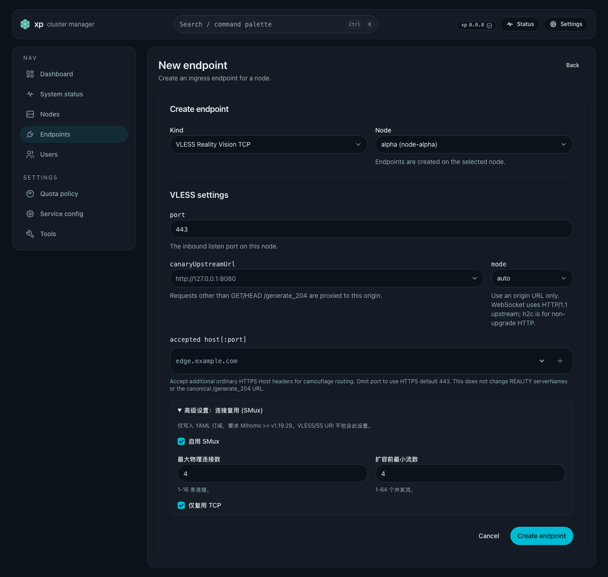
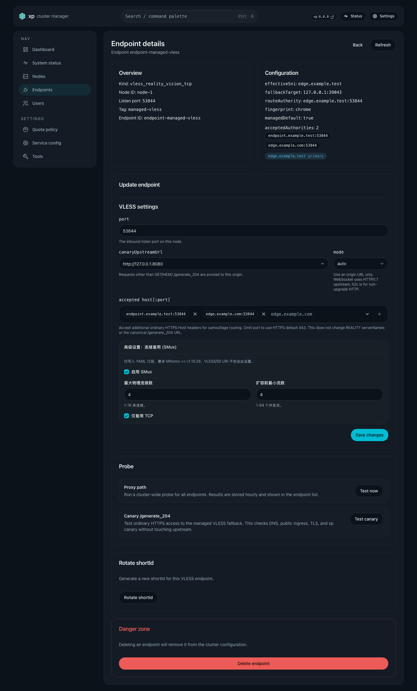

# SS2022 接入点 Mihomo SMux 策略

> 当前有效规范以本文为准。
> 实现覆盖与当前状态见 `./IMPLEMENTATION.md`，关键演进原因见 `./HISTORY.md`。

## 背景 / 问题陈述

一个客户端在同一 SS2022 接入点上建立大量独立 TCP 连接，
会使节点的入站连接数显著增大。

该现象不是 Xray 入站配置能够协商解决的问题。Mihomo 的 SMux 是客户端本地复用策略。
官方 `v1.19.29` 的 VLESS adapter 不接受 `smux` 字段；VLESS Reality/Vision 输出该字段会导致
客户端连接失败。SS2022 保留受支持的 YAML SMux 策略。

## 目标 / 非目标

### Goals

- 为 SS2022 接入点保存可编辑的 Mihomo SMux 策略。
- 仅 SS2022 YAML 订阅输出使用该策略，既有 SS2022 接入点默认启用。
- 仅在 SS2022 接入点的新建和详情页提供安全、常用的编辑项。

### Non-goals

- 不修改 Xray 入站、端口、流量路由或 TCP 回收策略。
- 不新增 sing-box、Xray 等订阅格式。
- 不向 Raw/Base64 VLESS 或 Shadowsocks URI 添加非标准参数。
- 不暴露 `max-streams`、Brutal、padding 或 statistic 的管理员调优项。
- 不迁移、删除或改写既有 VLESS `meta.mihomo_smux`；该历史字段只为 API/state
  兼容保留，不能影响任何 VLESS YAML 输出。

## 需求（Requirements）

### MUST

- `meta.mihomo_smux` 缺失时等价于 `enabled=true`、`max_connections=4`、
  `min_streams=4`、`only_tcp=true`。
- `max_connections` 只接受 `1..=16`，`min_streams` 只接受 `1..=64`。
- YAML 的启用配置精确包含 `enabled: true`、`protocol: smux`、`max-connections`、
  `min-streams`、`padding: false`、`statistic: false` 与 `only-tcp`；禁用时不输出
  `smux`。
- `format=clash`、`format=mihomo` 的 system provider payload 及直连/链式 SS2022
  条目遵守该策略。
- 所有 VLESS Reality/Vision YAML proxy 均不得输出 `smux`，无论其历史 metadata 为何；
  `dialer-proxy`、系统 provider `use`、filter 与链式候选必须保持不变。
- 管理 API 创建未传该字段时保存默认策略。
  PATCH 只接受完整对象，拒绝 `null` 与越界值。
- API 必须广告 `admin.endpoint-mihomo-smux` capability。管理 Web 仅在 SS2022 接入点
  显示 SMux 控件；该 capability 缺失时不发送 `mihomo_smux`，以便与支持窗口中的旧服务
  真实降级。
- Web 管理界面必须告知 `Mihomo >= v1.19.29` 的 SS2022 客户端要求。

## 接口契约（Interfaces & Contracts）

### 接口清单（Inventory）

- `POST /api/admin/endpoints`: HTTP API, internal, Modify, Web admin。
- `PATCH /api/admin/endpoints/{endpoint_id}`: HTTP API, internal, Modify, Web admin。
- `admin.endpoint-mihomo-smux`: API capability, internal, Read, Web admin feature gate。
- YAML subscription proxy: subscription contract, external, Modify,
  Mihomo >= v1.19.29。

## 验收标准（Acceptance Criteria）

- Given 旧 SS2022 接入点元数据没有 `mihomo_smux`，When 渲染 YAML，Then 每个系统
  SS2022 proxy 都带默认 `smux`。
- Given 任一 VLESS Reality/Vision 接入点持有启用或禁用的历史策略，When 渲染其直连、链式
  或 Clash YAML，Then 不存在 `smux` 字段，且 `dialer-proxy` 与 provider `use` 关系不变。
- Given 管理员禁用一个 SS2022 接入点的策略，When 渲染该接入点的所有 YAML proxy，Then
  不存在 `smux` 字段，且 URI 输出不变。
- Given 管理员创建或更新 SS2022 接入点，When 提交合法策略，Then API
  返回并持久化该完整对象。
- Given 策略数值为零、越界或 PATCH 值为 `null`，When 调用 API，Then 返回
  `400 invalid_request`。
- Given Mihomo `v1.19.29`，When 校验生成的 VLESS Reality/Vision 与 SS2022 YAML fixture，Then
  配置可被解析，且只有 SS2022 条目带 SMux。

## 质量门槛

- Rust 单元与 HTTP 测试。
- Web lint、typecheck 与组件测试。
- Storybook 状态与受控视觉证据。
- 官方 Mihomo `v1.19.29` YAML 配置校验。

## Visual Evidence

PR: include
SS2022 接入点创建页的默认 SMux 设置。

PR: include
SS2022 接入点详情页的 SMux 设置。

受控 Storybook 画布覆盖 `Components/EndpointMihomoSmuxSettings` 的默认、禁用和旧服务状态，
以及两个接入点页面的 SS2022 默认值交互。

## 假设

- YAML 输出的最低兼容基线为 `Mihomo >= v1.19.29`。
- SMux 是 SS2022 客户端本地策略，不要求节点重启或 Xray reconcile 语义变更。
