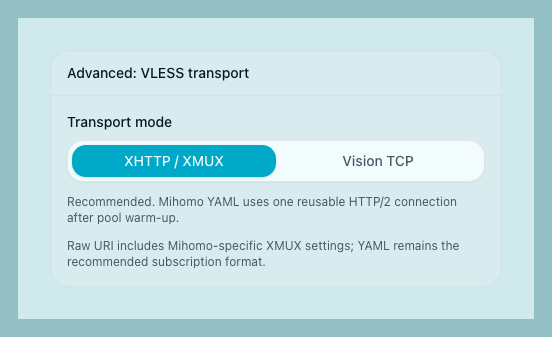
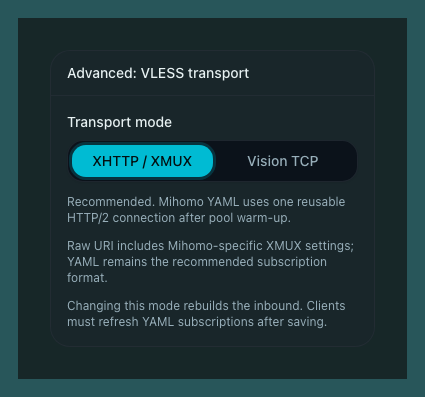

# VLESS XHTTP/XMUX 单连接复用

> 当前有效规范以本文为准；实现覆盖与当前状态见 `./IMPLEMENTATION.md`，关键演进原因见
> `./HISTORY.md`。

## 背景 / 问题陈述

VLESS Reality Vision/TCP 的每个代理 TCP 流都占用一条外部 TCP 连接。即使应用请求量不大，
浏览器、代理组探测和并发应用流量也会在 Xray `connIdle=300` 的回收窗口内形成大量常驻连接。

Mihomo 顶层 `smux` 使用 sing-mux framing，Xray VLESS Reality/Vision 入站并不实现该服务端协议；
它不能解决当前 VLESS 连接数问题。Mihomo 与 Xray 共同支持的复用路径是
VLESS XHTTP over Reality，并由 Mihomo XMUX 在一个 HTTP/2 transport 上承载多个代理流。

## 目标 / 非目标

### Goals

- 新建 VLESS 接入点默认使用 XHTTP/XMUX；连接池预热后，每个客户端到每个接入点稳态使用一条
  HTTP/2 TCP 连接。
- 历史接入点缺少 transport 字段时继续使用 Vision/TCP，避免升级后无提示改变现有订阅。
- 管理员可在接入点高级设置中显式切换 XHTTP/XMUX 与 legacy Vision/TCP。
- 使用固定、低资源的 XMUX 参数，不增加定时 H2 PING，也不暴露高风险调优项。

### Non-goals

- 不把 Mihomo sing-mux `smux` 下发给 VLESS。
- 不在同一接入点端口同时运行 Vision/TCP 与 XHTTP；切换会重建该 inbound。
- 不自动迁移历史接入点，不自动刷新客户端订阅。
- 不修改 Xray `connIdle=300`、Reality 密钥、端口、路由、配额或用户授权。
- 不为 operator 暴露 path、mode、XMUX 窗口、连接数或 keepalive 调优项。

## 范围（Scope）

### In scope

- VLESS endpoint metadata、创建/PATCH API、capability 与管理 Web 高级设置。
- Xray 动态 VLESS XHTTP/Reality inbound 与空 VLESS flow 用户账户。
- Clash、Mihomo provider 主配置/system payload、直连与链式 VLESS YAML。
- XHTTP VLESS Raw/Base64 URI 的 transport 与 XMUX share-link 参数。

### Out of scope

- SS2022 SMux；它继续由 `../endpoint-mihomo-smux/SPEC.md` 管理。
- sing-box、原生 Xray client 或其他订阅格式。
- Mesh 控制面 HTTP/2 pool；它由 Reality Mesh 规格管理。

## 需求（Requirements）

### MUST

- `meta.transport` 只接受 `vision_tcp` 或 `xhttp`。历史 metadata 缺少该字段时反序列化为
  `vision_tcp`，并在无关 metadata 重写中继续保持字段缺失。
- 新建的手动或 managed-default VLESS 接入点在请求未指定 transport 时保存 `xhttp`。
- XHTTP Xray inbound 必须使用 `protocol_name=splithttp`、path `/xp-xhttp`、mode
  `stream-one` 与 Reality security；对应 VLESS user account 的 `flow` 必须为空。
- Vision/TCP inbound 与订阅必须继续使用 TCP transport 和 `xtls-rprx-vision`。
- XHTTP Mihomo YAML 必须使用 `network: xhttp`、`alpn: [h2]`、固定 path/mode，并包含：
  `max-connections: "1"`、`max-concurrency: "0"`、`c-max-reuse-times: "0"`、
  `h-max-request-times: "0"`、`h-max-reusable-secs: "0"`、
  `h-keep-alive-period: -1`。负值关闭 Mihomo 默认的 HTTP/2 PING。
- XHTTP Raw URI 必须使用 Mihomo v1.19.29 可解析的 `type=xhttp` 与 `extra.xmux`；
  legacy Vision/TCP URI 必须保持原字节合同。
- API 必须广告 `admin.endpoint-vless-xhttp` capability。新 Web 仅在 capability 存在时展示并
  发送 transport；旧 Web 忽略新 metadata，新 Web 对旧 API 隐藏控件。
- transport PATCH 为 `null`、未知枚举或用于 SS2022 时必须返回明确的 `400`。
- transport 变化必须进入 inbound hash 并触发 Xray inbound 重建及用户重放；仅订阅字段变化仍
  不得重建 inbound。
- 详情页必须说明切换会重建 inbound，且客户端必须刷新 YAML 订阅。

### SHOULD

- 推荐 XHTTP/XMUX，Vision/TCP 作为兼容回退。
- XHTTP 客户端连接被主动切断后应自动建立一条新连接并继续请求。

### COULD

- 节点连接图后续可按 transport 标注历史区间，但本规格不要求新增遥测。

## 功能与行为规格（Functional/Behavior Spec）

### Core flows

- 新建 VLESS：默认选择 XHTTP/XMUX，服务端创建 XHTTP/Reality inbound，订阅输出 XHTTP。
- 编辑历史 VLESS：缺失字段显示 Vision/TCP；保存 XHTTP 后重建 inbound，客户端刷新订阅后切换。
- 回退：管理员选择 Vision/TCP 并保存，服务端重建 legacy inbound，客户端刷新订阅后恢复旧协议。

### Edge cases / errors

- 切换保存成功但客户端尚未刷新时，旧 transport 连接会失败；UI 必须提前说明这一边界。
- 冷启动并发发生在 Mihomo pool 建立之前时可短暂出现建连竞态；稳态验收从一次成功预热请求后
  开始，不以尚未滚出 24h 图窗的历史峰值判断失败。
- Raw URI 包含 XMUX share-link 参数，但 YAML 仍是主要、完整且受测的 Mihomo 配置合同。

## 接口契约（Interfaces & Contracts）

### 接口清单（Inventory）

- Endpoint `meta.transport`：新增内部 JSON metadata，由 XP state 管理，供 Xray、订阅和 Web
  使用；取值为 `vision_tcp` 或 `xhttp`。
- Endpoint create/PATCH：为 Admin Web 增加可选 transport 字段。
- `admin.endpoint-vless-xhttp`：由 XP HTTP 广告给 Admin Web 的渐进增强 capability。
- VLESS YAML/URI：XP subscription 面向 Mihomo `>= v1.19.29` 的 transport-specific 输出。

### 契约文档（按 Kind 拆分）

- 契约由本文内联定义，不新增独立 contract 文件。

## 验收标准（Acceptance Criteria）

- Given 历史 VLESS metadata 缺少 transport，When 读取、无关 PATCH、Reality domain 更新或
  shortId rotation，Then transport 仍为 Vision/TCP 且 JSON 仍不新增该字段。
- Given 新建 VLESS 未传 transport，When API 创建完成，Then metadata 保存 `xhttp`。
- Given XHTTP endpoint，When 构建 Xray inbound/user，Then transport 为 SplitHTTP/Reality、
  path/mode 固定且 user flow 为空。
- Given XHTTP endpoint，When 渲染全部 YAML 路径，Then 直连/链式/system payload 均带同一
  XHTTP/XMUX 合同，且不带 VLESS `smux`。
- Given Mihomo v1.19.29 与 Xray v26.3.27，When 一次预热后发起 64 个并发代理请求，Then
  全部成功且 counting proxy 总共只接受一条外部 TCP。
- Given 已建立的 XHTTP TCP 被主动切断，When 发起下一请求，Then 请求成功且总建连数增加到 2。
- Given legacy Vision/TCP fixture，When 渲染 YAML 与 URI，Then 与变更前字节一致。

## 验收清单（Acceptance checklist）

- [x] 核心路径的长期行为已被明确描述。
- [x] 关键边界/错误场景已被覆盖。
- [x] 涉及的接口/契约已写清楚。
- [x] 相关验收条件已经可以用于实现与 review 对齐。

## 非功能性验收 / 质量门槛（Quality Gates）

### Testing

- Unit tests：metadata 默认/legacy shape、builder flow/transport、inbound hash 与订阅合同。
- Integration tests：HTTP create/PATCH/capability、官方 Mihomo 配置解析。
- E2E tests：真实 Xray Reality + Mihomo 顺序/并发/断链重连与 TCP accept 计数。

### UI / Storybook

- 新建默认、历史回退、capability 缺失、双向切换与 API error 状态。
- 受控 Storybook/Playwright 检查 desktop/mobile 与 light/dark；不操作用户 Chrome。

### Quality checks

- `cargo fmt --check`、`cargo clippy -- -D warnings`、`cargo test`。
- Web lint、typecheck、Vitest、Storybook、Playwright 与 style budget。

## Visual Evidence

PR: none

source_type: storybook_canvas
target_program: mock-only
story_id_or_title: Components/EndpointVlessTransportSettings/DefaultXhttp
state: default XHTTP/XMUX
requested_viewport: 1280x900
viewport_strategy: storybook-viewport
capture_scope: element
margin_policy: require_margin
evidence_surface: component
sensitive_exclusion: N/A
submission_gate: approved
evidence_note: XHTTP/XMUX is selected by default and its reusable HTTP/2 behavior is visible.

source_type: storybook_canvas
target_program: mock-only
story_id_or_title: Components/EndpointVlessTransportSettings/ExistingVisionTcpMobile
state: existing Vision/TCP endpoint switched to XHTTP/XMUX
requested_viewport: 393x852
viewport_strategy: storybook-viewport
capture_scope: element
margin_policy: require_margin
evidence_surface: component
sensitive_exclusion: N/A
submission_gate: approved
evidence_note: The mobile control keeps both options readable and shows the inbound-rebuild warning.

## Related PRs

- None

## 风险 / 开放问题 / 假设（Risks, Open Questions, Assumptions）

- 风险：切换 transport 会短暂移除并重建 inbound，活跃连接会中断。
- 假设：YAML 客户端最低基线为 Mihomo v1.19.29，managed Xray 最低基线为 v26.3.27。

## 参考（References）

- Mihomo v1.19.29 `adapter/outbound/vless.go` 与 `transport/xhttp/reuse.go`。
- Xray v26.3.27 `transport/internet/splithttp/config.proto`。
- `../endpoint-mihomo-smux/SPEC.md`。
