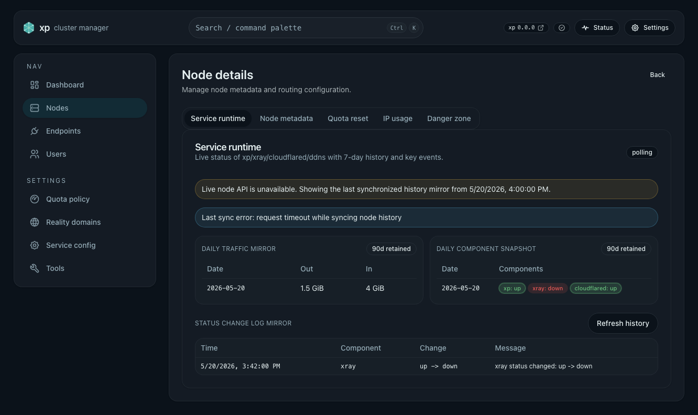

# 节点历史统计与失联 fallback（#k7m2n）

## 状态

- Status: 已完成
- Created: 2026-05-20
- Last: 2026-05-20

## 背景 / 问题陈述

- 现有节点运行态 API 依赖目标节点实时响应；当节点 HTTP API 超时或不可达时，管理界面只能显示实时请求失败，无法解释节点最近为什么掉线。
- 已有 `service_runtime.json` 保存单节点本地 7 天运行态，但其他节点无法在目标节点失联后读取这份本地文件。
- 运维需要在节点 API 不工作时仍能看到最近 90 天日级流量、组件日状态，以及最近 7 天状态变化日志。

## 目标 / 非目标

### Goals

- 新增面板本地节点历史镜像，保存每个节点最近 90 天日级统计与最近 7 天组件状态变化事件。
- 每个节点本地每小时采样 Xray 用户流量总计与 runtime 组件状态；面板节点每小时通过 internal API 同步远端 local snapshot。
- 节点 API 不可达时，`NodeDetailsPage` 展示最后成功同步的历史镜像、同步时间与最近同步错误。
- 历史数据不写入 Raft，避免把 90 天统计放进共识状态。

### Non-goals

- 不引入 Prometheus、Loki、外部 TSDB 或云监控系统。
- 不改变 quota 计费规则、用户授权模型或 Xray inbound 生成逻辑。
- 不要求失联节点继续实时更新；失联后只展示面板最后一次成功同步到的镜像。
- 不把组件日状态扩展为完整小时桶；本规格只保存日终/当日最后一次可观测状态快照。

## 范围

### In scope

- Backend: `node_history_cache.json` 本地持久化、90 天/7 天裁剪、每小时 local sample 与 remote sync worker。
- Backend API: 单节点 history admin API 与 local history internal API。
- Web: `NodeDetailsPage` 在 live runtime 失败时展示 history fallback。
- Storybook: 覆盖 runtime history fallback 状态。
- Docs: API 与规格同步。

### Out of scope

- Nodes/Dashboard 列表的大规模重排。
- PR 之外的历史数据迁移工具。
- 外部告警渠道联动。

## 需求

### MUST

- `${XP_DATA_DIR}/node_history_cache.json` 必须保存每节点历史镜像，不进入 Raft。
- 每个节点本地采样必须按 Xray stats uplink/downlink 总计计算日级增量；counter reset 时重置 baseline，不产生负增量。
- 今日数据必须在每小时 worker tick 后刷新；历史日数据保留最近 90 天。
- 每日组件状态必须保存每组件当天最后一次可观测状态与 `observed_at`。
- 组件状态变化日志只保留 `status_changed` 类事件，窗口为最近 7 天，且每节点最多 50 条。
- 远端同步失败时必须保留已有镜像，并记录 `last_sync_error`。

### SHOULD

- Admin history API 返回 `history: null` 时，前端应保持 live runtime 错误态，不伪造数据。
- Storybook mock 应能稳定展示 fallback 状态。

## 功能与行为规格

- Local sample worker 每小时读取当前节点 memberships，对每个 membership 查询 Xray `uplink/downlink` 用户 stats，总和形成节点级累计总量。
- `node_history_cache.json` 对当前节点保存 traffic baseline；同日后续 tick 用当前总量减去 baseline 累加到当日 `daily_traffic`。
- Local sample worker 同时读取 `NodeRuntimeHandle` snapshot，将 runtime components 写为当日 `daily_component_status`，并把 runtime `status_changed` 事件镜像到 `component_status_events`。
- Remote sync worker 每小时遍历 Raft state 中的节点列表，对远端节点调用 internal local history API；成功后覆盖该节点镜像，失败后只更新 `last_sync_error`。
- `NodeDetailsPage` 优先展示 live runtime；当 live runtime 查询失败且 history 存在时展示 fallback 面板。

## 接口契约

- `GET /api/admin/nodes/{node_id}/history`
  - 返回 `{ node, history }`。
  - `history` 可能为 `null`，表示面板尚未同步到该节点历史镜像。
- `GET /api/admin/_internal/nodes/history/local`
  - 仅接受 internal signature。
  - 返回当前节点本地 `NodeHistorySnapshot`。
- `NodeHistorySnapshot`
  - `node_id`
  - `last_synced_at`
  - `last_sync_error`
  - `daily_traffic[]`: `date`, `uplink_bytes`, `downlink_bytes`, `updated_at`
  - `daily_component_status[]`: `date`, `components[]`
  - `component_status_events[]`: `event_id`, `occurred_at`, `component`, `message`, `from_status`, `to_status`

## 验收标准

- Given 节点正常可达，When 每小时同步运行，Then 面板本地镜像更新今日流量、当日组件状态和最近状态变化事件。
- Given 某节点 API 不可达，When 打开节点详情，Then 页面展示该节点最后同步的 90 天日流量、90 天日组件状态、7 天最多 50 条状态变化日志，并明确 `last_synced_at`。
- Given Xray counter reset，When 下一次 sample 读取到更小总量，Then history 重置 baseline 且当日流量不出现负增量。
- Given 数据超过保留窗口，When 持久化或同步后，Then 90 天外日数据与 7 天外/超过 50 条事件被裁剪。

## 非功能性验收 / 质量门槛

- Backend targeted tests 覆盖日流量增量、counter reset 与事件裁剪。
- Web tests 覆盖 history schema 与 NodeDetails fallback 渲染。
- Storybook 覆盖 `Pages/NodeDetailsPage/RuntimeHistoryFallback`。
- Quality checks: `cargo fmt`、`cargo test node_history`、`cd web && bun run typecheck`、相关 Vitest。

## 文档更新

- `docs/desgin/api.md`
- `docs/specs/README.md`

## Visual Evidence

- source_type=storybook_canvas · target_program=mock-only · capture_scope=element
  - state: `Pages/NodeDetailsPage/RuntimeHistoryFallback`
  - evidence_note: `NodeDetailsPage` 在 live runtime 不可用时展示最后同步的历史镜像、每日流量、每日组件状态与状态变化日志。
    

## 实现里程碑

- [x] M1: Backend history model, persistence, local sample, remote sync and APIs
- [x] M2: Web API schema, NodeDetails fallback UI, tests and Storybook state
- [x] M3: Docs, validation, visual evidence and PR convergence

## 风险 / 开放问题 / 假设

- 风险：首个流量 sample 只能建立 baseline，不能回填此前日流量。
- 风险：远端节点长期不可达时，fallback 会随时间变旧；UI 通过 `last_synced_at` 和 `last_sync_error` 明示。
- 假设：Xray 用户 traffic stats 是可用的节点级流量来源；缺失单个 membership stats 时跳过该 membership，不阻断整个 history sample。
