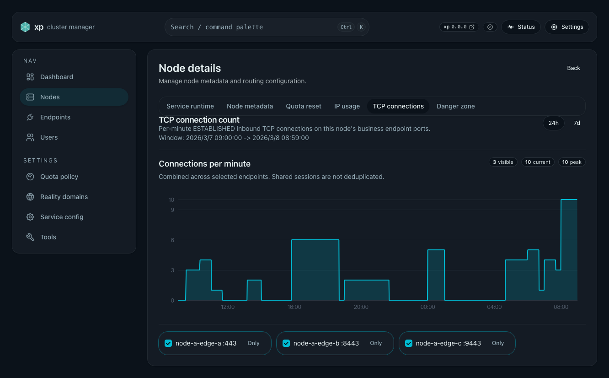
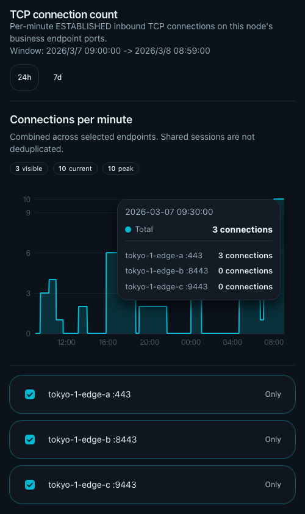
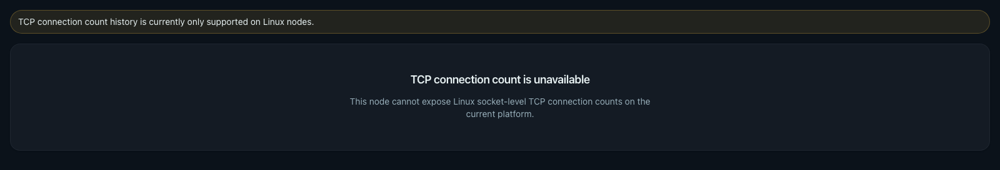

# 节点 TCP 连接数面板（#m4n7c）

## 状态

- Status: 已完成
- Created: 2026-06-21
- Last: 2026-06-21

## 背景 / 问题陈述

- 现有节点详情里的 `IP usage` 面板回答的是“源 IP 占用情况”，不是系统级 TCP 连接数。
- 节点运营侧需要直接观察“当前业务入站端口上到底有多少 TCP 连接”，而不是推断 IP 数或在线用户数。
- 现有仓库没有本地分钟级 TCP 连接历史，也没有 node detail 维度的 endpoint 聚合过滤能力。

## 目标 / 非目标

### Goals

- 在 Linux 节点本机按分钟采样业务 endpoint 监听端口上的系统级 `ESTABLISHED` 入站 TCP 连接数。
- 在节点详情新增独立 `TCP connections` tab，支持 `24h` / `7d` 窗口和 endpoint 多选过滤，默认全选。
- 图表展示语义固定为“已选 endpoint 逐分钟直接求和”，不做跨 endpoint 去重。
- 当平台不支持或系统 socket 读取失败时，返回明确 warning / unsupported，而不是伪装成零值。

### Non-goals

- 不统计 IP 数、online user 数、Xray `statsUserOnline` 或 access log 派生指标。
- 不实现新建连接次数、连接生命周期事件数或严格会话数。
- 不扩展到 `UserDetailsPage`、dashboard 或告警系统。
- 不与现有 `IP usage` 面板做双线图、差值摘要或联动高亮。

## 范围（Scope）

### In scope

- Backend：本地 `tcp_connection_usage.json` 分钟级历史、Linux `/proc/net/tcp*` 采样、node detail admin/internal APIs、endpoint/node 删除清理与 snapshot install 兼容。
- Frontend：`NodeDetailsPage` 新增 `TCP connections` tab、新 API client、endpoint 多选过滤、折线图与 warning/unsupported/empty/error 状态。
- Storybook / tests：Node details TCP tab 场景、基础 Vitest 覆盖。
- Docs：新增 topic spec，并同步 spec index。

### Out of scope

- 非 Linux 节点的主动兼容实现。
- 用户详情、跨节点聚合总览、告警与导出。

## 需求（Requirements）

### MUST

- 采样口径固定为 Linux 本机 socket 视角，只统计业务 endpoint 监听端口上的 `ESTABLISHED` TCP 连接。
- 历史窗口固定保留最近 7 天（10080 分钟），查询只支持 `24h` / `7d`。
- endpoint 必须按 `endpoint_id / endpoint_tag / port` 单独存储与返回。
- 新增 `GET /api/admin/nodes/{node_id}/tcp-connections?window=24h|7d`。
- 新增 `GET /api/admin/_internal/nodes/tcp-connections/local?window=24h|7d`。
- Node details 新 tab 默认全选所有 endpoint；前端多选过滤后按已选 endpoint 逐分钟求和。
- endpoint 删除、node 删除、snapshot install 或历史裁剪后，不得返回 stale endpoint 历史。
- 非 Linux 或 socket 读取失败时，API 和页面必须给出明确 warning / unsupported 状态。

### SHOULD

- 复用现有本地 JSON 持久化与 internal fan-out 范式，不引入外部 TSDB。
- 前端复用现有页面结构和图表风格，但不得复用 IP usage 的语义类型。

## 验收标准（Acceptance Criteria）

- Given 节点某个业务 endpoint 监听端口存在 `ESTABLISHED` 入站连接，When 分钟采样写入，Then 对应 endpoint 在该分钟的连接数大于 `0`。
- Given 选中多个 endpoint，When 页面渲染图表，Then 每分钟值等于这些 endpoint 当分钟连接数的直接求和。
- Given 切换 `24h` 与 `7d`，When API 与页面刷新，Then 返回与展示对应固定窗口边界。
- Given 当前平台不支持 Linux socket 视图，When API/页面请求，Then 返回明确 unsupported warning，而不是正常零值曲线。

## 质量门槛（Quality Gates）

- Backend: `cargo fmt` / `cargo clippy -- -D warnings` / `cargo test`
- Web: `cd web && bun run lint && bun run typecheck && bun run test`
- Storybook: `cd web && bun run test-storybook`

## 实现里程碑（Milestones / Delivery checklist）

- [x] M1: 本地 TCP 连接数历史模型与 Linux 采样接入
- [x] M2: node admin/internal APIs 与状态清理链路
- [x] M3: NodeDetailsPage 新 tab、前端过滤/图表、Storybook/Vitest
- [x] M4: 文档同步、视觉证据与快车道收敛

## 文档更新（Docs to Update）

- `docs/desgin/api.md`: 新增 node TCP connection usage admin/internal APIs。
- `docs/ops/README.md`: 补充 Linux-only TCP connection history 前置条件、采样口径与快速检查方式。

## 计划资产（Plan assets）

- Directory: `docs/specs/m4n7c-node-tcp-connection-count/assets/`
- In-plan references: None.

## Visual Evidence

- source_type: `storybook_canvas`
  target_program: `mock-only`
  capture_scope: `browser-viewport`
  requested_viewport: `1600x1800`
  viewport_strategy: `devtools-emulate`
  sensitive_exclusion: `N/A`
  submission_gate: `approved`
  story_id_or_title: `Pages/NodeDetailsPage/TcpConnectionsTab`
  state: `desktop page view (24h, all endpoints selected)`
  evidence_note: 验证桌面端 Node details 页面中的 `TCP connections` 页签：包含页面壳层、tab 选中态、24h 默认窗口、连接数图表以及图表下方 endpoint 选择项布局。
  image:
  

- source_type: `storybook_canvas`
  target_program: `mock-only`
  capture_scope: `browser-viewport`
  requested_viewport: `none`
  viewport_strategy: `storybook-viewport`
  sensitive_exclusion: `N/A`
  submission_gate: `approved`
  story_id_or_title: `Components/TcpConnectionUsageView/TooltipBreakdownPreview`
  state: `stable tooltip preview`
  evidence_note: 验证 TCP 连接图表 tooltip 在固定分钟下稳定展示主题对齐的浮层配色、总数以及每个已选 endpoint 的连接数明细，不再依赖瞬时 hover 抓图。
  image:
  

- source_type: `storybook_canvas`
  target_program: `mock-only`
  capture_scope: `browser-viewport`
  requested_viewport: `1600x1800`
  viewport_strategy: `devtools-emulate`
  sensitive_exclusion: `N/A`
  submission_gate: `approved`
  story_id_or_title: `Components/TcpConnectionUsageView/UnsupportedPlatform`
  state: `unsupported Linux-only warning`
  evidence_note: 验证非 Linux / 无法读取系统 socket 视图时，页面明确进入 unsupported warning 空态，而不是伪装成零值曲线。
  image:
  
