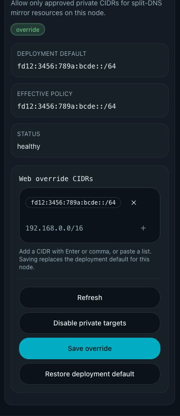

# Mihomo private resource CIDR policy

## Summary

Mihomo external resource mirroring may reach a private address only when the
address is in the node-local policy. The deployment default comes solely from
`XP_MIHOMO_ALLOWED_PRIVATE_CIDRS`; an administrator may replace it for one node
through the signed Mesh-backed node API.

## Contract

- Only RFC1918 IPv4 and IPv6 ULA (`fc00::/7`) networks can be configured.
- Every policy-list input accepts either CIDR notation or one private IP literal.
  A host literal is normalized at ingress to an exact host CIDR: IPv4 uses
  `/32` and native IPv6 ULA uses `/128`. API reads, persisted policy state,
  and Web tags always use CIDR notation.
- The Web tag editor commits valid entries from a submitted batch and retains
  every rejected entry as an editable draft with its validation error. Local
  validation must never discard rejected input.
- `Save override` first attempts to commit the current editor draft. A rejected
  draft blocks the API request and remains editable. Explicit successful
  replacement actions (`Disable private targets` and `Restore deployment default`)
  may clear it; a failed action leaves it intact.
- Loopback, link-local, multicast, unspecified, documentation, shared-address,
  and metadata ranges remain blocked even when a containing network is listed.
- DNS answers are filtered individually. Each HTTPS redirect repeats URL, DNS,
  and address validation and is limited to five redirects.
- The effective policy is Web override, then deployment default, then empty.
  An empty override is an explicit deny-all private policy; DELETE restores the
  deployment default.
- Policy state is node-local and never replicated through Raft.
- A corrupt override fails closed for private targets and is reported by the
  node policy API.

## Related ADRs

- [ADR 0007](../../adr/0007-node-local-mihomo-private-cidr-policy.md)

## Visual Evidence

