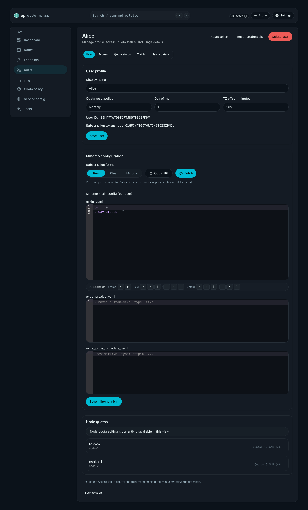
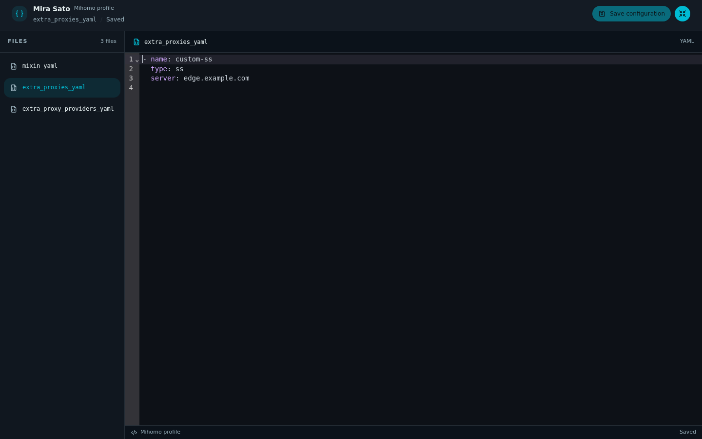
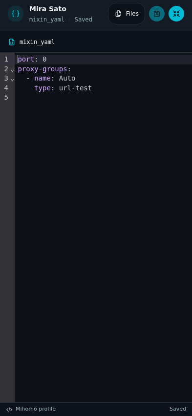
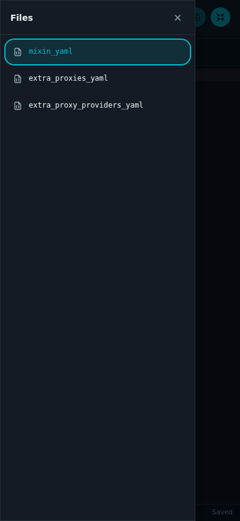

# 用户订阅 Mihomo 混入配置

## Related ADRs

None

## Context and Scope

### 背景 / 问题陈述

- 当前订阅接口虽已支持 `format=mihomo`，但早期口径仍偏向“template + extra_*”自由拼装，容易把动态节点、provider 名称或落地组写死在用户输入里。
- 真实使用里，动态层应由系统根据 XP 用户订阅数据生成：
  - `proxies`（主力节点）来自 membership/endpoint/node；
  - `proxy-providers`（普通节点池）若存在，则整体作为地区入口与链式代理的候选池；
  - 用户输入只应补充静态配置与业务分组，不应继续固化动态节点名。
- 若不把动态层系统内置化，会持续出现：
  - 清空 `extra_*` 或切换用户后仍残留不存在的 proxy/provider/group 引用；
  - 管理端把完整配置当模板粘贴后，动态层与静态层职责混淆；
  - 示例配置难以稳定复用，管理员无法确认最终订阅与示例行为是否等价。
- 用户详情页三个 YAML 编辑器纵向排列且高度受限，长配置需要反复滚动。
  Mihomo 工作区将三个文档集中为文件导航与单文档编辑区。

## 目标 / 非目标

### Goals

- 稳定 `format=mihomo` 输出，支持每用户 mixin、系统动态注入与用户扩展。
- 保持 `raw/base64/clash` 现有行为不变。
- 将管理 API 字段统一收敛为 `mixin_yaml`，移除旧字段 `template_yaml` 兼容层。
- 系统内置生成并覆盖 provider-only 模式下的动态地区组与落地组：
  - 可见地区组：`🌟 {Japan|HongKong|Taiwan|Korea|Singapore|US|Other}`
  - 兼容地区组：固定地区面对应的 `🔒/🤯` 隐藏 alias
  - 聚合组：`🔒 高质量`、`💎 高质量`、`🚀 节点选择`、`💎 节点选择`、`🤯 All`
  - 落地组：`🛬 {base}` 与落地池 `🔒 落地`
- 保持 `extra_proxies_yaml` 为正式官方能力；`extra_proxy_providers_yaml` 保持可选。
- 对脱敏 Mihomo 示例生成可证明的等价输出，并说明差异。
- 支持放大编辑 Mihomo Profile，并保留宽窄屏的编辑、保存、缩回能力。

### Non-goals

- 不内置敏感配置内容到仓库。
- 不保证 YAML 注释/anchors 原样保留。
- 不新增 provider 自动抓取逻辑。

## 范围（Scope）

### In scope

- 后端用户级 Mihomo mixin 配置存储与管理 API 收敛。
- 订阅接口 `format=mihomo` 的系统动态组生成、mixin 合并与悬挂引用裁剪。
- Web 用户详情页的 Mihomo mixin 编辑、保存与预览语义迁移。
- 用户详情页 Mihomo 工作区、文件切换、草稿连续性与响应式布局。
- 单测/集成测试/前端测试与共享测试机真实 Mihomo 校验。
- Spec、契约文档与设计文档同步到 mixin 语义。

### Out of scope

- 不重做现有 raw/clash 命名规则。
- 不追求 YAML 行级一致；验收以行为等价为准。
- 不把示例中的具体动态节点名继续暴露为 mixin 的稳定接口。
- ToolsPage 脱敏输入/输出编辑器、其他 YAML 编辑器与通用文件管理器。
- 浏览器 Fullscreen API、新路由、单文件保存 API、自动保存与跨刷新草稿恢复。
- 额外链式区域与可配置 filter。

## Requirements

### MUST

- **REQ-MIHOMO-SUB-001**: `GET /api/sub/{token}?format=mihomo` 支持完整输出。
- **REQ-MIHOMO-SUB-002**: 用户 mixin 按 `user_id` 持久化存储。
- **REQ-MIHOMO-SUB-003**: 管理 API 请求与响应统一使用 `mixin_yaml`。
- **REQ-MIHOMO-SUB-004**: 对外只接受 `mixin_yaml`；内部状态/WAL/snapshot 兼容读写 `template_yaml`，并双写两字段。
- **REQ-MIHOMO-SUB-005**: 支持 `extra_proxies_yaml` sequence 与可空 `extra_proxy_providers_yaml` mapping。
- **REQ-MIHOMO-SUB-006**: 渲染时系统重建并覆盖 `proxies`、`proxy-providers` 与所有系统保留动态组。
- **REQ-MIHOMO-SUB-007**: 系统保留地区组、`🔒 高质量`、`💎 高质量`、`🚀 节点选择`、`💎 节点选择` 与 `🤯 All` 必须只从节点主动探测得到的订阅地区派生，不再使用 `node_name` slug 猜测。
- **REQ-MIHOMO-SUB-008**: 地区面固定为 `Japan / HongKong / Taiwan / Korea / Singapore / US / Other`；首次成功探测前，为避免滚动升级时既有地区组瞬间清空，历史节点继续沿用 legacy slug fallback（JP/HK/TW/KR）归类；一旦存在成功探测结果，则优先使用 `subscription_region`，但仅在 probe 未 stale 时视为权威；probe stale 后回退到 legacy slug fallback / `Other`。
- **REQ-MIHOMO-SUB-009**: `proxy-providers` 视为一个整体普通节点池；provider-only 模式下系统按 `Node.access_host` 聚合 relay，relay 组只消费外部 provider，并在 provider 为空时仍必须生成可加载配置。
- **REQ-MIHOMO-SUB-010**: `extra_proxies_yaml` 中的节点会并入最终 `proxies`。
- **REQ-MIHOMO-SUB-011**: 落地组生成遵循 provider filter 合同：`🛬 {base}` 通过 system provider payload 稳定消费 `{base}-ss-chain` / `{base}-reality-chain`，并保持 ss-chain 在前、reality-chain 在后。
- **REQ-MIHOMO-SUB-012**: 节点名冲突自动稳定重命名并记录告警日志。
- **REQ-MIHOMO-SUB-013**: mixin 缺失时 `format=mihomo` 回退 clash。
- **REQ-MIHOMO-SUB-014**: `GET/PUT /api/admin/users/{user_id}/subscription-mihomo-profile` 返回与存储原样一致的 profile；服务端不自动抽取、不自动规范化，也不隐式剥离系统托管引用。

- **REQ-MIHOMO-SUB-018**: 用户资料保存区与 Mihomo 配置保存区 MUST 以同级区域呈现，各自的保存按钮只属于对应区域。
- **REQ-MIHOMO-SUB-019**: `raw/clash/base64` 的输出语义与 content-type MUST 保持兼容。

### SHOULD

- **REQ-MIHOMO-SUB-015**: `mixin_yaml` / extra YAML 在写入前做根类型校验并返回可读错误。
- **REQ-MIHOMO-SUB-016**: mixin 与对应 `extra_*` 同时提供动态段时返回 `invalid_request`，避免静默覆盖。
- **REQ-MIHOMO-SUB-017**: 输出订阅示例应提供脱敏片段与差异说明，方便人工复核。

### REQ-MIHOMO-WORKSPACE-001 — 入口与工作区边界

- 用户详情页的 Mihomo mixin 配置标题旁 MUST 提供一个有可访问名称的放大按钮。
- 放大后工作区充满当前浏览器内容视口，覆盖应用页头与主导航；只保留工作区自己的标题、文件导航和编辑操作。
- 工作区不增加路由或浏览器历史记录，也不调用浏览器 Fullscreen API。
- 首次打开选中 `mixin_yaml`；同一用户页面内再次打开沿用上次选中的文档。
- 配置尚未加载时，入口不可用；已加载的只读配置允许放大查看。

### REQ-MIHOMO-WORKSPACE-002 — 固定配置文档与编辑连续性

- 文件树 MUST 固定列出 `mixin_yaml`、`extra_proxies_yaml`、`extra_proxy_providers_yaml`，右侧一次显示选中的一个文档。
- 这些条目表示既有 Profile 字段，不是独立磁盘文件；不提供创建、删除、重命名或上传文件的能力。
- 当前文件必须有明确的选中状态；每个文件独立标记相对已保存配置的未保存变更，恢复原值后清除该标记。
- 工作区必须显示当前用户及当前文件的上下文，避免将配置误认为另一个用户或生成的订阅。
- 文件切换及放大/缩回 MUST 保留内容、光标/选区、滚动与撤销/重做历史。
- 保留现有 YAML 语法高亮、行号、折叠和 Ctrl/Cmd+F 搜索能力；长行仅在编辑器内横向滚动。

### REQ-MIHOMO-WORKSPACE-003 — 草稿、缩回与离开页面

- 原页面与工作区 MUST 使用同一用户的同一份 Profile 草稿；不能形成两套需要再次应用的独立副本。
- 切换文件、缩回或退出工作区仅改变展示状态，不隐式保存或丢弃草稿，也不弹出未保存确认框。
- 工作区顶栏提供始终可见的缩回按钮；缩回后返回原页面的原滚动位置，并恢复入口焦点。
- `Esc` 优先交给当前打开的搜索、补全或文件抽屉；这些内部交互关闭且事件未被消费时，`Esc` 才缩回工作区。
- 真正导航离开当前用户时，继续使用现有 Mihomo Profile 未保存变更保护；不能用缩回行为绕过它。
- 视图切换和后台刷新不得覆盖脏草稿；页面刷新仍沿用既有草稿生命周期，不引入跨刷新恢复。

### REQ-MIHOMO-WORKSPACE-004 — 手动保存整个 Profile

- 工作区顶栏 MUST 提供“保存配置”操作，使用既有 Profile 保存流程一次提交三个字段，与当前文件无关。
- 保存成功后保持工作区打开、保留选中文档与编辑位置，并更新已保存基线及未保存标记。
- 保存进行中禁止重复提交与配置编辑，允许切换文件或缩回；请求终态的结果在当前展示模式下仍可见。
- 保存失败必须保留全部草稿、显示可读错误并允许显式重试，不自动关闭工作区。
- 只读模式必须保留文件切换、查看和缩回能力，同时禁止配置编辑与保存；不因放大而放宽权限。
- 用户资料与 Mihomo 保存独立；订阅 Fetch 继续使用已有预览流程。

### REQ-MIHOMO-WORKSPACE-005 — 宽屏与窄屏布局

- 宽屏 MUST 使用左文件树、右编辑区的布局，文件导航不随编辑器内容滚动；编辑器占满顶栏之外的可用高度。
- 窄屏将编辑区铺满工作区，通过“文件”按钮打开文件抽屉；选择文档后自动收起抽屉。
- 保存和缩回操作在各视口中始终可见；文件名或错误长文本不能挤出这些操作。
- 工作区必须适应浏览器动态视口、软键盘与安全区；允许编辑器内部滚动，不能产生页面级横向溢出或让背景页面滚动。
- 视口尺寸变化只改变布局，不改变当前文档、草稿或编辑状态。

### REQ-MIHOMO-WORKSPACE-006 — 主题、键盘与焦点

- 工作区 MUST 延续项目现有浅色/深色主题、图标与操作控件风格。
- 放大/缩回、文件选择、保存与文件抽屉必须可通过键盘操作，提供清楚的可访问名称和可见焦点。
- 工作区打开时焦点进入工作区，Tab 导航不得进入被覆盖的背景页面；窄屏文件抽屉关闭后焦点返回编辑区或触发控件。
- 工作区不能截断现有 CodeMirror 搜索与折叠操作；未保存状态须提供文字或可访问说明，不能仅以颜色区分。

## 功能与行为规格（Functional/Behavior Spec）

### Core flows

- 管理员在用户详情页编辑并保存 Mihomo mixin config。
- 用户订阅拉取 `format=mihomo` 时：
  - 读取用户 `mixin_yaml`；
  - 读取 `extra_proxy_providers_yaml` 作为普通节点池（可空）；
  - 生成 system provider payload 与落地节点：`-reality`、`-ss`、`-ss-chain`、`-reality-chain`；
  - 读取节点主动探测持久化状态，把每个落地节点映射到固定地区面；
  - 合并 `extra_proxies_yaml`；
  - 覆盖并注入系统保留动态组（可见地区组、隐藏 alias、高质量/节点选择聚合组、`🔒 落地` 与 `🛬 {base}`）；
  - 裁剪或重映射 mixin 中残留的未知动态引用；
  - 输出可直接导入的 Mihomo YAML。

### Edge cases / errors

- `mixin_yaml` 非法或根类型错误：管理 API 返回 `400 invalid_request`。
- extra YAML 根类型不符合约束：管理 API 返回 `400 invalid_request`。
- 用户只传 `mixin_yaml`；旧字段 `template_yaml` 不再接受。
- 未配置 mixin：订阅接口回退 clash 输出。

## 接口契约（Interfaces & Contracts）

### 接口清单（Inventory）

| 接口（Name）                                                 | 类型（Kind） | 范围（Scope） | 变更（Change） | 契约文档（Contract Doc） | 负责人（Owner） | 使用方（Consumers）       | 备注（Notes）             |
| ------------------------------------------------------------ | ------------ | ------------- | -------------- | ------------------------ | --------------- | ------------------------- | ------------------------- |
| `GET /api/sub/{subscription_token}?format=mihomo`            | HTTP API     | external      | Existing       | ./contracts/http-apis.md | backend         | mihomo client/web preview | 无 mixin 时回退 clash     |
| `GET /api/admin/users/{user_id}/subscription-mihomo-profile` | HTTP API     | internal      | Changed        | ./contracts/http-apis.md | backend         | web admin                 | 响应主字段为 `mixin_yaml` |
| `PUT /api/admin/users/{user_id}/subscription-mihomo-profile` | HTTP API     | internal      | Changed        | ./contracts/http-apis.md | backend         | web admin                 | 仅接受 `mixin_yaml`       |

### 契约文档（按 Kind 拆分）

- [contracts/http-apis.md](./contracts/http-apis.md)

## Verification

- **VER-MIHOMO-SUB-001** (covers: `REQ-MIHOMO-SUB-001`, `REQ-MIHOMO-SUB-006`): Given 用户已配置 mixin，When 拉取 `format=mihomo`，Then 返回 YAML 包含系统生成的 `-reality`、`-ss`、`-chain` 节点。
- **VER-MIHOMO-SUB-002** (covers: `REQ-MIHOMO-SUB-009`): Given 用户配置了多个 `proxy-providers`，When 拉取 `format=mihomo`，Then per-access-host relay 组只消费这些外部 provider，并带有 `url-test` 高可用探测参数。
- **VER-MIHOMO-SUB-003** (covers: `REQ-MIHOMO-SUB-009`): Given `proxy-providers` 为空，When 拉取 `format=mihomo`，Then relay 组仍存在、订阅仍可加载，且不出现不存在的 proxy/provider/group 引用。
- **VER-MIHOMO-SUB-004** (covers: `REQ-MIHOMO-SUB-007`, `REQ-MIHOMO-SUB-008`): Given 新增节点已拥有 membership 与系统 provider 入口，When 该节点完成首次主动探测并映射到 `Taiwan`，Then 无需修改任何用户模板，`🌟 Taiwan` 与 `🚀 节点选择` 都会自动包含 `🛬 {base}`，且 `🔒 高质量` 会稳定暴露该地区入口。
- **VER-MIHOMO-SUB-005** (covers: `REQ-MIHOMO-SUB-008`): Given 旧集群升级后某历史节点暂时还没有成功探测记录，When 其旧节点名 slug 原本会命中 `Japan/HongKong/Taiwan/Korea`，Then 订阅渲染仍保持该 legacy 地区归类，直到首次成功探测结果落盘。
- **VER-MIHOMO-SUB-006** (covers: `REQ-MIHOMO-SUB-008`): Given 某节点主动探测暂时失败，When 该节点存在最近一次成功归类且该结果仍在 stale 窗口内，Then 订阅仍保留其上一轮地区归类，不会立即从系统托管分组中消失；一旦 probe 进入 stale，渲染回退到 legacy slug fallback / `Other`。
- **VER-MIHOMO-SUB-007** (covers: `REQ-MIHOMO-SUB-006`): Given mixin 中残留旧系统组定义或引用（如 `🛣️ Japan` / `🔒 Japan`），When 拉取 `format=mihomo`，Then 这些旧系统组会在渲染阶段被系统覆盖为被动兼容组；若引用最终仍悬挂，则继续按悬挂引用处理并裁剪。
- **VER-MIHOMO-SUB-008** (covers: `REQ-MIHOMO-SUB-006`): Given 用户组引用旧地区名或系统聚合别名，When 拉取 `format=mihomo`，Then 按 helper block 顺序重放并折叠为公开地区、高质量或节点选择组；缺少 helper 时只做最小替换，不暴露 hidden alias。
- **VER-MIHOMO-SUB-009** (covers: `REQ-MIHOMO-SUB-010`): Given 仅存在 `extra_proxies_yaml`，When 拉取 `format=mihomo`，Then extra proxies 仍出现在最终 `proxies` 中，且不会额外生成由系统托管的 `🛬 {base}` 落地组。
- **VER-MIHOMO-SUB-010** (covers: `REQ-MIHOMO-SUB-010`): Given `extra_proxies_yaml` 中包含名称看起来像系统动态后缀（如 `-chain` / `-reality`，或历史遗留的 `-JP`）的静态节点，When 业务组显式引用这些节点，Then 引用仍绑定到这些 extra proxies，而不会被错误重映射到系统生成节点。
- **VER-MIHOMO-SUB-011** (covers: `REQ-MIHOMO-SUB-011`): Given 存在 `base-reality` 与 `base-ss` 同时可用，When 生成 `🛬 {base}`，Then `🛬 {base}` 必须包含 `base-reality`，且不得再把 `base-ss` 暴露为该组成员。
- **VER-MIHOMO-SUB-012** (covers: `REQ-MIHOMO-SUB-011`): Given 仅存在 `base-ss`（无 `base-reality`），When 生成 `🛬 {base}`，Then `🛬 {base}` 继续沿用 `base-chain` 与 `base-ss` 的兼容回落路径。
- **VER-MIHOMO-SUB-013** (covers: `REQ-MIHOMO-SUB-003`): Given 请求体只提供旧字段 `template_yaml`，When 保存 profile，Then 请求被拒绝。
- **VER-MIHOMO-SUB-014** (covers: `REQ-MIHOMO-SUB-018`): Given 管理员打开 User Details，When 编辑用户资料或 Mihomo mixin，Then 用户资料保存区与 Mihomo 配置保存区以同级区域呈现，
  且各自的保存按钮只属于对应区域。
- **VER-MIHOMO-SUB-015** (covers: `REQ-MIHOMO-SUB-017`): Given 一份外部提供的脱敏 Mihomo 示例作为目标，When 在共享测试机生成 `format=mihomo` 输出，Then 必须能展示一份脱敏但结构真实的订阅片段，并说明系统托管动态段带来的结构差异与业务行为等价证据。
- **VER-MIHOMO-SUB-016** (covers: `REQ-MIHOMO-SUB-017`): Given 目标示例自带脱敏后的静态 `proxies`（如遮蔽的 REALITY 公钥），When 需要做真实 Mihomo `-t` 校验，Then 应基于同一份业务 mixin 去掉这些不可解析的脱敏静态节点后再校验，以验证系统生成的动态层、provider 池与业务分组仍可被 Mihomo 实际加载。
- **VER-MIHOMO-SUB-017** (covers: `REQ-MIHOMO-SUB-019`): Given 现有 `raw/clash/base64` 调用，When 回归测试，Then 输出语义与 content-type 不回归。

### VER-MIHOMO-SUB-018 — Profile 根类型与原样存储

- Method: 既有 Profile API 契约验证。
- covers: `REQ-MIHOMO-SUB-002`, `REQ-MIHOMO-SUB-003`, `REQ-MIHOMO-SUB-005`, `REQ-MIHOMO-SUB-014`, `REQ-MIHOMO-SUB-015`
- Pass condition: 不同用户的 Profile 独立保存与读取；mixin 为 mapping，extra proxies 为 sequence，extra providers 为 mapping，允许相应空字段。
  非法 YAML 或根类型返回可读错误；合法输入原样保存，读取字段为 `mixin_yaml`，不隐式抽取或改写内容。

### VER-MIHOMO-SUB-019 — 内部状态兼容

- Method: 状态/WAL/snapshot 的序列化与兼容回放验证。
- covers: `REQ-MIHOMO-SUB-004`
- Pass condition: 内部状态同时保留 `mixin_yaml` 与旧 `template_yaml` 的兼容读写能力；对外 Profile API 不重新接受旧字段。

### VER-MIHOMO-SUB-020 — 冲突、空 mixin 与 provider filter

- Method: 订阅渲染与 Profile 校验场景验证。
- covers: `REQ-MIHOMO-SUB-011`, `REQ-MIHOMO-SUB-012`, `REQ-MIHOMO-SUB-013`, `REQ-MIHOMO-SUB-016`
- Pass condition: 节点名冲突被稳定重命名并记录告警；未配置 mixin 时回退 clash；mixin 与 extra 字段重复提供同类动态段时返回 `invalid_request`。
  落地组按 system provider filter 合同消费 ss-chain 与 reality-chain，保持要求的顺序。

### VER-MIHOMO-WORKSPACE-001 — 放大入口与范围

- Method: 用户详情页交互检查与工作区布局验证。
- covers: `REQ-MIHOMO-WORKSPACE-001`
- Pass condition: 从配置区的唯一入口打开后，工作区覆盖整个内容视口且隐藏背景导航；首次选中 `mixin_yaml`，URL、历史记录和浏览器全屏状态不变。
  缩回后重新打开恢复上次选中文档；配置加载前入口不可用，已加载的只读配置仍可打开。

### VER-MIHOMO-WORKSPACE-002 — 文件切换与编辑状态

- Method: 使用三个不同 YAML 文档执行真实编辑器交互与未保存状态检查。
- covers: `REQ-MIHOMO-WORKSPACE-002`
- Pass condition: 文件树只有三个固定条目，选择后右侧只显示对应编辑器，用户与文件上下文清楚。
  分别编辑三个文件并设置不同选区、滚动位置后，来回切换及放大/缩回不丢内容或编辑状态；撤销/重做继续作用于各自文档。
  每个脏文档被标记，恢复已保存内容后标记消失；长行滚动限制在编辑器内部。

### VER-MIHOMO-WORKSPACE-003 — 缩回与草稿保护

- Method: 同一用户页面的双向草稿同步、键盘退出与导航保护场景。
- covers: `REQ-MIHOMO-WORKSPACE-003`
- Pass condition: 原页修改后放大可见同一草稿，工作区修改后缩回可见同一草稿；退出不发保存请求、不弹确认且恢复原页滚动位置和入口焦点。
  搜索、补全或抽屉打开时首次 `Esc` 只关闭内部交互，后续未消费的 `Esc` 缩回；后台刷新不覆盖脏草稿。
  真正离开当前用户时仍进入现有保存/放弃/继续编辑保护流程。

### VER-MIHOMO-WORKSPACE-004 — 保存成功、失败与只读

- Method: Profile 请求参数与延迟成功、失败、只读状态场景验证。
- covers: `REQ-MIHOMO-WORKSPACE-004`
- Pass condition: 无论选中哪个文件，保存均通过既有流程提交三个字段；成功后不关闭工作区，清除对应未保存标记并保留编辑位置。
  请求未终结时不能重复保存或继续改写配置，切换和缩回仍可用；失败后草稿完整、错误可见并能重试。
  只读时文件可切换和查看，但无法编辑或保存；保存配置不会触发用户资料保存或订阅 Fetch。

### VER-MIHOMO-WORKSPACE-005 — 响应式与滚动

- Method: 320px、393px 窄屏、768px 平板和 1440px 桌面视口的布局与交互验证，覆盖动态高度、软键盘和长行。
- covers: `REQ-MIHOMO-WORKSPACE-005`
- Pass condition: 宽屏左树右编辑，窄屏通过文件抽屉切换且选中后自动收起；保存与缩回均可见。
  长文件、长行、错误文本、窗口缩放和移动端键盘不会产生页面级溢出、背景滚动、草稿丢失或隐藏关键操作。

### VER-MIHOMO-WORKSPACE-006 — 主题与可访问交互

- Method: 浅色/深色视觉检查、键盘遍历与可访问语义验证。
- covers: `REQ-MIHOMO-WORKSPACE-006`
- Pass condition: 两种主题下文件选中、未保存状态、焦点和代码均可读，控件保持项目风格。
  使用键盘可以完成打开、文件切换、保存、抽屉关闭与缩回；工作区活动期间焦点不落到背景，搜索/折叠快捷键仍可用。

## Visual Evidence

User Details sibling save regions after the layout split.

Mihomo workspace visual proof: desktop tree/editor and narrow toolbar/drawer states.

## 主题资产

- Directory: `docs/specs/mihomo-subscription-template/assets/`

## 示例资产

- 规范化后的 owner-facing mixin 样例：
  - `assets/owner-mixin-normalized.yaml`
- 该样例表示“当前合同下可直接提交的 owner mixin”：
  - 不再携带系统托管 provider、系统地区组、系统高质量组、系统节点选择组与落地组定义
  - 只保留 owner-owned 的规则、rule-providers、listeners、DNS/TUN 与业务分组
  - 业务分组统一引用当前 owner-facing 合同名（如 `🔒 高质量`、`💎 节点选择`）

## 方案概述（Approach, high-level）

- 以“混入配置（mixin config）”为静态补充，后端在渲染阶段覆盖动态段并注入系统保留动态组。
- 将高风险自由输入限制为 YAML 根类型校验 + 联合预渲染校验 + 悬挂引用裁剪，保证配置最小正确性。
- 通过系统托管动态组与 deterministic remap/prune，避免用户 mixin 持续依赖具体动态节点名。

## Compatibility Constraints

- 风险：用户输入 mixin 仍可能包含客户端不兼容字段，服务端只保证结构正确性与已知动态组约束。
- 风险：示例配置的“功能等价”需要依赖真实测试机验证，不能仅凭文本 diff 判断。
- 风险：Mihomo 不提供纯被动、零主动探测的自动回落；当前实现只能接受“失败后触发主动补检”的折中。
- provider-only 系统托管层由 [Mihomo provider dual track](../mihomo-provider-dual-track/SPEC.md) 负责；本主题负责用户 mixin/profile API 与配置编辑的 owner-facing 边界。

## 参考（References）

- 样例配置：外部提供的脱敏 Mihomo YAML（不入仓）
