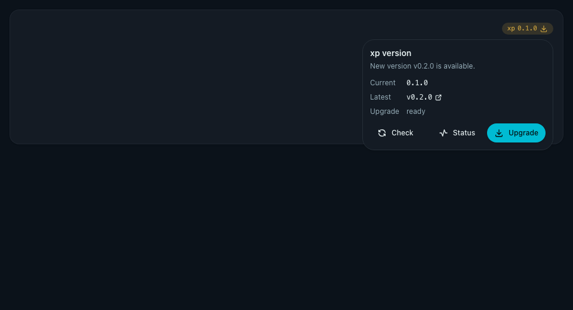
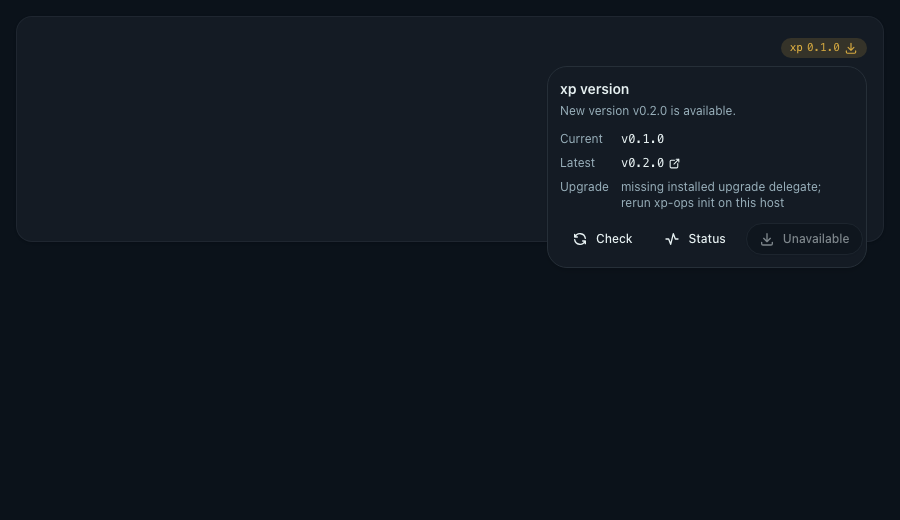
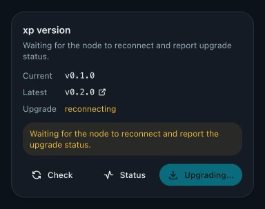
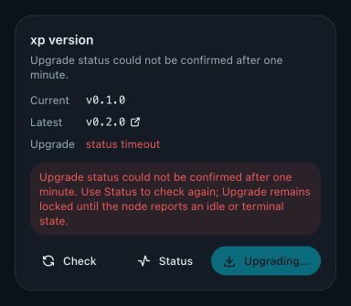

# Web 原地升级入口（#nq4ha）

## 状态

- Status: 已完成
- Created: 2026-07-04
- Last: 2026-08-03

## 背景 / 问题陈述

- `#n5mtq` 已经让 Web 顶栏展示当前 `xp` 版本并检查 stable GitHub Release，但更新发现后的行动仍需要离开 UI 手动执行。
- `#ap63t` 已经把升级能力统一到 `xp-ops upgrade`，包含 release 锁定、`xp-ops` 自升级续跑、`xp` 替换、`xray` 静态配置收敛与失败回滚。
- 需要在不让 `xp` 以 root 运行、不复制升级逻辑、不扩大任意命令执行面的前提下，让 host-managed 当前节点能从 Web 触发一次受限原地升级。

## 目标 / 非目标

### Goals

- 顶栏版本入口收敛为单个 `VersionIndicator`，有更新时右侧图标切换为升级/下载图标。
- 版本入口支持 hover、focus、click 打开交互 popover，展示当前版本、最新版本、release 链接、检查状态、升级支持状态与最近 job 状态。
- 新增 admin-only 本机 upgrade job API：查询支持状态和最近 job，按 UI 确认后的 target tag 启动升级。
- 通过 `xp-ops` 隐藏 runner 和一次性 root 委托入口触发现有 `xp-ops upgrade`，不在 `xp` 内重写升级流程。
- 升级状态持久化到本机数据目录，`xp` 重启后 Web 仍能恢复 running/succeeded/failed/unsupported 状态。
- 明确 host-managed systemd/OpenRC 支持 Web 自动升级；Docker/Compose 节点不支持容器内自动升级，并显示宿主侧升级指引。

### Non-goals

- 不做全集群滚动升级。
- 不做远程节点选择或跨节点升级。
- 不让 `xp` 常驻 root。
- 不新增任意 shell 执行 API。
- 不提供 prerelease/channel 选择 UI。
- 不为 Docker/Compose 节点提供容器内自动升级。

## 范围（Scope）

### In scope

- `GET /api/admin/upgrade/status`
- `POST /api/admin/upgrade/start`
- `src/upgrade_job.rs` 持久化 job 状态与支持检测。
- `xp-ops _upgrade-runner` 隐藏入口。
- `xp-ops init` 写入 systemd/OpenRC 一次性 root 委托资产。
- `web/src/components/VersionIndicator.tsx`、admin upgrade API schema、Storybook 状态画廊。
- `docs/ops/**`、`AGENTS.md` 与本 spec 同步。

### Out of scope

- release channel 管理。
- 远端节点认证/调度协议。
- Docker image pull / Compose restart 自动化。
- Web 回滚按钮。

## 需求（Requirements）

### MUST

- `GET /api/admin/upgrade/status` 必须要求 admin auth，并返回：
  - `support.supported`
  - `support.reason`
  - `support.trigger` (`systemd|openrc|null`)
  - 最近 job status。
- `POST /api/admin/upgrade/start` 必须要求 admin auth，并要求请求体携带确认后的 `target_tag`。
- 当已有 active job (`running|restarting`) 时，重复启动必须返回 `409 upgrade_already_running`。
- 当运行环境是 Docker/Compose 容器时，Web 自动升级必须返回/展示 unsupported，不得在容器内替换自身。
- 一次性 root 委托只能触发固定 upgrade runner，不能传入任意命令。
- runner 必须读取 `XP_DATA_DIR` 下受限 request，调用现有 `xp-ops upgrade --version <target>`
  流程，并写 durable status。
- UI 点击 Upgrade 必须先弹出确认框；确认后才调用 start API。
- UI 必须在 running/restarting 时禁用重复启动，并轮询恢复状态。
- UI 确认升级前必须建立同标签页观察记录，并将目标版本和绝对截止时间写入
  `sessionStorage`。
  刷新页面后只恢复剩余观察时间。
- 观察期间必须每 2.5 秒查询 status。无结构 5xx、网络中断和
  `409 upgrade_already_running` 只表示 start 结果未知或已有任务；必须继续观察。
  结构化拒绝必须立即显示失败。
- status 返回 `succeeded|failed|unsupported` 时必须停止观察。
  属于新一次 attempt 的 terminal snapshot 必须已见 active 状态，或其更新时间严格晚于本次启动时刻；
  不得让残留的上一轮结果收口新一轮观察。
  连续 60 秒不能获得确定结果时，必须停止轮询、保持 Upgrade 锁定并显示安全的 timeout 摘要。
- 观察开始后 popover 必须保持打开且不因 pointer leave 自动关闭。
  用户可用点击外部或 Esc 主动收起，后台观察继续，顶栏保留 spinner。
  timeout 后手动 Status 查询到 active job 时必须开启新的 60 秒窗口；查询到 idle 或 terminal 状态时解除锁定。

### SHOULD

- Popover 内提供手动 Check 与 Status refresh；手动 Check 必须绕过后端 latest release 缓存，重新查询 stable GitHub Release。
- 失败状态应显示简短安全摘要，避免泄露 token/secret。
- host-managed systemd/OpenRC 样例应能直接解释 root 委托边界。

## 接口与运维契约（Interfaces & Ops Contracts）

### HTTP API

| Method | Path                        | Auth  | Behavior                                      |
| ------ | --------------------------- | ----- | --------------------------------------------- |
| GET    | `/api/admin/upgrade/status` | admin | 返回支持状态与最近 job                        |
| POST   | `/api/admin/upgrade/start`  | admin | 按 `target_tag` 启动当前节点升级；单 job 互斥 |

`GET /api/version/check?refresh=1` keeps the existing version-check response shape but requires
admin bearer auth and bypasses the in-process latest-release cache. UI-triggered manual Check must
use this refresh mode; automatic focus-based checks may use the cached public path.

`POST /api/admin/upgrade/start` 请求体：

```json
{
  "target_tag": "v0.3.0"
}
```

The upgrade source repo is server-controlled from `XP_OPS_GITHUB_REPO`; the start API must not trust
or persist a browser-supplied repo override.

### Durable files

Under `${XP_DATA_DIR}`:

- `upgrade/request.json`: Web start API 写入的受限请求。
- `upgrade/status.json`: runner 与 `xp` 共同读写的最近状态。
- 如果委托 one-shot 在 `_upgrade-runner` 写入 terminal result 前失败，status API 必须把
  durable active status 收敛为 `failed`，不得让 UI 永久显示 `running`。

Status states:

- `idle`
- `running`
- `restarting`
- `succeeded`
- `failed`
- `unsupported`

### Root delegation

- systemd: `xp-upgrade.service` 是 root one-shot service，`xp` 用户默认通过
  `/usr/local/libexec/xp-upgrade-trigger` 固定 helper 与窄 sudoers drop-in 触发该 unit；
  polkit rule 仅作为支持 `unit` / `verb` action detail 的系统上的兼容补充。
- systemd `xp-upgrade.service` 必须直接执行 `/usr/local/bin/xp-ops _upgrade-runner`，并通过
  unit environment / `/etc/xp/xp.env` 传递 `XP_DATA_DIR`。不得用 `/bin/sh -c` 包裹
  `--data-dir "${XP_DATA_DIR:-...}"` 这类命令行文本，因为 systemd 会先处理 `$` 展开。
- OpenRC: `xp-upgrade` 是 root one-shot service。root-owned fixed
  `/usr/local/libexec/xp-openrc-upgrade-trigger` 只接受 `--check`，以 root 验证
  `/etc/init.d/xp-upgrade` 可执行且 `/etc/doas.conf` 包含精确的 fixed start rule；
  `xp` 用户只能通过窄 doas rule 调用该 check 或 `/sbin/rc-service xp-upgrade start`。
  支持检测必须执行 `doas -n /usr/local/libexec/xp-openrc-upgrade-trigger --check`，而不是直接读取
  root-only `/etc/doas.conf`。
  旧版 `xp-ops` 无法在首次跨越该 helper 边界的升级中执行新代码，因此现有 OpenRC 节点完成普通
  `xp-ops upgrade` 后，必须由 root 显式运行一次 `xp-ops init`；readiness check 不得通过启动
  one-shot service 隐式迁移。

## 验收标准（Acceptance Criteria）

- Given `update_available`，When 查看版本元素，Then 右侧显示升级/download icon。
- Given 版本元素获得 hover/click/focus，
  When popover 打开，
  Then 可看到 current/latest/release 链接、upgrade support 与最近 job 状态。
- Given 点击 Upgrade，When 未确认，Then 不调用 start API；When 确认，Then 调用 `POST /api/admin/upgrade/start`。
- Given 未带 admin auth，When 调用 upgrade status/start，Then 返回 401。
- Given active job 已存在，When 再次 start，Then 返回 409。
- Given Docker/Compose runtime，When start upgrade，Then 返回 unsupported，UI 显示不支持 Web 自动升级与宿主侧操作方向。
- Given `xp` 重启后读取同一 `XP_DATA_DIR`，When 查询 status，Then 最近 succeeded/failed/running 状态仍可恢复。
- Given systemd one-shot runner 在写入 terminal status 前失败，
  When 查询 upgrade status，
  Then durable active status 被收敛为 failed，UI 不继续显示 running。
- Given systemd/OpenRC 委托入口，
  When 审计脚本/unit/doas/polkit，
  Then 只能触发固定 `xp-ops _upgrade-runner`，不能执行任意命令。
- Given CentOS 7-class systemd/polkit，
  When `unit` / `verb` action detail 不可用于 polkit rule，
  Then systemd Web upgrade 仍可通过固定 helper + sudoers 触发 `xp-upgrade.service`。
- Given OpenRC 的 `/etc/doas.conf` 是 `0600 root:root` 且 fixed helper 与两条窄 rule 有效，
  When `xp` 查询 upgrade status，
  Then support 返回 `supported=true` 与 `trigger=openrc`，且 `xp` 不读取该 policy。
- Given OpenRC helper、runner 或 fixed start rule 缺失/篡改，
  When `xp` 查询 upgrade status，
  Then support 保持 unsupported，且 check 不调用 `rc-service`。
- Given 旧版 OpenRC 节点尚未安装 helper，
  When 完成普通 `xp-ops upgrade` 后由 root 显式执行 `xp-ops init`，
  Then helper 与两条窄 doas rule 被安装且 `supported=true`；执行前保持 unsupported，readiness
  check 不得启动 one-shot service。
- Given 服务端版本检查缓存中仍保存旧 latest release，
  When 用户在版本 popover 内点击手动 Check，
  Then UI 必须请求 refresh 模式，后端必须绕过缓存重新查询 latest release。
- Given 确认升级后 start 响应在服务重启边界返回无结构 502 或网络错误，
  When UI 无法确认请求结果，Then popover 保持打开、Upgrade 保持禁用，
  并继续每 2.5 秒查询 status。
- Given 观察状态在同一标签页内刷新，When `sessionStorage` 中的绝对截止时间尚未到期，
  Then UI 只恢复剩余观察窗口；到期后显示 timeout 并停止自动轮询。
- Given 用户在观察期间主动收起 popover，When 后台 status 仍在查询，
  Then 顶栏 spinner 保留且重新打开时显示当前观察状态。
- Given timeout 后用户点击 Status，When status 返回 running 或 restarting，
  Then 开启新的 60 秒观察窗口；When 返回 idle、succeeded、failed 或 unsupported，
  Then 解除 Upgrade 锁定。

## 实现前置条件（Definition of Ready / Preconditions）

- 升级范围为当前连接节点。
- 升级目标默认 stable latest，由现有 `/api/version/check` 提供。
- 受限 root 委托形态为一次性 service/runner。
- Docker/Compose v1 不支持 Web 自动升级。

## 非功能性验收 / 质量门槛（Quality Gates）

- `cargo fmt`
- `cargo test`
- `cargo clippy -- -D warnings`
- `cd web && bun run lint`
- `cd web && bun run typecheck`
- `cd web && bun run test`
- `cd web && bun run storybook`
- `cd web && bun run test-storybook`
- UI 视觉证据：Storybook Canvas `Components/VersionIndicator/Reconnecting` 与
  `Components/VersionIndicator/StatusTimedOut` 展示打开的 popover 与观察终态。

## Visual Evidence

- Storybook `Components/VersionIndicator/UpdateAvailable`

PR: include


- Storybook `Components/VersionIndicator/UpdateAvailableUnsupported`

PR: include


- source_type: storybook_canvas
  - story_id_or_title: `Components/VersionIndicator/Reconnecting`
  - target_program: mock-only
  - capture_scope: element
  - requested_viewport: none
  - viewport_strategy: storybook-viewport
  - margin_policy: require_margin
  - evidence_surface: component
  - sensitive_exclusion: N/A
  - submission_gate: owner-approved
  - state: reconnecting after an ambiguous start result
  - evidence_note: direct popover element capture verifies spinner, preserved
    popover, reconnecting summary, and locked Upgrade action

PR: include


- source_type: storybook_canvas
  - story_id_or_title: `Components/VersionIndicator/StatusTimedOut`
  - target_program: mock-only
  - capture_scope: element
  - requested_viewport: none
  - viewport_strategy: storybook-viewport
  - margin_policy: require_margin
  - evidence_surface: component
  - sensitive_exclusion: N/A
  - submission_gate: owner-approved
  - state: one-minute observation timeout
  - evidence_note: direct popover element capture verifies the timeout summary,
    Status recovery action, locked Upgrade action, and content padding

PR: include


## 文档更新（Docs to Update）

- `docs/specs/README.md`
- `docs/ops/README.md`
- `docs/ops/systemd/xp-upgrade.service`
- `docs/ops/systemd/xp-upgrade-trigger`
- `docs/ops/systemd/sudoers-xp-upgrade`
- `docs/ops/systemd/xp-upgrade.polkit.rules`
- `docs/ops/openrc/xp-upgrade`
- `docs/ops/openrc/xp-upgrade-trigger`
- `docs/ops/openrc/doas-xp-upgrade.conf`
- `AGENTS.md`

## 实现里程碑（Milestones / Delivery checklist）

- [x] M1: 建立 owning spec，链接 `#n5mtq` 与 `#ap63t` 行为事实
- [x] M2: 后端 upgrade job 状态模型、admin API、单 job 并发保护与支持检测
- [x] M3: `xp-ops` 隐藏 runner 与 systemd/OpenRC 一次性 root 委托入口
- [x] M4: 顶栏 `VersionIndicator`、popover、确认框、升级轮询、API schema/tests、Storybook 状态画廊
- [x] M5: ops/AGENTS/spec 文档同步与验证证据

## 风险 / 开放问题 / 假设（Risks, Open Questions, Assumptions）

- 风险：Web start API 成功触发 one-shot 后，`xp` 可能因升级重启导致短暂连接中断；UI 通过 status 轮询与版本检查恢复。
- 风险：host-managed 节点若未安装 `xp-ops init` 写入的 root 委托资产，会返回 trigger failure，需要操作者重新运行 init/deploy 路径。
- 假设：admin token 已保护 Web 管理面；upgrade start API 不额外引入第二套凭据。
- 开放问题：None.

## 变更记录（Change log）

- 2026-07-04: 创建并完成 Web 当前节点原地升级入口规格；实现委托 runner、admin API、顶栏 popover 与文档同步。
- 2026-07-05: 修复 systemd polkit private directory 对 delegate 检测的误判，同时拒绝只装 unit
  的半安装状态；unsupported 状态下 Web 升级按钮变为不可用展示，版本号统一显示 release tag
  风格，并稳定 popover hover 关闭行为。
- 2026-07-05: systemd Web upgrade 改为优先使用 root-owned 固定 helper 与窄 sudoers 委托，
  避免 CentOS 7-class polkit 缺失 `unit` / `verb` action detail 时无法触发 `xp-upgrade.service`。
- 2026-07-06: systemd upgrade unit 改为直接执行 `_upgrade-runner`，避免 systemd 提前展开
  shell 风格 `XP_DATA_DIR` 表达式导致 runner 收到空 `--data-dir`；status API 增加 failed
  one-shot 自愈，防止 durable active status 残留为 running。
- 2026-07-07: 手动 Check 改为调用 `/api/version/check?refresh=1`，绕过 1 小时后端缓存；
  自动焦点检查继续允许使用缓存以避免频繁访问 GitHub。
- 2026-07-30: OpenRC readiness 改为调用 root-owned fixed helper 的 non-interactive doas
  `--check`。这避免 `xp` 直接读取 root-only `/etc/doas.conf` 造成有效委托被误报为
  unsupported，同时保留固定 `xp-upgrade start` 的最小授权边界。
- 2026-08-03: Web 客户端在确认升级后维护同标签页的 60 秒观察状态。
  无结构 5xx、网络中断与 `upgrade_already_running` 不再被当作确定失败；popover 保持可观察状态。
  terminal status 或显式 timeout 才收口，timeout 的手动 Status 可按服务端事实恢复或解除锁定。

## 参考（References）

- `docs/plan/n5mtq:ui-version-check/PLAN.md`
- `docs/plan/ap63t:xp-ops-upgrade-unified/PLAN.md`
- `docs/specs/c8qtw-docker-single-image-cluster-node-deploy/SPEC.md`
- `docs/solutions/ops/openrc-web-upgrade-delegate-readiness.md`
- `src/ops/upgrade.rs`
