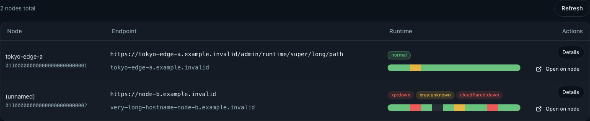
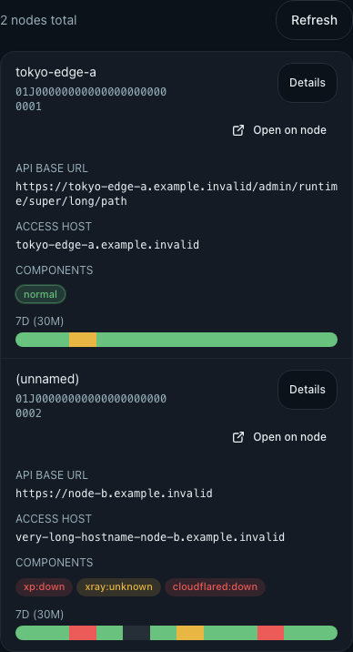

# 节点列表表格优先与跨节点同页跳转（#q4n8p）

## 状态

- Status: 已完成
- Created: 2026-06-23
- Last: 2026-06-23

## 背景 / 问题陈述

- `Dashboard` 与 `Nodes` 共享的 `NodeInventoryList` 当前在容器宽度小于 `960px` 时会提前切成卡片布局，导致桌面常见内容宽度下仍显示为卡片堆叠，不符合运维场景对表格扫描效率的预期。
- 节点列表当前只有一个 icon-only 的 “Open node panel” 入口，语义过载：既不够显眼，也无法表达“从当前节点切到目标节点托管的同一管理页”这类跨节点操作。
- 管理页登录态按 origin 保存在 `localStorage`；跨节点切换到另一台节点托管的管理页时，现有登录流程会丢失原始目标页，并固定回到首页。

## 目标 / 非目标

### Goals

- 在 `Nodes` 与 `Dashboard` 的共享节点列表中恢复桌面表格优先：容器可用宽度 `>= 768px` 时使用表格，只有 `< 768px` 时才切换为卡片。
- 将节点行操作升级为两个显式按钮：`Details` 进入本地 `/nodes/$nodeId`，`Open on node` 打开目标节点托管的当前页面（保留 `pathname + search + hash`）。
- 跨节点跳转默认带上当前 admin token 的 `login_token`，在目标 origin 未登录时能自动完成登录并回到原目标页，而不是固定回 `/`。
- 新增 topic spec，并记录 supersede/link 关系、登录回跳规则、URL 合成规则、断点与视觉验收面。

### Non-goals

- 不修改 `/api/admin/nodes/runtime`、`/api/cluster/info` 或任何后端字段与路由。
- 不扩展到 `Nodes` / `Dashboard` 之外的其他节点列表或其它管理页入口。
- 不引入新的长期认证机制、跨 origin 会话共享方案，或新的登录 UI。
- 不支持新标签打开；`Open on node` 固定为同标签切页。

## 范围（Scope）

### In scope

- `web/src/components/NodeInventoryList.tsx`：桌面 4 列表格、移动卡片、双动作按钮、跨节点 URL helper。
- `web/src/router.tsx` 与 `web/src/views/LoginPage.tsx`：受保护路由的 `redirect` 透传、`login_token` 自动登录与回跳。
- `web/src/components/NodeInventoryList.test.tsx`、`web/src/views/NodesPage.test.tsx`、`web/src/views/HomePage.test.tsx`、`web/src/views/LoginPage.test.tsx`：新增/更新行为回归。
- `web/src/components/NodeInventoryList.stories.tsx` 与 `web/src/views/NodesPage.stories.tsx`：Storybook 场景、viewport 断言与交互覆盖。
- `docs/specs/README.md`：新增 spec index 行。

### Out of scope

- Join token 卡片与部署命令 UI。
- `NodeDetailsPage` 内容与交互。
- demo 站点行为与其它页面的跨 origin 切换入口。

## 需求（Requirements）

### MUST

- `Nodes` 与 `Dashboard` 两处共享同一个 `NodeInventoryList`，桌面下显示 4 列：`Node`、`Endpoint`、`Runtime`、`Actions`。
- 容器可用宽度 `>= 768px` 时使用表格；`< 768px` 时使用卡片。`768px~959px` 允许表格横向滚动，不得提前切卡片。
- 每个节点行固定提供两个动作按钮：
  - `Details`：跳转 `/nodes/$nodeId`
  - `Open on node`：以 `node.api_base_url` 作为 origin，同标签打开当前 `pathname + search + hash`
- `Open on node` 必须注入当前 admin token 的 `login_token`，并替换已有同名参数而不是叠加。
- 受保护路由在未登录时必须重定向到 `/login?redirect=<sanitized-relative-target>`；若原始目标页带 `login_token`，重定向时必须把它从 `redirect` 中剥离并单独保留在登录页 query 中。
- `LoginPage` 自动消费 `login_token` 成功后，必须按 `redirect` 回到原目标页；若 `redirect` 非法，则回退 `/`。
- 非法或不可解析的 `api_base_url` 不得生成错误跨 origin 跳转；该动作需显式禁用并给出可访问性说明。

### SHOULD

- 桌面 `Actions` 列使用紧凑按钮样式，并保持 `Nodes` 与 `Dashboard` 一致。
- 移动卡片保留与桌面相同的两个动作入口，避免能力分叉。
- `Open on node` 保持明显的外跳语义，例如带外链图标或 title 文案。

## 验收标准（Acceptance Criteria）

- Given 当前页面容器可用宽度大于等于 `768px`，When 管理员查看 `Nodes` 或 `Dashboard` 节点列表，Then 列表以表格渲染并包含 `Actions` 表头。
- Given 任意节点行，When 管理员查看操作区，Then 同时看到 `Details` 与 `Open on node` 两个按钮，且目标分别为本地详情页与目标节点托管的当前页。
- Given 当前地址含 `query/hash`，When 点击 `Open on node`，Then 目标 URL 保留这些片段，并用新的 `login_token` 覆盖旧值。
- Given 目标节点 origin 尚未登录，When 打开受保护页，Then 跳转到登录页后自动登录并回到原目标页，而不是固定回 `/`。
- Given `redirect` 为非相对路径或以 `//` 开头，When 登录成功，Then 页面回退到 `/`，不得发生 open redirect。
- Given 容器宽度小于 `768px`，When 查看节点列表，Then 仍使用卡片布局，并且两种动作都可触达。

## 质量门槛（Quality Gates）

- `cd web && bun run lint`
- `cd web && bun run typecheck`
- `cd web && bun run test`
- `cd web && bun run test-storybook`

## 实现里程碑（Milestones / Delivery checklist）

- [x] M1: 共享节点列表切回桌面表格优先，并补双动作按钮
- [x] M2: 登录守卫与 `LoginPage` 支持跨节点回跳
- [x] M3: 测试与 Storybook 覆盖补齐
- [x] M4: 视觉证据落盘、spec/index 同步与快车道收敛

## 文档更新（Docs to Update）

- `docs/specs/README.md`

## Visual Evidence

- source_type: `storybook_canvas`
  story_id_or_title: `Components/NodeInventoryList/DesktopTable`
  state: `desktop table`
  evidence_note: 桌面容器宽度下保持 4 列表格，并展示 `Actions` 列中的 `Details` / `Open on node`

- source_type: `storybook_canvas`
  story_id_or_title: `Components/NodeInventoryList/MobileCards`
  state: `mobile cards`
  evidence_note: 小屏降级为卡片布局，同时保留 `Details` / `Open on node` 两类动作

## References

- supersedes: `docs/specs/puf2g-node-panel-link-entry/SPEC.md`
- related: `docs/specs/gj4xg-dashboard-nodes-shared-list/SPEC.md`
