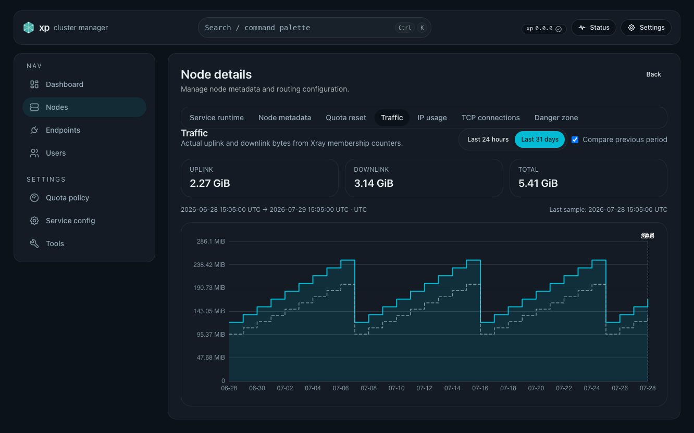
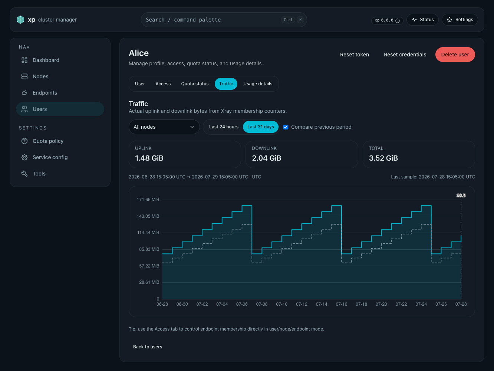
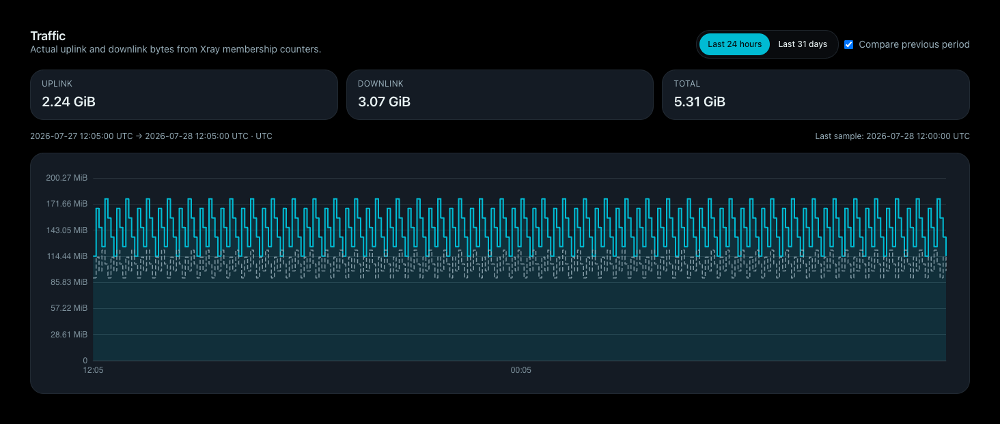
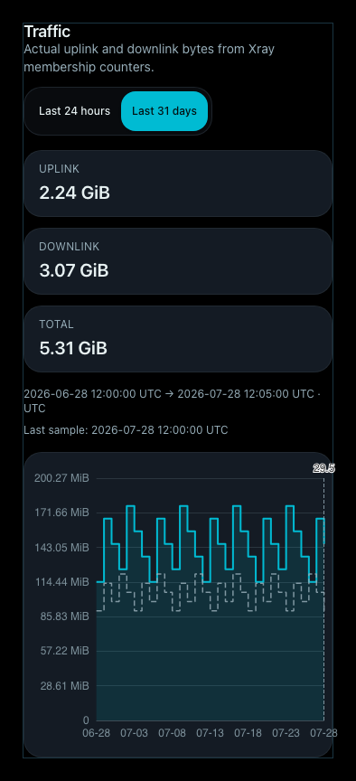

# 节点与用户 Traffic 统计（#r26nc）

> 当前有效规范以本文为准；实现覆盖与当前状态见 `./IMPLEMENTATION.md`，关键演进原因见 `./HISTORY.md`。

## 背景 / 问题陈述

现有节点历史只保留 90 天 daily traffic，并且 Web 仅在节点 runtime 失联时显示
fallback；用户没有真实流量历史。管理员需要在节点和用户详情中比较近期用量、当前 quota 周期用量，
并在采样不完整时看到明确提示。

## 目标 / 非目标

### Goals

- 同一份 Xray membership counter delta 同时形成节点、用户-节点、daily 与短期细粒度统计。
- Node/User details 提供一致的 Traffic Tab、当前周期总览、24h/31d 趋势和前一等长窗口参考线。
- 数据最多保留 49 小时五分钟 rollup 与 90 天 UTC daily rollup；缺失数据保持可见的不完整语义。

### Non-goals

- 不采集 membership 之外的系统网络流量、协议开销、mesh control-plane 或 canary 流量。
- 不保存 hourly rollup、往期周期快照、外部 TSDB、导出或 endpoint/membership 级 UI。
- 不修改 quota enforcement、IP usage 或 TCP connections 语义。

## 范围（Scope）

### In scope

- `node_history_cache.json` schema v2 的五分钟/daily 节点与用户-节点 rollup、周期累加器、裁剪及生命周期清理。
- Node/User admin traffic API 与 internal local API，包含 partial、warnings、缺失点及跨节点聚合。
- NodeDetailsPage 与 UserDetailsPage 的 Traffic Tab、共享 ECharts 视图、Storybook 状态和视觉证据。
- API 设计文档、运维数据目录说明及本 spec 的实现状态。

### Out of scope

- 计费规则、配额分配算法、网络层抓包和长期指标平台。

## 需求（Requirements）

### MUST

- 采样按 UTC 五分钟边界运行；只保留最近 49 小时（最多 588 个桶）和 90 个 UTC 日桶。
- 节点聚合包含 endpoint probe；用户 API 只返回真实用户，并按用户自身 quota reset 汇总。
- 24h 返回最近 288 个五分钟桶及此前 288 个参考桶；31d 返回 30 个完整日加当前日及此前 31 日参考桶。
- 采样缺失、首次跟踪、counter reset、周期变化必须设置 partial/tracking/warning 信息；图表缺失点为 null，不填零或插值。
- 节点周期按节点实际 reset；用户周期按用户自身 reset；unlimited 使用最近 30 个 UTC 日期槽。
- 节点与用户删除清理对应历史；membership 移除后的历史保留至自然过期。

### SHOULD

- 节点聚合镜像每五分钟同步；用户查询按节点 fan-out，不复制所有用户历史到面板节点。
- 周期总览保存恒定空间的当前 cycle start/end 与上/下行累计，首个未完整周期显示 tracking since。

## 功能与行为规格（Functional/Behavior Spec）

### Core flows

- 本地采样读取当前节点 membership 的 Xray uplink/downlink 累计值，计算非负 delta，同时更新节点和用户-节点 rollup。
- Node Traffic 默认 24h；User Traffic 默认聚合全部节点，可切换单节点；用户和节点范围选择共享并持久化。
- 主图是圆角阶梯面积图，当前总量有填充，参考总量为虚线；tooltip 展示上下行与总量。31d 当前日有不同背景，前方有竖向虚线。

### Edge cases / errors

- Xray 不可达或某 membership 采样失败时，受影响桶断线并显示 partial/warning；恢复后的跨缺口 delta 不被伪装成某个连续桶。
- counter 变小只重置 baseline，不产生负流量。
- panel fan-out 有不可达节点时返回可用节点数据、`partial=true`、`unreachable_nodes` 和最近成功采样时间。

## 接口契约（Interfaces & Contracts）

### 接口清单（Inventory）

- External node API: `/api/admin/nodes/{node_id}/traffic?window=24h|31d`。
  Consumer: Web NodeDetails；契约：`./contracts/http-apis.md`。
- External user API: `/api/admin/users/{user_id}/traffic?window=24h|31d&node_id=<optional>`。
  Consumer: Web UserDetails；契约：`./contracts/http-apis.md`。
- Internal node API: `/api/admin/_internal/nodes/traffic/local?window=24h|31d`。
  Consumer: node mirror sync；requires internal signature。
- Internal user API: `/api/admin/_internal/users/{user_id}/traffic/local?window=24h|31d`。
  Consumer: user fan-out；requires internal signature。

### 契约文档（按 Kind 拆分）

- `./contracts/http-apis.md`

## 验收标准（Acceptance Criteria）

- Given 节点有可用 Xray stats，When 五分钟采样完成，Then 节点与用户-节点上/下行 rollup 同时更新且总量等于两者之和。
- Given 页面选择 24h 或 31d，When 参考线开启，Then 当前与此前等长窗口按 UTC 对齐显示，缺失桶断线。
- Given 用户跨多个节点，When User Traffic 使用 All nodes，Then summary 和图表聚合所有可达节点并报告 partial 节点。
- Given 数据超过保留窗口，When 新采样或加载发生，Then 五分钟数据不超过 49 小时、daily 不超过 90 天。
- Given quota reset 周期或 counter reset 变化，When 下一次采样完成，Then 累加器重新建立窗口且不产生负值。

## 非功能性验收 / 质量门槛（Quality Gates）

### Testing

- Rust unit/HTTP tests 覆盖 delta、裁剪、schema 兼容、周期、fan-out 和清理。
- Web Vitest 覆盖 schema、Tab、范围记忆、节点筛选、partial/error/empty/offline 与 tooltip。
- Storybook `play` 覆盖 24h/31d、参考线、当前日分隔和用户节点筛选。

### UI / Storybook (if applicable)

- 新增共享 TrafficView 状态 gallery，并更新 Node/User page fallback stories。
- 使用 Storybook mock 数据生成 desktop/mobile 视觉证据。

### Quality checks

- `cargo fmt --check`、`cargo clippy -- -D warnings`、`cargo test`。
- `cd web && bun run lint && bun run typecheck && bun run test && bun run build`。
- Storybook test/build、style budget 和相关 Playwright。

## Visual Evidence

PR: none

Storybook覆盖=通过

视觉证据目标源=storybook_canvas（TrafficView）+ Storybook page fallback（Node/User details）

视觉证据=存在

空白裁剪=已裁剪（component 使用 require_margin，page 使用 trim_only）

聊天回图=已展示

证据落盘=已落盘

证据绑定sha=fd213dd

桌面 Node details 与 User details 页面，以及移动端 TrafficView 状态：

PR 正文保持无图。

## Related PRs

- None

## 风险 / 开放问题 / 假设（Risks, Open Questions, Assumptions）

- 风险：JSON rollup 在高用户数节点上会增加本地写入与 fan-out payload；必须保留窗口上限并验证文件大小。
- 假设：Xray 用户 traffic stats 是唯一业务流量来源；quota reset 的真实时区不改变 UTC 图表桶口径。

## 参考（References）

- `../k7m2n-node-history-fallback/SPEC.md`
- `../../desgin/quota.md`
- `../../desgin/api.md`
