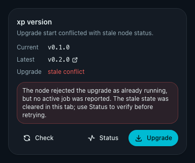
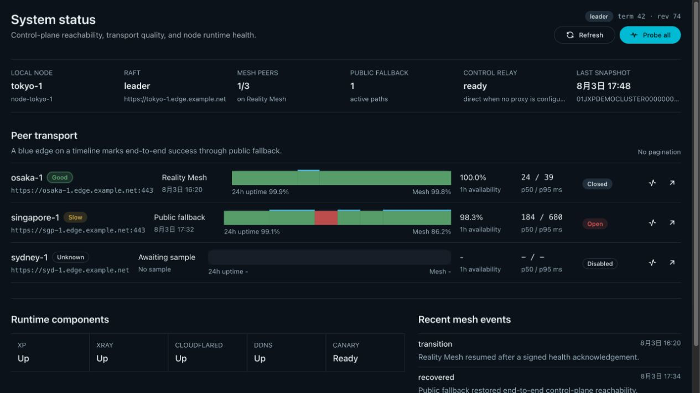
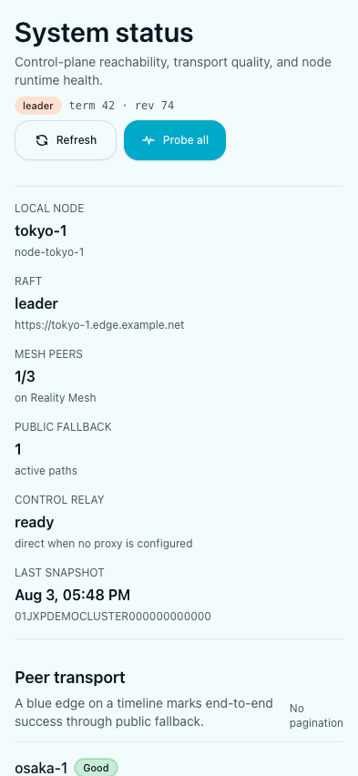
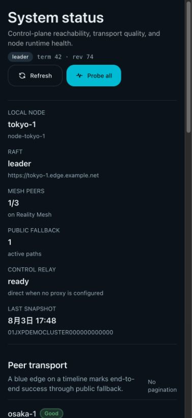
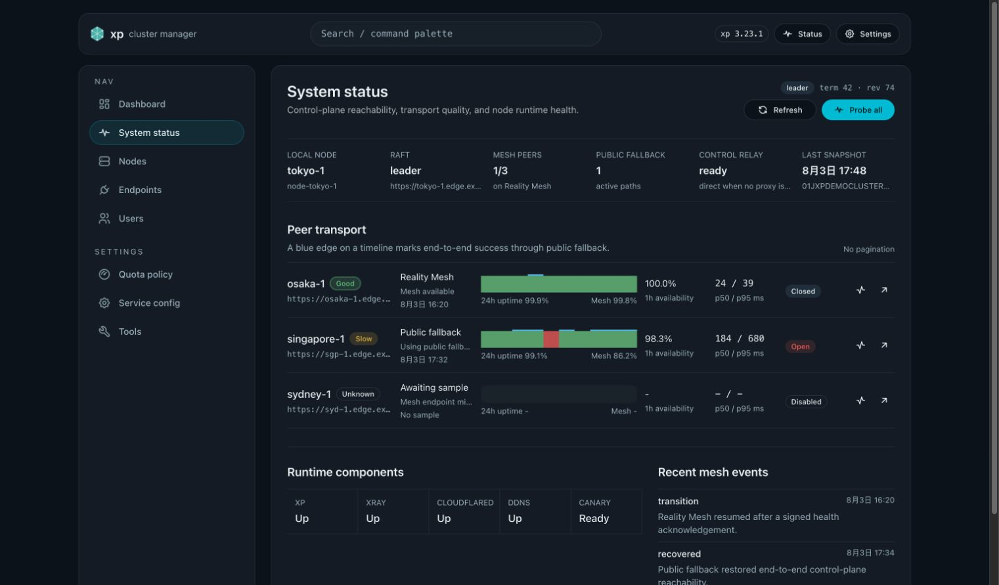
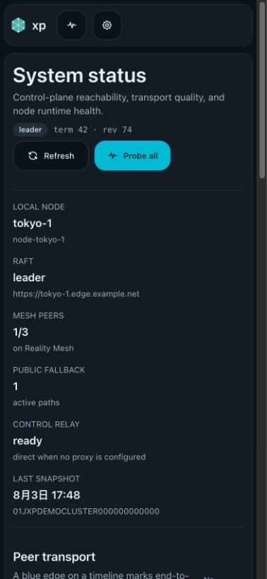
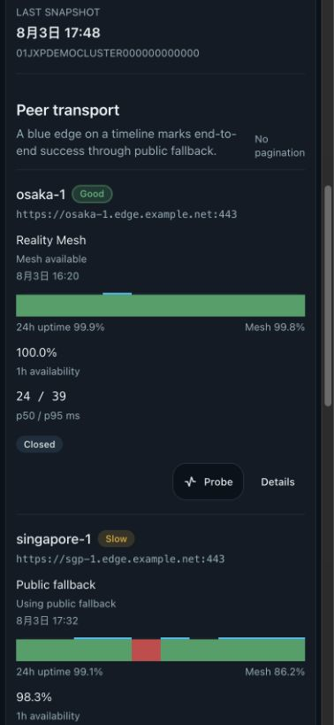
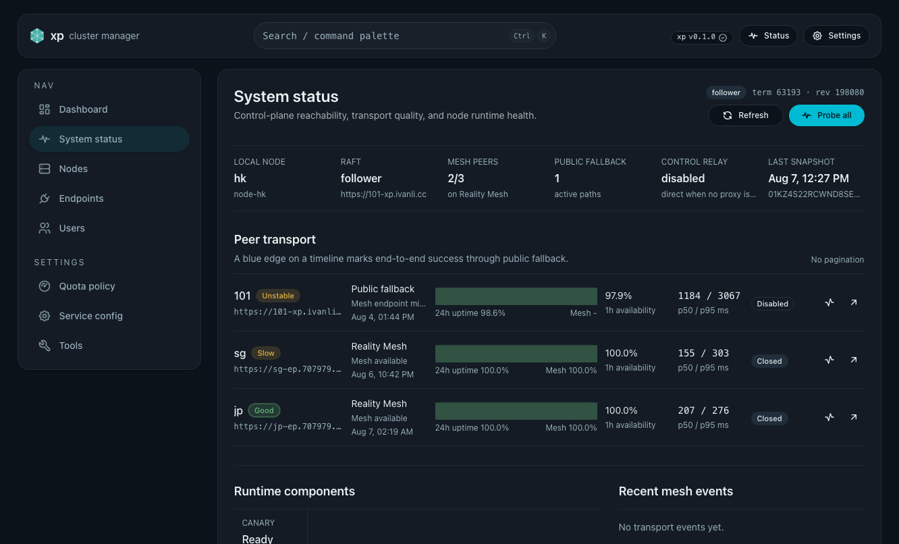
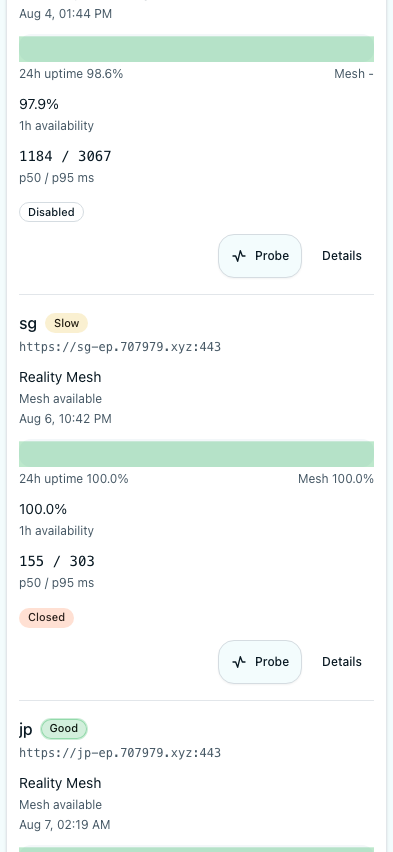
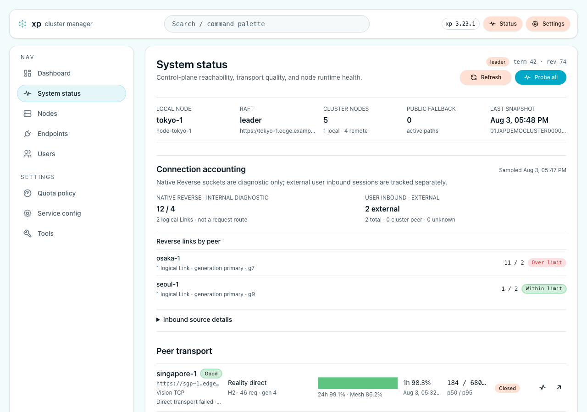

# Reality fallback 控制面 Mesh 与系统状态页

> 本文是当前有效规范。
> 实现状态见 `./IMPLEMENTATION.md`，设计缘由见 `./HISTORY.md`。

## Related ADRs

- [0014-xhttp-endpoint-direct-mesh](../../adr/0014-xhttp-endpoint-direct-mesh.md)
- [ADR 0015](../../adr/0015-directed-mesh-admission-and-peer-isolation.md)

## 背景

- 控制面此前只访问 peer 的公网 `api_base_url`。
- 内部 HMAC 没有覆盖 body、时间或身份。
- 失败后的跨路径重试可能让 mutation 重复执行。
- 管理界面缺少当前节点视角的 peer 链路诊断。
- 运维需要一个由 Raft 统一复制的集群级 Mesh 开关，以便在公网 HTTPS 仍可用时止损。

## 目标

- 从唯一 managed-default VLESS-REALITY endpoint 派生 HTTPS Mesh 路径。
- 先尝试 Mesh；路径不可用时再访问 peer 的公网地址。
- Mesh 请求在共享读准入边界内并发执行；集群 gate 切换取得独占写屏障，等待已准入请求完成后才改变状态，避免关闭后的新请求越过公网-only 边界。
- 用 internal-auth v2、稳定 request ID 和 durable dedupe 保护内部调用。
- 提供本地持久遥测、管理 API 与 `/system-status`。
- Direct Mesh 启用前必须通过 current voter 的全有向 `health-v2` 预检：有合格 managed
  endpoint 的目标必须走 Direct-only；无 endpoint 的 owner-approved private Docker voter
  必须走其注册的 `api_base_url`。预检失败不得写入 `mesh_enabled=true`。
- Direct validation、Public circuit、active route 和 endpoint 资格必须作为独立事实显示；
- 面向节点资源 current snapshot 的跨节点失败必须保留同一请求的有序路径追踪、来源/目标节点、
  Public circuit 状态和签名确认结论；诊断只能使用稳定枚举、时间、关联 ID、受控重试次数和可选
  HTTP 状态，不暴露 URL、IP、端口、正文、签名、ACK 内容、证书或底层传输原文。
  5 分钟没有有效 Direct ACK、成员或 endpoint fingerprint 变化、或进程重启后，受影响 peer
  进入 `configured_unverified` 并暂走 Public。
- `PersistedState.mesh_enabled` 是集群级开关，默认开启；关闭时控制面只访问 peer 注册的
  公网 `api_base_url`，不改用私网或 Reverse Mesh。能力探测也使用同一签名的公网请求并保留
  predecessor 404 兼容；专用 Reverse health/link probe 在当前发布中固定停用，即使集群
  Mesh 开关开启也不会重新启用 Native Reverse。
- 已准入的 Mesh 响应必须把读 guard 绑定到完整 response body 生命周期；准入期间的成功遥测
  必须复用该 guard，不得再次获取同一写优先读写锁而阻塞 gate transition。
- 所有节点间 Mesh 调用复用进程级 HTTP/2 传输，每个 peer 的稳态外部 TCP 连接为一条。
- 在不持久化地址或端口的前提下，提供连接复用和异常 churn 的可观测证据。
- 对 auth epoch 跨界升级实施维护窗口 hard cut。

## 非目标

- 不实现 VLESS protocol overlay、L3 VPN、mTLS 或每节点身份体系。
- 不改变 join、bootstrap、浏览器管理入口或用户代理流量。
- 不为响应 body 或 SSE event 单独增加 MAC。
- 不实现 nonce replay cache、强制选路、breaker reset 或自动修复。
- 不保证 50 个以上 peer 的性能。
- 不修改 Xray inbound、`connIdle`、Reality 端口或用户代理流量。
- 不为 Mesh pool、idle timeout、flow-control window 或 keepalive 暴露 operator 配置。
- 不提供节点本地环境变量覆盖集群 Mesh 开关。

## 范围

### In scope

- Raft RPC、leader forwarding、内部 fan-out、runtime events、alerts 与 probes。
- Reality fallback canary mux、request/ack HMAC、idempotency、breaker 与 telemetry。
- System Status 表格、SVG uptime strip、Storybook、mock-only `ui_demo` 与离线快照。
- systemd、OpenRC、single-image Docker 的 cutover guard 与回滚路径。

### Out of scope

- 对 operator supplied URL 发起探测。
- UI 强制选路、重置 breaker 或主动修复。
- 混合 auth v1/v2 的零停机滚动升级。

## 必须满足

- Mesh URL 只能由唯一 managed-default VLESS/Reality endpoint 与有效 `access_host` 推导；
  Vision/TCP 标记为 `vision_tcp`，XHTTP 标记为 `xhttp_reality_fallback`。XHTTP Direct Mesh
  发送既有签名 HTTP/2 控制面流量，不复用用户 XHTTP session。
- 无端点、多个 endpoint、不可用的 `access_host` 或不支持控制面 Mesh 的 transport 时，使用
  `Node.api_base_url`；已选择 Mesh 路径后，health ack 的认证或协议无效必须拒绝，不能降级到公网。
- owner-approved private Docker voter 可以合法无 endpoint；它仍参与完整 voter 预检，但只通过
  注册的 `api_base_url` 验证和承载控制面请求。该例外不允许跳过 voter，也不改变其他已有
  managed endpoint 的 Direct-only 认证和协议失败边界。
- `health-v2` 与 `mesh-v2` 使用同一个 v2 认证协议。
- canonical 覆盖版本、route、method、原始 URI、content metadata、body hash、
  cluster、sender、target、request ID 和 issued-at。
- 认证窗口为 `+/-120s`；不得引入 nonce header 或 nonce cache。
- request 与 acknowledgement key 经 HKDF-SHA256 做用途分离。
- key material 来自 parsed CA private-key DER 与 CA certificate fingerprint。
- canary 顺序固定为 `/generate_204`、health、mesh、ordinary camouflage。
- Canary 转发只把认证后的原始 path/query 组合到固定 XP loopback origin；HTTP/2
  absolute-form URI 的 origin 不得进入 loopback URL，URL client 会规范化 path/query 时必须拒绝。
- 无效 reserved route 返回普通 `404`，不得把 body 交给 camouflage upstream。
- Mesh 只允许 `/raft/*` 与 `/api/admin/_internal/*`。
- 普通 `/api/admin/*` 始终要求管理员 Bearer token。
- 普通内部 body 上限为 1 MiB；Raft/snapshot 上限为 8 MiB。

## 传输与幂等

- 进程启动时只构造一份 Mesh transport bundle，并注入 Raft、leader forwarding、node
  history、定时与手动 probes、runtime、alerts、quota、traffic、IP usage、TCP history、
  endpoint probes 和 SSE fan-out；请求 handler 不得读取证书或创建短生命周期 client。
- Mesh client 固定使用 HTTP/2 prior knowledge 与自适应 H2 flow-control window；后者仅在活动大流量时
  扩张，避免为每个 peer 常驻预留大快照缓冲。每个 origin 最多保留一条 idle connection，pool idle timeout
  固定为 120 秒，不发送 HTTP/2 PING。60 秒 probe 是连接活跃性的唯一周期流量。
- 公网 direct 使用独立、长期共享的兼容 client；严格 HTTP/2 policy 不得污染公网
  direct。Mesh H2 协商或 transport 失败按既有 breaker/fallback 规则处理；Native Reverse
  不属于通用请求回退路径。
- 同一 target 的顺序请求、并发 fan-out、Raft burst、8 MiB snapshot 与长驻 SSE 必须复用同一
  HTTP/2 connection。主动断链或 idle timeout 后允许新建一条；重连交叠瞬间最多两条，随后回到一条。
- 每个 peer 连续三次可重试 Mesh transport 失败后打开 breaker。
- breaker 退避为 `30/60/120/240/300s`。
- half-open 只允许一次探测性 Mesh 请求。
- auth 或 protocol failure 会释放 half-open 探测槽，但不触发公网降级或改变 breaker 失败计数。
- Mesh 预算为 `min(5s, max(500ms, total/3))`；公网取得剩余预算。
- 有效 ack 的任何 HTTP status 都是权威结果，禁止降级。
- 公网边缘返回无签名 `502`、`503`、`504`、`520`、`522`、`523` 或 `524` 时，
  只读、Raft 幂等和 durable history 请求可在原请求预算内按 `200ms`、`500ms` 退避重试两次；
  请求在响应头之前遇到连接、DNS、TLS 或超时错误时，对同一组幂等请求使用相同的有界重试；
  认证错误、协议错误和带签名响应不得重试。
- auth、protocol error 与 headers 后的流中断不得触发公网降级。
- Direct protocol/auth failure 必须隔离 Direct；Public transport failure 或无签名 ACK 不得
  无限触发 Raft 网络请求。Public circuit 在一次有界请求预算耗尽后进入 `30/60/120/240/300s`
  冷却，半开只允许一个 bodyless `health-v2`。
- 只读、Raft RPC 与 durable idempotency mutation 才可模糊超时后 fallback；这里的 public
  transport 指注册的公网 `api_base_url`，不等同于 Bearer 管理 API。
- 其他 mutation 必须返回 `outcome_unknown`。
- 跨 Mesh/public 的 mutation 重用同一个 `request_id`。
- 本地 ledger 保留 10 分钟，最多 16,384 条，满载拒绝新请求。

## 遥测与 API

- 遥测原子保存在 `XP_DATA_DIR/mesh/telemetry.json`，不经过 Raft。
- 常规 `record_sample`、终态失败和最近一次 Public 故障只更新内存，首次样本立即原子写入，之后
  每个节点最多每 5 秒写入一次最新 revision；崩溃最多丢失该窗口内的普通诊断样本或 Public
  故障记录。路由状态变化、breaker 和显式事件继续同步持久化；持久化失败保留 dirty 状态，并由
  后续样本重试。
- 启动时优先读取 `mesh/telemetry.json`；文件缺失时只读提取 3.32 SQLite
  `history_snapshots.mesh_telemetry` BLOB，验证 schema 后原子创建 JSON。迁移不删除或修改旧 BLOB，
  无效 legacy 数据必须使启动失败而不是重置遥测；通用 history storage 不得清理该 JSON 文件。
- 每个 peer 保存 24 小时的 1 分钟 buckets；本机另外保存最近 200 个全局事件。
- Mesh probe 每 60 秒；public standby 每 5 分钟。
- public standby 记录可用性样本，但不得覆盖 peer 的当前 active path 或最近切换时间。
- probe 有 jitter，最多并发四个 peer；三分钟无样本标记 stale。
- `GET /api/admin/mesh/status` 对完整状态表示计算 ETag。
- `POST /api/admin/mesh/probes` 只接受当前成员 node ID。
- `PUT /api/admin/mesh/config` 通过 Raft 写入 `{ "enabled": boolean }`；状态响应的
  `cluster_mesh_enabled` 表示当前集群值。关闭后既有公网请求继续工作，开启后新请求恢复
  Mesh 尝试。写入前必须确认当前 Raft membership 的 voter 与 learner 都支持该命令；旧
  learner 不能被跳过，必须先升级或退休。
- 新加入且尚未应用认证 Raft state/snapshot 的非 bootstrap 节点必须保持本地 Mesh gate 关闭，
  只走已注册公网路径；首次 state apply 后才采用持久化集群值。
  Snapshot payload 持久化明确的 `mesh_state_applied` 证据与 snapshot identity；安装期间先持久化
  fail-closed marker，再写数据与 metadata，最后清除 pending marker。读取时拒绝 identity 不匹配的
  文件对；显式 `false` 或缺失 marker 不得被升级为 `true`。旧 metadata 缺失该字段时，仅在
  snapshot metadata 与已应用日志一致且 payload marker 为 `true` 时恢复 gate，否则保持关闭。
  现代 metadata 的 `true` 在没有本地 snapshot 文件时可直接作为已认证日志证据；若存在 snapshot
  文件，则只要求 data/meta 彼此一致且 payload marker 为 `true`，允许快照水位落后于后续已应用日志。
  bootstrap 在 Raft 已初始化但本节点尚未出现在 state machine 时，且本节点仍是当前 voter，重启必须
  再次补写本节点，不得因 `is_initialized` 而跳过恢复；learner 或已退役身份不得触发补写。
  snapshot existence/read 错误保持 fail-closed。
- status SSE 保持现有 `hello`、`snapshot`、`snapshot_error` schema 和 5 秒节奏。进程级快照 hub
  仅在存在订阅者时运行一个 producer，执行一次远端 runtime fan-out、序列化和去重后广播给所有
  订阅者；后加入订阅者在 `hello` 后重放当前 producer 的最后一条 `snapshot` 或 `snapshot_error`。
  `snapshot_error` 后的下一条成功快照不得被去重抑制；发生 broadcast lag 的订阅者重建 receiver 并
  重放当前更新，避免持续陈旧。最后一个订阅者离开后停止并要求下一次订阅重新采样。鉴权、路径和
  Mesh 状态 API 保持不变。
- 质量枚举固定为 good、slow、unstable、down 与 unknown。
- Mesh 失败但公网成功代表端到端成功，并单独记录 fallback。
- 成功 Mesh response 的 HTTP version 与 socket tuple 只用于进程内识别连接；原始地址、源 IP、
  本地端口、远端端口和证书信息不得进入 telemetry、API、日志或 UI。
- 每分钟 bucket 追加 `mesh_h2_requests` 与 `mesh_connection_starts`；peer 保存连接 generation、
  当前 generation 请求数和最后建连时间。旧 telemetry 缺字段时按零值读取，schema version 不变，
  且不得因此增加常规采样的五秒持久化上界。
- status peer 可选返回 `mesh_transport`：`protocol`、`health`、`connection_generation`、
  `current_connection_requests`、5m/1h 请求数与建连数、`last_connection_started_at`。
- `health` 固定为：无传输样本时 unknown；HTTP/2 且最近 5 分钟建连不超过两次时 healthy；
  协议异常或最近 5 分钟建连超过两次时 churning。public fallback 保留最近一次 Mesh 复用证据。
- status peer additive 返回 `direct_validation`、`public_circuit`。
  `direct_validation` 的值为 `configured_unverified`、`verified`、`transport_failed` 或
  `protocol_rejected`；旧客户端缺失字段按 unknown/closed 兼容解析。
- `PUT /api/admin/mesh/config` 的 `enabled=true` 在 Raft 写入前执行有向预检。失败返回
  `409 mesh_preflight_failed`，仅返回 sender、target 和 `invalid_target|transport|protocol`，
  不返回 socket、IP、证书或 endpoint URL 细节。整个预检由服务端 30 秒截止时间约束，
  节点方向检查按有界串行顺序执行；截止或取消时不得写入 Raft。

## Web

- `/system-status` 在桌面显示无分页的全部 peer 表格。
- 每行包含当前路径、24h uptime、1h/24h availability、Mesh availability、
  p50/p95、breaker、最近切换和操作。
- 压缩 SVG strip 用填充色表示质量，用 2px 顶边表示公网 fallback。
- 移动布局按 peer 堆叠，不能隐藏 uptime strip。
- 页首显示本机、leader、term、XP、Xray、cloudflared、DDNS 与 canary 摘要。
- 离线时只展示带时间戳的持久快照，并禁用 probe。
- capability `admin.mesh-transport-reuse` 声明后，peer 当前路径区域行内显示
  `H2 · N req / M starts · gen G`；无传输样本显示 `Reuse data unavailable`。
  旧 API 或未声明 capability 时隐藏该信息，不新增页面、卡片或表格列。

## 升级

- 多节点跨 auth epoch 的 Web upgrade 返回 `coordinated_upgrade_required`。
- host 由已校验的目标版 `xp-ops upgrade --allow-internal-auth-v2-cutover` 执行一次性 bootstrap；
  容器由目标 image 的 `container mark-internal-auth-v2-cutover` 写入 marker。
- marker 未消费时可由容器的 `container cancel-internal-auth-v2-cutover` 取消。
- 新 binary 在多节点且没有 marker 时拒绝启动，交给现有升级路径回滚。
- marker 消费后持久化 epoch；此后拒绝 v1 回滚，同 epoch 的 Web upgrade 再次可用。
- Web upgrade 的 start guard 使用进程死亡时自动释放的 advisory lock，并在调用 host trigger
  前释放；磁盘上的 `start.lock` 文件本身不表示存在活动任务。
- OpenRC 只能通过 root-owned 固定 helper 的 `--check` / `start` 入口触发。runner 后台执行并
  在退出后 zap one-shot 状态；crashed runner 会把遗留 active status 收敛为 `failed`。
- Web 收到 `upgrade_already_running` 后必须立即刷新状态：真实 active job 继续观察，只有旧
  terminal/idle 状态时立即显示 stale conflict 并解锁，不等待一分钟超时。
- 若 marker 已被新进程消费，随后重启或 runtime reconcile 失败都只保留 v2 XP；绝不恢复旧 v1
  XP binary。

## 契约

- [internal-auth v2](./contracts/internal-auth-v2.md)
- [Mesh status API](./contracts/mesh-status-api.md)

## 验收

- body、method、URI、member、target、时间窗、v1 与未认证 Raft 均被拒绝。
- 已执行但响应丢失的 mutation 复用 request ID，只返回第一次结果。
- breaker、预算、ack、降级规则、header 清洗、SSRF/self-loop 与 body limit 有测试。
- 真实流量和主动 probe 均更新本地 telemetry。
- 真实 TLS counting proxy 下，32 次顺序请求和 16 次并发 signed Mesh 请求仅产生一次 TCP
  accept，且所有 response 为 HTTP/2；主动断链后下一请求成功并将总 accept 增至两次。
- 缩短的测试 policy 证明 idle timeout 会丢弃旧连接；H2 不可用只触发 transport fallback，
  invalid ack/auth 仍不得降级。
- 长驻 SSE、Raft burst、8 MiB snapshot 与普通 fan-out 在同一 H2 connection 上并行。
- 50-peer 15 分钟 workload 中 XP peak anonymous PSS 不超过 18,432 KiB，XP total PSS 与
  候选完整栈均不高于各自基线 1,024 KiB，XP CPU-seconds 不高于基线 5%，TLS/TCP 建连至少
  减少 90%。file-backed PSS 仍计入 total PSS；该相对门禁不代表完整托管栈已经满足 64 MiB
  总预算。
- Web 覆盖 healthy、fallback、slow、down、stale、empty、partial 与 50 peers。
- 后端通过 fmt、clippy 和 test；前端通过 lint、typecheck、Vitest、
  Storybook、Playwright 与 style budget。

## Visual Evidence

Web upgrade stale-conflict state:

- Source: Storybook canvas `Components/VersionIndicator/StaleUpgradeConflict`.
- Bound implementation commit: `fa1c0db7e91e6d52694476f481785187887d41d1`.
- Capture metadata: `source_type=storybook_canvas`, `target_program=mock-only`,
  `capture_scope=element`, `requested_viewport=none`,
  `viewport_strategy=storybook-viewport`, `margin_policy=require_margin`,
  `evidence_surface=component`, `sensitive_exclusion=N/A`,
  `submission_gate=approved`.
- The immediate conflict message is visible and the Upgrade action is enabled.
- Whitespace normalization: already satisfied the required 16 px outer margin.

- Source: mock-only, login-free `/ui-demo/system-status`.
- Bound implementation commit: `721c0a6a1d4e1cd2c6f4ff20e6a067802766058a`.
- Capture metadata: `source_type=ui_demo`, `target_program=mock-only`,
  `capture_scope=browser-viewport`, `requested_viewports=1280x720,393x852`,
  `rendered_assets=1265x712,393x852`, `sensitive_exclusion=N/A`,
  `submission_gate=approved`.

- Whitespace normalization: no meaningful surrounding whitespace was present.

Latest capability/reason diagnostics and unified row actions:

- Source: mock-only, login-free `/ui-demo/system-status`.
- Evidence implementation commit: `b1f932e2b31035f8852ea03d3147c887616775b4`.
- Capture metadata: `source_type=ui_demo`, `target_program=mock-only`,
  `capture_scope=browser-viewport`, `requested_viewports=1280x900,393x852`,
  `rendered_assets=1280x900,393x852`, `sensitive_exclusion=N/A`,
  `submission_gate=approved`.
- The desktop peer rows show equal `32x32` Probe and details controls; the mobile
  capture keeps the existing text actions and shows short Mesh reasons.

Peer action containment at the production-width content column:

- Source: mock-only, login-free `/ui-demo/system-status`.
- The demo is a presentation-only surface and does not prove production AppShell geometry.
- Real route geometry is covered by `web/tests/e2e/system-status-layout.spec.ts`, which renders
  `/system-status` with the authenticated AppShell and API fixture at `1605x806` CSS pixels and
  asserts both the peer row and detail action remain inside `main.xp-panel` content bounds.
- Capture metadata: `source_type=ui_demo`, `target_program=mock-only`,
  `capture_scope=browser-viewport`, `requested_viewports=1536x900,393x852`,
  `rendered_assets=1536x900,378x852`, `sensitive_exclusion=N/A`.
- Desktop peer rows use a constrained seven-column grid. Both action targets render at
  `32x32`, and the details target's right edge is contained by the peer row's right edge.
- Below the desktop table breakpoint, peers use full-width stacked rows and retain the
  existing 44px-high text actions without horizontal overflow.

Latest real AppShell route evidence:

- Source: Playwright `/system-status` with the production `AppShell`, test token, and deterministic
  mock API fixture; this is not the login-free `ui_demo` route.
- Bound implementation commit: `5ad40c4a`.
- Capture metadata: `source_type=playwright_mock_api`, `target_program=local_xp_web_preview`,
  `capture_scope=browser-viewport`, `requested_viewports=1605x806,393x852`,
  `rendered_assets=1332x806,393x852`, `capture_transform=desktop_trim_whitespace_to_content_bounds`,
  `sensitive_exclusion=mock_data_only`, `submission_gate=approved`.
- The desktop PNG is a presentation crop of the 1605x806 browser capture; the geometry assertions
  and acceptance measurements run against the uncropped browser viewport.
- Desktop geometry asserts each peer row and details action remain inside the real `main.xp-panel`
  content boundary. Mobile capture shows the stacked peer actions without horizontal overflow.

Current candidate browser viewport evidence:

- Source: local login-free `/ui-demo/system-status` served by the candidate Web shell.
- Bound implementation commit: `f6353357`.
- Capture metadata: `source_type=ui_demo`, `target_program=Playwright Chromium`,
  `capture_scope=browser-viewport`, `requested_viewport=1280x900`,
  `rendered_assets=1280x900`, `viewport_strategy=explicit-fixed-viewport`,
  `margin_policy=visible-browser-viewport`, `evidence_surface=full-page`,
  `sensitive_exclusion=N/A`, `submission_gate=approved`.
- The viewport shows the actual System Status page, including separate Native Reverse internal
  diagnostics, external user inbound accounting, and per-peer Direct/Public transport state.

## 参考

- `docs/specs/xray-control-plane-relay/SPEC.md`
- `docs/solutions/ops/reality-dest-sni-separation.md`
- `docs/solutions/web/pwa-offline-admin-shell.md`
- `docs/solutions/ops/reality-fallback-control-plane-mesh.md`
