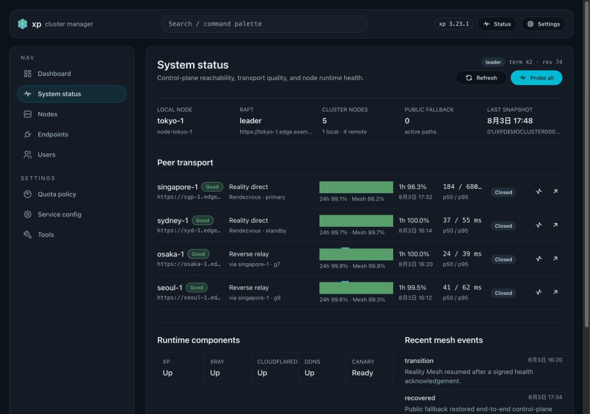
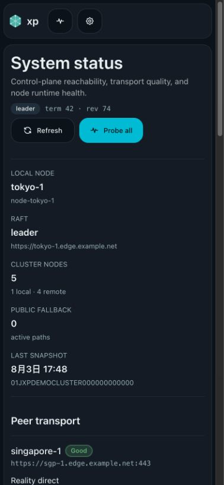
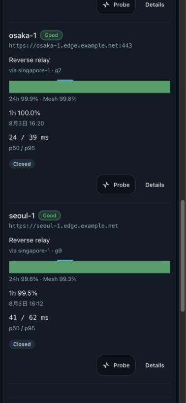
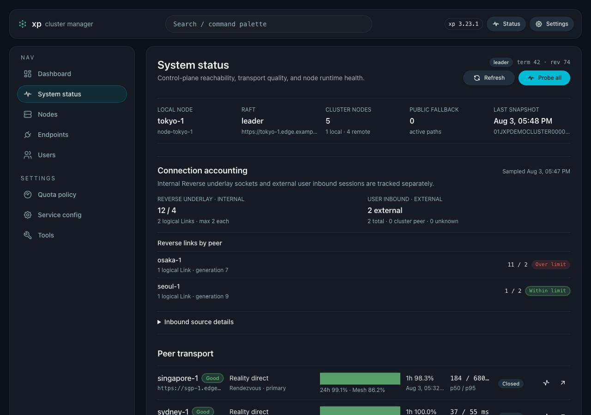
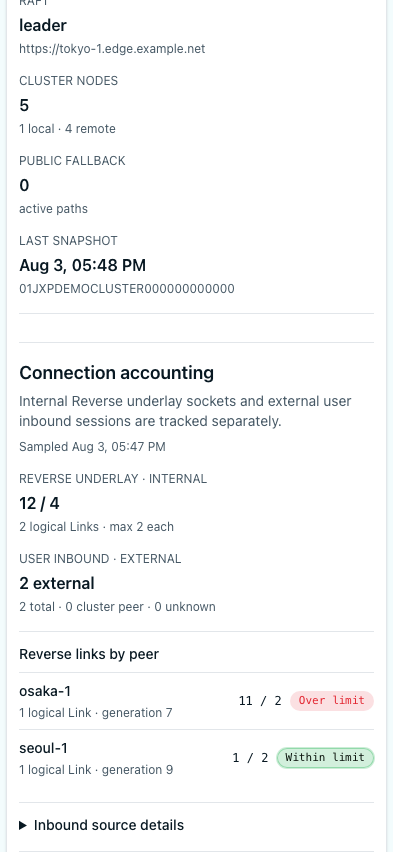

# Reality Mesh 反向中继

> 当前有效合同。实现状态见 `./IMPLEMENTATION.md`，决策缘由见 `./HISTORY.md`。

## Related ADRs

- [0005-reverse-link-unverified-cooldown](../../adr/0005-reverse-link-unverified-cooldown.md)
- [0013-reverse-underlay-connection-budget](../../adr/0013-reverse-underlay-connection-budget.md)

## 背景

Reality Mesh 目前依赖目标节点可被入站访问的 managed VLESS endpoint。位于单向防火墙、运营商 NAT 或仅允许出站连接的节点，无法作为 Mesh server，导致控制面只能退回 Public/API。反向中继让目标节点主动经一个可访问的 Rendezvous 建立受限的 VLESS Reverse 链路，
同时保留现有 Reality Direct 与 Public fallback。

## 目标

- 在 Raft DesiredState 中保存一次性的 `reverse_mesh_epoch` 与每个 target 的确定性双 Rendezvous assignment。
- 只选择当前 voter、具备静态 capability、signed Xray readiness 和 managed VLESS endpoint 的 Rendezvous；target 自身不要求 managed endpoint。
- 使用上游 Xray 动态 Handler/Routing API、固定本地 SOCKS5 portal 和 reqwest HTTP/2 prior knowledge，不手写 H2C、CONNECT 或 Xray fork。
- 为 health、Raft、内部 Admin fan-out 和 SSE 提供 Reverse Relay；这些调用方保留既有
  peer-direct 选择，只有 direct 路径未成功时才使用 Reverse，并保持现有 `outcome_unknown` 与幂等语义。
  History repository 同步固定使用目标节点的公网 HTTPS `api_base_url`，不进入 Reverse 或 dynamic relay。
- Reverse 只承载 authenticated XP control-plane HTTP，禁止通用 VPN、任意 TCP/UDP、用户流量和递归中继。
- 为 generation drain、Xray worker tombstone、受控重启、fresh join、host-managed systemd/OpenRC 与 single-image container 提供确定性降级。
- 以 additive status API 和紧凑 System Status 行显示 `reality_direct|reverse_relay|public`，不新增手动选路控件。

## 非目标

- 通用 VPN、任意 TCP/UDP 转发、WebSocket、CONNECT passthrough、内层 TLS 或用户流量隧道。
- 自制 H2/H2C 帧、reqwest connector、静态 Rendezvous 角色、公网监听端口、人工路径 override。
- 替换 Cloudflare Tunnel/Public fallback，或改变 history repository 的公网 HTTPS-only 同步合同。
- 放宽 internal-auth、membership、Raft promotion、64 MiB 总 PSS 或现有部署升级合同。

## 稳定契约

### Assignment

- `ReverseMeshAssignment` 包含 `target_node_id`、`generation`、`membership_revision`、`primary_node_id`、可选 `standby_node_id` 与 `credential_epoch`。
- 1 voter 不分配 Reverse；2 voter 只能形成一条 degraded 链；3+ voter 最多两条链。候选始终排除 target，按 target 排序分配，先选择当前 assignment 负载最少者，HRW 仅用于并列打破；primary 与 standby 不得相同。
- 所有 voter 声明 `cluster.mesh-reverse-assignment-v1` 前不得写首个 epoch。epoch 写入后，旧 schema 回滚必须被阻止。assignment generation 只由 leader CAS 更新；连续三次验证失败才换 generation，已恢复的旧候选不得抢占健康现任。

### Xray underlay

- Rendezvous 动态创建 password-auth、TCP-only、UDP-disabled 的 `127.0.0.1:10086` SOCKS5 inbound；端口冲突时 fail closed。
- target 动态创建独立 Reverse account 的 VLESS outbound，经 Rendezvous 的现有 Reality/XHTTP 或 Reality/Vision TCP endpoint 主动建链。Rendezvous 的 VLESS inbound 首次握手按 generation 创建 reverse handler。
- XP 通过 `socks5h` 与 `http2_prior_knowledge()` 请求 `http://rvs-<128-bit-id>.mesh.invalid:443`。target 仅允许精确 origin 路由到固定 XP loopback；未匹配 SOCKS 流量 block。target 不需要 managed VLESS endpoint。
- XP 进程内共享控制面 client 对每个 Rendezvous 的 Reverse outer request 固定最多 8 个
  in-flight slots；该上限由所有 `MeshAwareHttpClient` clones 共享，满载时立即拒绝新请求而不排队
  或建立新的 underlay stream。普通请求最多占用其中 7 个，始终保留至少 1 个 health slot；slot
  绑定到 guarded response body/stream 的完整生命周期，并在成功、错误、超时或 response 丢弃后释放。
  Direct/Public、assignment 和 Link lease 行为不变。
- XP 生成的 Reverse XHTTP outbound 为每个 logical Link 固定 `XMUX max_connections=2`，且不提供
  环境变量或 Web/API 覆盖。已有 underlay 必须复用，不为后续请求打开第三条连接；请求 admission
  仍由既有每 Rendezvous 的 8-slot gate 控制，slot 满载时才快速失败并沿用 Direct/Public fallback。
  Primary、standby、bootstrap Link 各自独立计数。
- Reverse outer requests retain concurrent read-side gate admission; a cluster Mesh gate transition
  takes the exclusive write side and waits for admitted requests to finish before disabling
  Mesh/Reverse traffic.
- 进程内 Xray reconciler 串行全量重载 XP-owned rule，顺序固定为 API、target bridge、portal exact-match、portal block。旧 handler 进入 120 秒 drain，禁止新请求但允许已开始的 response stream 完成。
- `Reverse Assignment` 是 durable topology；`Reverse Link` 是按
  `(epoch,target,Rendezvous,role,generation)` 区分的进程内生命周期。target 只为一个
  `probe_underlay|active` Link 安装 initiating Xray outbound。签名 `health-v2`
  必须携带经 reverse relay 信封认证的精确派生 authority，并由该 Link 的 Rendezvous 签发，才签发
  120 秒 `Link Lease`；单独的 Link headers 或普通直连 health 不得续租。每个 Link 同时至多一个
  probe/active outbound。新 Link 先获得一个 10 秒 probe window；首个未获 lease 的结果会立即
  fence 新请求、移除 initiating outbound，并在 30 秒后只重试一次。第二个未获 lease 的结果进入
  15 分钟 cooldown；cooldown 后每次只允许一个 10 秒 half-open probe。active lease 过期时也立即
  移除 initiating outbound，30 秒后从同一两次探测序列重新获取 lease。精确签名 health 成功会立即
  授予 120 秒 lease 并清除未验证失败历史。Direct/Public 和 membership 不受影响。
- 每个 retired handler 在首次发现时只获得一个固定的 120 秒 drain deadline；replacement 未获 lease
  不能延长或无限延迟旧 initiating outbound 的移除。tag、origin、UUID 按 cluster epoch、target、
  Rendezvous、role、generation 派生且永不复用；SOCKS password 按 cluster CA、local node、portal
  epoch 派生，不新增持久 secret。
- 固定版 Xray 不能证明 worker 已关闭时写 tombstone；每进程最多两个。产生第三个前由 systemd/OpenRC/supervisor 受控重启 Xray，并只重建当前 generation。重启不可用或失败只禁用 Reverse，Direct/Public 和 membership 继续可用。

### Relay wire 与路径

- 新增 `POST /api/admin/_internal/mesh/reverse-relay` 与 signed runtime report endpoint。
  caller 非 Rendezvous 时，先用独立 outer request 到 R。
  远端 R 固定按 Reality Mesh 后 Public/API 的顺序访问。
  caller 自身就是 R 时，固定走其受签名保护的 XP loopback portal，避免两 voter 拓扑回绕公网地址。
  outer request 禁止 Reverse 递归。
- outer body 是未编码的原始 inner body。`x-xp-relay-*` 包含 version、assignment generation、target、原始 method/URI/content type/route/sender/request ID/issued-at/signature/content length 与派生 reverse authority。
  R 校验 outer、assignment、成员、route、inner signature 后透传；target 再次校验 inner。标准 outer ACK 与 `x-xp-relay-inner-ack` 必须同时验证。
- 共享 HMAC 只表示 joined-member trust，不宣称 per-node 不可伪造身份；日志不得记录 body、凭据或原始 socket 信息。
- 对采用 `Reality Direct -> Reverse Relay -> Public/API` 的控制面调用，Reality 与 Reverse 各占
  `min(5s,max(500ms,total/3))`，Public 使用剩余预算；breaker-open 跳过相应段。收到 headers/
  首字节后不换路；不安全重试返回 `outcome_unknown`。history 不属于该 Reverse fallback 路径，
  固定使用公网 HTTPS `api_base_url`。
- assignment worker 对每个 target 的 primary 和 standby Rendezvous 分别发送 signed Reverse `health-v2`。
  只有各自收到 target ACK 的 Rendezvous 才可转发该 generation 的非 health 请求；因此 standby
  在故障切换前已完成预热验证。
- 普通 body 上限 1 MiB，Raft/snapshot 8 MiB；请求缓冲、响应流式。History repository 使用
  自己的公网 HTTPS direct 请求和 durable retry，不使用 Reverse 或 dynamic relay。

### Join、部署与状态 API

- fresh join 在响应前向 leader 与确定性 standby 预注册短期 Reverse；响应中的
  `reverse_mesh_bootstrap` 与现有 0600 `raft_bootstrap_sender` marker 只保存 generation、公开
  endpoint 参数和 epoch，不保存 secret。首次认证 Raft state/snapshot apply 前 marker 仅作为
  元数据，节点保持 Mesh/Reverse 关闭并沿用 Direct/Public；完成 apply 和 capability barrier 后
  才可承载 bootstrap/Raft。bootstrap 使用独立 `ReverseRole::Bootstrap` 派生域，join operation
  进入 terminal phase 后才建立正式 Primary/Standby 双链并 drain 临时链，promotion 仍遵循已有
  log-index 条件。尚未完成 capability barrier 或无可用候选时，marker 缺省且沿用现有
  Direct/Public join。
- public health 优先；signed Reverse health 200 后可标记 `reverse-dependent`。systemd/OpenRC/container 首次启用、滚动升级、restart fallback 和 operator intervention 必须保持 Direct/Public 可用。
- 入站 signed Reverse health 在校验 Link 后必须持有 Mesh read admission 直到 lease 确认完成；集群 Mesh
  关闭一旦取得写屏障，不得再确认 health 或续租 Link。
- 保留 `current_path=mesh|public`。新增可选 `active_route.kind=reality_direct|reverse_relay|public`。
  route 提供当前 Rendezvous、其 `primary|standby|bootstrap` 角色与成员、generation、readiness 和汇总计数；旧客户端可继续解析旧字段。
  System Status 由当前 assignments 标明直连 Rendezvous 的 primary/standby 角色。
  每个 Reverse target 用两条单行摘要显示 `Reverse relay` 与当前活动 Rendezvous/generation，不重复 standby。
  Cluster nodes 计数包含本机，所有 remote member 各有一行；每个状态单元最多显示两条单行摘要，不新增手动选路控件。
- `/api/admin/mesh/status` 的 `mesh_transport.current_connection_requests` 继续表示控制面 HTTP 请求数，
  不表示 TCP socket 数量。新增可选 `peers[].reverse_underlay`，分别返回 logical Link、physical
  underlay、每 Link 上限、generation、role 与 `ok|over_limit|unknown|unavailable` 状态；本机
  `local.connection_usage.user_inbound` 单独返回 `external`、`cluster_peer`、`unknown` 计数及
  管理员可展开的来源地址明细。来源地址明细最多保留 128 个聚合来源，并以
  `sources_truncated=true` 明确表示还有未展开来源。`/proc` 不可读时这些计数为 `null`，而不是
  零值；过期或缺失的 egress probe 只允许 `unknown`，共享 egress 地址也不得冒充唯一集群节点。
  Reverse underlay 套接字从 user inbound 统计中排除，避免在两个区域重复计算。System Status 以 `Reverse underlay · internal` 和
  `User inbound · external` 两个独立区域展示，不合并为一个入站总数。超过 2 条只产生诊断状态，
  不自动断链或重启 XP。

## 验收

- 固定 Xray `26.3.27@d2758a023cd7f4174a5a5fa4ff66e487d4342ba0` 共享测试机 spike 已证明两台 Xray 经 XHTTP+Reality 与 Vision TCP+Reality 建立动态 VLESS Reverse，并完成受限 SOCKS5、H2C、精确 block 和移除隔离；测试端口仅绑定 host loopback，生产仍固定为 `127.0.0.1:10086`。
  XP 还会对已分配 target 的 primary 与 standby 分别发起只走 Reverse 的 signed `health-v2` 请求；各 Rendezvous 在 target ACK 通过后保存短期健康证据。
  重启重建、非对称防火墙、fresh join 的正式双链收敛、部署回滚和内存门禁仍须集成证据，完成前不得
  启用生产 epoch。不可达 Rendezvous 的 15 分钟 shared-testbox 场景必须证明：每个 Link 至多两次
  probe 安装、open 期间不存在 target-side reverse outbound、SYN-SENT 不累积、Xray CPU 不超过
  Reverse-disabled 基线的 125% 或额外 10 CPU-seconds（取较宽者）、在一次真实 Reverse handler
  安装/删除预热后 Xray PSS 增量不超过 2 MiB，且
  固定的 Direct/Public outbound 持续可用。
- assignment 在 1/2/3/4/20 voter、leader change 与负载变化下确定一致；旧 schema 回滚被阻止。
- relay 拒绝错误成员、过期/重放、stale generation、自环/递归、路径/body/length/signature 篡改与 ACK 置换；日志无 body/secret。
- target 拒绝携带 Reverse Link headers 但缺少有效 relay 信封的 health，且拒绝 sender、generation、
  request identity 或派生 authority 与 Link 不一致的健康响应。
- 非对称防火墙下 Direct -> Reverse -> Public、R/Xray 故障、120 秒 drain、1 MiB/8 MiB、SSE、response-start failure、fresh join、三种部署和受控重启符合合同；tombstone 不超过 2。
- managed stack 20 节点与既有 50-peer 压测总 PSS 不超过 65,536 KiB；Rust/Web/Storybook/E2E/style/spec drift/required CI 通过，交付停在 `merge-ready / Step 5C Ready`。

## Visual Evidence

5 节点桌面状态：本机、两台直连 Rendezvous 与两台 Reverse target 均可见。
每个 Reverse target 使用两条单行摘要。

393x852 移动端总览：集群计数包含本机，显示 `1 local · 4 remote`。

393x852 移动端目标区：每个 Reverse target 分别显示 `Reverse relay`。
下一行显示当前 Rendezvous/generation。

Connection accounting in the Web Demo separates internal Reverse underlays from external user
inbound sessions. The desktop viewport shows the over-limit `11 / 2` Osaka Link and the separate
`2 external` user count.

The mobile viewport keeps the same two categories visible and preserves the per-peer limit state.

