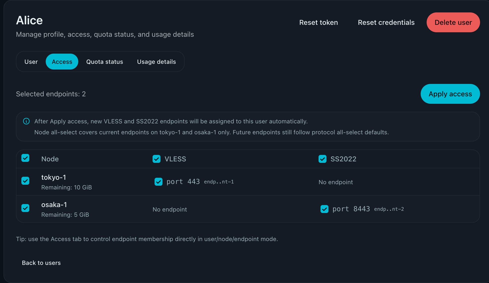

# Hard Cut: Remove Grants (membership-only access) (#wvrmn)

## Status

- Status: 已完成
- Created: 2026-03-01
- Last: 2026-04-29

## Background

- `grant-groups` 已下线，但 `grants` 仍是核心业务实体（订阅生成、Xray 下发、流量计量、配额状态都依赖）。
- 这导致接入模型复杂（membership + grants + 历史 user_node_quotas）、历史残留覆盖配额影响行为、并将“接入关系”与“凭据/计量”耦合在 grant 上。

## Goals / Non-goals

### Goals

- **彻底下线 grants 实体**：系统不再存储、读取、写入、暴露 `Grant/grant_id`。
- 接入模型统一为：`memberships(user_id, endpoint_id, node_id)`（`node_id` 仅冗余索引，来自 endpoint）。
- Admin 侧读写仅围绕 Access（membership）进行，不再出现 grants 语义。
- Admin Access 保存时可持久化“该用户已拥有某协议全部 endpoints”的自动授予意图；后续新增同协议 endpoint 时自动补齐 membership。
- Admin Access UI 在协议全选或节点全选时给出就地提示，说明保存后的自动授予范围与节点全选边界。
- 非 admin 订阅输出协议格式保持不变（raw/base64/clash 协议输出不变）。
- 升级后历史数据可读、可启动、可运行，不依赖 grants 历史语义。

### Non-goals

- 不改 quota 分配算法（P1/P2/P3/overflow）。
- 不改节点、端点协议类型与已有端口/Reality 基本行为。
- 不引入长期双写兼容期（采用硬切）。
- 不跨协议自动授予；VLESS 全选只影响未来 VLESS endpoint，SS2022 全选只影响未来 SS2022 endpoint。

## Scope

### In scope

- Backend：删除 grants 领域模型/状态分支/命令分支/HTTP API。
- Frontend：删除 grants 相关 API/types/calls（含页面状态、测试、Storybook mock）。
- 无 `grant_id` 的凭据与计量键：凭据派生 + usage key 改为 membership key。
- 一次性数据迁移（state + usage + snapshot/WAL 兼容）。
- 清理 `user_node_quotas` 历史覆盖能力（迁移清空，运行时忽略）。

### Out of scope

- 业务策略数值调整（配额值、权重策略规则本身）。

## API & Contracts

### Keep (semantic change: membership-only)

- `GET /api/admin/users/:user_id/access`
  - Response:
    - `{ "items": [ { "user_id": "...", "endpoint_id": "...", "node_id": "..." } ], "auto_assign_endpoint_kinds": ["vless_reality_vision_tcp"] }`
- `PUT /api/admin/users/:user_id/access`
  - Request:
    - `{ "items": [ { "endpoint_id": "..." } ] }` (不接受 `node_id`；由后端从 endpoint 推导)
  - Response:
    - `{ "created": 1, "deleted": 2, "items": [ { "user_id":"...", "endpoint_id":"...", "node_id":"..." } ], "auto_assign_endpoint_kinds": ["ss2022_2022_blake3_aes_128_gcm"] }`
  - Semantics:
    - apply 后该用户 memberships **精确等于** `items`（按 `endpoint_id` 去重；`items=[]` 表示清空）。
    - apply 后服务端按现有 endpoint 集合推断 `auto_assign_endpoint_kinds`：若请求覆盖某个 `EndpointKind` 的全部现存 endpoints，则记录该 kind；否则清除该 kind。
    - 后续 `UpsertEndpoint` 时，若新 endpoint 的 kind 命中用户记录的 `auto_assign_endpoint_kinds`，服务端自动创建对应 membership。

### Delete (hard cut, always 404)

- `GET/PUT /api/admin/users/:user_id/grants`
- 其它任何 grants admin API（若存在）

### New

- `POST /api/admin/users/:user_id/reset-credentials`
  - Effect: `user.credential_epoch += 1`（Raft 强一致）
  - Response: `{ "user_id": "...", "credential_epoch": 1 }`

## Key Formats (frozen)

- `membership_key` (用于 usage map key / 调试输出)：`"{user_id}::{endpoint_id}"`
- Xray `email` (stats + remove_user)：`"m:{membership_key}"`

## Credential derivation (frozen)

- 目标：同一用户 **同一协议** 尽量复用同一份凭据（减轻用户配置负担），但 **email/usage 仍按 membership 唯一** 保证计量不混。
- 种子：`cluster_ca_key_pem`（HMAC key）
- 输入消息（ASCII 文本）必须包含 `user_id` 与 `credential_epoch`

### VLESS UUID (per-user)

- `HMAC_SHA256(seed, "xp:v1:cred:vless:{user_id}:{epoch}")`
- 取前 16 bytes，设置 RFC4122 variant/version 位，输出 UUID 字符串

### SS2022 user_psk (per-user)

- `HMAC_SHA256(seed, "xp:v1:cred:ss2022-user-psk:{user_id}:{epoch}")`
- 取前 16 bytes，`base64.StdEncoding` 得到 `user_psk_b64`
- endpoint password：`"{server_psk_b64}:{user_psk_b64}"`（因此 client-side “全串”可能因 endpoint.server_psk 不同而不同，但 user-side 核心 secret 最小化）

## Data migration

### State (SCHEMA_VERSION: 10)

- 移除 `grants` 字段全量数据。
- `node_user_endpoint_memberships`：
  - 从旧 grants 提取有效 memberships，按 `(user_id, endpoint_id)` 去重。
  - 丢弃 orphan（缺 user 或缺 endpoint）。
  - `node_id` 从 `endpoint.node_id` 推导。
  - **不因旧 `grant.enabled=false` 丢 membership**（封禁改为仅数据面，避免把“临时封禁”变成“永久失去接入”）。
- `user_node_quotas`：迁移置空，并删除运行时生效逻辑。
- `users`：补 `credential_epoch: 0`。
- SHOULD：输出迁移统计日志（保留/丢弃/去重数；user_node_quotas 清空条目数）。

### State (SCHEMA_VERSION: 12)

- 新增 `user_auto_assign_endpoint_kinds: map<user_id, set<EndpointKind>>`，表示用户已选择某协议全部现存 endpoints，未来同协议 endpoint 应自动授予。
- v11 -> v12 迁移从当前 `node_user_endpoint_memberships` 推断该字段：只有当用户已拥有某协议全部现存 endpoints 时才记录；无现存 endpoint 的协议不推断。
- 启动、snapshot 安装、endpoint upsert/delete、user delete 都会规范化该字段并重新同步 memberships，避免 orphan user 与 stale endpoint 残留；若某协议 endpoint 暂时全部删除，已记录的自动授予意图继续保留以覆盖后续同协议 endpoint。

### Usage (USAGE_SCHEMA_VERSION: 2)

- 从 `usage.grants[grant_id]` 聚合到 `usage.memberships[membership_key]`：
  - 同 user+endpoint 的多 grant 使用量求和。
  - 有效窗口取 `last_seen_at` 最大 entry 的 `(cycle_start_at, cycle_end_at)`。
  - `last_uplink_total/last_downlink_total` 统一置 `0`（强制下一次 poll 以新 email totals 重新建立 baseline，避免负 delta）。
  - 迁移后按“当前 memberships 集合”做 retain：删除不再存在的 membership usage 条目。

## WAL + Snapshot compatibility (must)

- Snapshot:
  - `install_snapshot()` 允许读取旧 snapshot payload（含 grants），先反序列化 compat struct，再迁移到 v10 state。
- WAL:
  - 兼容反序列化旧 grants 相关命令（仅用于回放兼容）：
    - `ReplaceUserGrants` => 映射 `ReplaceUserAccess`（提取 endpoint_id）
    - `UpsertGrant` => “确保该 (user_id, endpoint_id) membership 存在”
    - `DeleteGrant` / `SetGrantEnabled` => no-op（记录日志计数）

## Acceptance criteria

- UI 中无 grants 概念：无 grants 路由、无 grants API 调用、无 grants 文案。
- Access tab 在协议全选时提示：apply 后未来同协议 endpoint 会自动分配；在节点全选时提示：仅覆盖该节点当前 endpoints，未来 endpoint 仍按协议级默认授予规则处理。
- `/api/admin/users/:id/access` 可完整管理接入关系：0 endpoint => 0 输出；N endpoint => N 条。
- 用户保存某协议全选后，新建同协议 endpoint 会自动出现在该用户 access 与订阅输出中；不同协议不会被自动授予。
- `GET/PUT /api/admin/users/:id/access` 返回 `auto_assign_endpoint_kinds`，且 `PUT` 请求体保持仅提交 `items[{endpoint_id}]`。
- 旧 grants API 下线后统一返回 404。
- 订阅输出回归：raw/base64/clash 协议格式不变，条目数正确。
- Xray reconcile 不再按 grant_id；不再残留 `email=grant:*` 用户。
- quota/usage 不再依赖 grant_id；迁移后统计正确。
- `user_node_quotas` 历史覆盖不再生效（迁移清空 + 运行时忽略）。
- 全量测试通过（Rust + Web + Storybook + E2E）。

## Visual Evidence

- source_type: storybook_canvas
  story_id_or_title: Pages/UserDetailsPage/AccessTab
  state: protocol and node all-select hint
  evidence_note: verifies Access tab explains that protocol all-select creates future same-protocol auto assignment while node all-select only covers current endpoints.
  image:
  

## Milestones

- [x] M1: docs/specs 冻结（本 spec）+ API/format/迁移口径锁定
- [x] M2: backend hard cut end-to-end（schema v10 + usage v2 + compat + API + subscription + reconcile + quota + probe + tests）
- [x] M3: web hard cut end-to-end（API client + views/components + tests + storybook mocks）
- [x] M4: 全量验证通过（Rust/Web/Storybook/E2E）+ PR/checks/review-loop 收敛

## Risks / Open questions

- WAL compat 代码删除门槛：建议在 “全量集群升级到包含 v10 的版本，并完成一次 snapshot/purge” 后，下一次 schema bump（v11）时移除 compat shim。

## Change log

- 2026-03-01: implemented (PR #86)
- 2026-03-02: AccessMatrix 多 endpoint 树交互做 post-fix（父子勾选对齐、折叠态保留全选、列宽固定不抖动且树展开保持 in-flow 以允许行高变化）；继续补强为 `colgroup + table-fixed` 固定列宽，移除 Node ID 与空态提示文案展示，折叠/展开图标切换为 Iconify 文件夹并加过渡动画，同时将树引导线对齐到图标中心并弱化配色，修正折叠态复选框与右侧标题的垂直对齐（PR #90）。
- 2026-03-02: AccessMatrix 树形勾选状态修正：多选单元格部分选中时，行/列/全局勾选框均正确显示 `indeterminate` 而非错误“全选”；同时修复单 endpoint 未勾选场景的元数据显示，避免展示 `port ?`（PR #90）。
- 2026-03-02: AccessMatrix 状态一致性修正：当 endpoint 列表变更时，仅保留仍存在于当前 options 的已选 endpoint，避免 stale endpoint_id 导致单元格误显示为选中或提交无效 endpoint（PR #90）。
- 2026-04-29: 增加协议级自动授予语义：用户保存某协议全选后，新增同协议 endpoint 自动补齐 membership；Access API 响应暴露 `auto_assign_endpoint_kinds`。
- 2026-04-29: Access tab 增加协议全选与节点全选的上下文提示，明确 apply 后未来 endpoint 自动授予范围。
